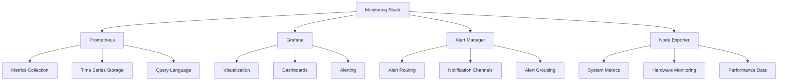

# Monitoring & Observability Infrastructure - AGENTS

## Module Overview

The monitoring directory contains production-ready monitoring and observability infrastructure for the Active Inference Simulation Lab, providing comprehensive telemetry, alerting, and visualization capabilities.

## Monitoring Stack Architecture



## Prometheus Configuration

### Core Metrics Collection

Production-grade metrics collection with service discovery and federation.

**Features:**
- Service discovery for dynamic environments
- Federation for multi-cluster monitoring
- Long-term storage with remote write
- High availability and scalability

**Configuration:**
```yaml
# prometheus.yml
global:
  scrape_interval: 15s
  evaluation_interval: 15s
  scrape_timeout: 10s

rule_files:
  - "alert_rules.yml"

scrape_configs:
  - job_name: 'active-inference'
    static_configs:
      - targets: ['localhost:8000']
    metrics_path: '/metrics'
    scrape_interval: 5s

  - job_name: 'node-exporter'
    static_configs:
      - targets: ['localhost:9100']
    scrape_interval: 15s

  - job_name: 'kubernetes-apiserver'
    kubernetes_sd_configs:
      - role: endpoints
    scheme: https
    tls_config:
      ca_file: /var/run/secrets/kubernetes.io/serviceaccount/ca.crt
      insecure_skip_verify: true
    bearer_token_file: /var/run/secrets/kubernetes.io/serviceaccount/token
    relabel_configs:
      - source_labels: [__meta_kubernetes_namespace, __meta_kubernetes_service_name]
        action: keep
        regex: default;kubernetes
      - source_labels: [__meta_kubernetes_endpoint_port_name]
        action: keep
        regex: https

remote_write:
  - url: "http://cortex:9201/api/v1/write"
    headers:
      "X-Scope-OrgID": "active-inference"
```

### Active Inference Metrics

Custom metrics specifically designed for active inference systems.

**Key Metrics:**
```yaml
# Active Inference specific metrics
active_inference_agents_total: Total number of active agents
active_inference_inference_operations_total: Total inference operations performed
active_inference_planning_operations_total: Total planning operations performed
active_inference_memory_usage_bytes: Memory usage by component
active_inference_cpu_usage_percent: CPU utilization
active_inference_free_energy: Current free energy levels
active_inference_prediction_error: Prediction error metrics
active_inference_cache_hit_ratio: Cache performance metrics
active_inference_errors_total: Error counts by type
active_inference_response_time_seconds: Response time distributions
```

## Grafana Dashboards

### Comprehensive Visualization

Real-time dashboards with custom panels and alerting integration.

**Dashboard Structure:**
```json
{
  "dashboard": {
    "title": "Active Inference Monitoring",
    "tags": ["active-inference", "production"],
    "timezone": "UTC",
    "panels": [
      {
        "title": "System Overview",
        "type": "stat",
        "targets": [
          {
            "expr": "up{job=\"active-inference\"}",
            "legendFormat": "Active Instances"
          }
        ]
      },
      {
        "title": "Inference Performance",
        "type": "graph",
        "targets": [
          {
            "expr": "histogram_quantile(0.95, rate(active_inference_response_time_seconds_bucket[5m]))",
            "legendFormat": "95th Percentile Response Time"
          }
        ]
      },
      {
        "title": "Resource Usage",
        "type": "bargauge",
        "targets": [
          {
            "expr": "active_inference_memory_usage_bytes / active_inference_memory_limit_bytes",
            "legendFormat": "Memory Usage %"
          }
        ]
      }
    ],
    "time": {
      "from": "now-1h",
      "to": "now"
    }
  }
}
```

### Dashboard Panels

**Performance Monitoring:**
- Response time distributions (P50, P95, P99)
- Throughput metrics (requests per second)
- Error rates and success rates
- Resource utilization (CPU, memory, disk)

**Active Inference Specific:**
- Free energy trajectories
- Belief state distributions
- Planning horizon effectiveness
- Cache hit ratios and performance

**System Health:**
- Service availability and uptime
- Pod status and restarts
- Network latency and throughput
- Security event monitoring

## Alerting Configuration

### Intelligent Alert Rules

Context-aware alerting with severity levels and escalation policies.

**Critical Alerts:**
```yaml
# alerts.yml
groups:
  - name: active-inference-critical
    rules:
      - alert: ActiveInferenceDown
        expr: up{job="active-inference"} == 0
        for: 5m
        labels:
          severity: critical
        annotations:
          summary: "Active Inference service is down"
          description: "Active Inference has been down for more than 5 minutes."

      - alert: HighErrorRate
        expr: rate(active_inference_errors_total[5m]) > 0.1
        for: 3m
        labels:
          severity: critical
        annotations:
          summary: "High error rate detected"
          description: "Error rate exceeds 10% for 3 minutes."
```

**Warning Alerts:**
```yaml
  - name: active-inference-warning
    rules:
      - alert: HighMemoryUsage
        expr: active_inference_memory_usage_bytes / active_inference_memory_limit_bytes > 0.9
        for: 5m
        labels:
          severity: warning
        annotations:
          summary: "High memory usage"
          description: "Memory usage exceeds 90% for 5 minutes."

      - alert: SlowResponseTime
        expr: histogram_quantile(0.95, rate(active_inference_response_time_seconds_bucket[5m])) > 1.0
        for: 5m
        labels:
          severity: warning
        annotations:
          summary: "Slow response times"
          description: "95th percentile response time exceeds 1 second."
```

### Alert Routing

Intelligent alert routing based on severity, time, and context.

**Routing Configuration:**
```yaml
# alertmanager.yml
global:
  smtp_smarthost: 'smtp.gmail.com:587'
  smtp_from: 'alerts@active-inference.com'
  smtp_auth_username: 'alerts@active-inference.com'
  smtp_auth_password: 'password'

route:
  group_by: ['alertname', 'severity']
  group_wait: 10s
  group_interval: 10s
  repeat_interval: 1h
  receiver: 'default'
  routes:
    - match:
        severity: critical
      receiver: 'critical-team'
      continue: true
    - match:
        severity: warning
      receiver: 'warning-team'

receivers:
  - name: 'default'
    email_configs:
      - to: 'devops@active-inference.com'
        subject: 'Active Inference Alert: {{ .GroupLabels.alertname }}'
        body: '{{ .CommonAnnotations.summary }}'

  - name: 'critical-team'
    pagerduty_configs:
      - service_key: 'active-inference-critical'
    slack_configs:
      - api_url: 'https://hooks.slack.com/services/.../.../...'
        channel: '#critical-alerts'
        title: '🚨 Critical Alert: {{ .GroupLabels.alertname }}'
        text: '{{ .CommonAnnotations.description }}'

  - name: 'warning-team'
    email_configs:
      - to: 'developers@active-inference.com'
        subject: 'Active Inference Warning: {{ .GroupLabels.alertname }}'
```

## Node Exporter Integration

### System Metrics Collection

Comprehensive system-level monitoring for infrastructure health.

**Key Metrics:**
```yaml
# Hardware metrics
node_cpu_seconds_total: CPU usage by core
node_memory_MemTotal_bytes: Total memory
node_memory_MemAvailable_bytes: Available memory
node_disk_io_time_seconds_total: Disk I/O time
node_network_receive_bytes_total: Network traffic
node_load1: System load average

# Process metrics
namedprocess_namegroup_cpu_percent: Process CPU usage
namedprocess_namegroup_memory_percent: Process memory usage
namedprocess_namegroup_num_procs: Number of processes
namedprocess_namegroup_num_threads: Number of threads
```

**Configuration:**
```yaml
# Node Exporter systemd service
[Unit]
Description=Node Exporter
Wants=network-online.target
After=network-online.target

[Service]
User=node_exporter
Group=node_exporter
Type=simple
ExecStart=/usr/local/bin/node_exporter \\
  --collector.cpu \\
  --collector.meminfo \\
  --collector.loadavg \\
  --collector.filesystem \\
  --collector.diskstats \\
  --collector.netdev \\
  --collector.stat \\
  --web.listen-address=:9100

[Install]
WantedBy=multi-user.target
```

## Integration with Active Inference

### Telemetry Integration

Direct integration with the Active Inference telemetry system.

**Python Integration:**
```python
from active_inference.monitoring import PrometheusExporter
from prometheus_client import Counter, Histogram, Gauge

class MonitoredActiveInferenceAgent:
    """Active inference agent with Prometheus monitoring."""

    def __init__(self, agent_id):
        self.agent_id = agent_id

        # Prometheus metrics
        self.inference_counter = Counter(
            'active_inference_inference_operations_total',
            'Total number of inference operations',
            ['agent_id']
        )

        self.inference_duration = Histogram(
            'active_inference_inference_duration_seconds',
            'Time spent on inference operations',
            ['agent_id']
        )

        self.memory_usage = Gauge(
            'active_inference_memory_usage_bytes',
            'Current memory usage',
            ['agent_id', 'component']
        )

        self.free_energy = Gauge(
            'active_inference_free_energy',
            'Current free energy level',
            ['agent_id']
        )

    def act(self, observation):
        """Monitored action selection."""

        with self.inference_duration.labels(agent_id=self.agent_id).time():
            # Perform inference
            beliefs = self.inference.update_beliefs(self.beliefs, observation)

            # Update metrics
            self.inference_counter.labels(agent_id=self.agent_id).inc()
            self.memory_usage.labels(agent_id=self.agent_id, component='inference').set(
                self._get_memory_usage()
            )
            self.free_energy.labels(agent_id=self.agent_id).set(
                self._compute_free_energy(beliefs)
            )

            # Plan action
            action = self.planning.plan_action(beliefs, self.model)

        return action
```

### Health Check Endpoints

HTTP endpoints for health monitoring and status reporting.

**Health Check Implementation:**
```python
from flask import Flask, jsonify
from active_inference.monitoring import HealthChecker

app = Flask(__name__)
health_checker = HealthChecker()

@app.route('/health')
def health_check():
    """Basic health check endpoint."""
    health_status = health_checker.check_health()

    if health_status['healthy']:
        return jsonify(health_status), 200
    else:
        return jsonify(health_status), 503

@app.route('/ready')
def readiness_check():
    """Readiness check for Kubernetes."""
    if health_checker.is_ready():
        return jsonify({'status': 'ready'}), 200
    else:
        return jsonify({'status': 'not ready'}), 503

@app.route('/metrics')
def metrics():
    """Prometheus metrics endpoint."""
    from prometheus_client import generate_latest
    return generate_latest()

if __name__ == '__main__':
    app.run(host='0.0.0.0', port=8000)
```

## Deployment Configurations

### Docker Compose for Development

Complete monitoring stack for local development.

**Configuration:**
```yaml
# docker-compose.monitoring.yml
version: '3.8'

services:
  prometheus:
    image: prom/prometheus:latest
    ports:
      - "9090:9090"
    volumes:
      - ./monitoring/prometheus.yml:/etc/prometheus/prometheus.yml
      - prometheus_data:/prometheus
    command:
      - '--config.file=/etc/prometheus/prometheus.yml'
      - '--storage.tsdb.path=/prometheus'
      - '--web.console.libraries=/etc/prometheus/console_libraries'
      - '--web.console.templates=/etc/prometheus/consoles'
      - '--storage.tsdb.retention.time=200h'
      - '--web.enable-lifecycle'

  grafana:
    image: grafana/grafana:latest
    ports:
      - "3000:3000"
    volumes:
      - grafana_data:/var/lib/grafana
      - ./monitoring/grafana/provisioning:/etc/grafana/provisioning
    environment:
      - GF_SECURITY_ADMIN_PASSWORD=admin
      - GF_USERS_ALLOW_SIGN_UP=false

  node-exporter:
    image: prom/node-exporter:latest
    ports:
      - "9100:9100"
    volumes:
      - /proc:/host/proc:ro
      - /sys:/host/sys:ro
      - /:/rootfs:ro
    command:
      - '--path.procfs=/host/proc'
      - '--path.rootfs=/rootfs'
      - '--path.sysfs=/host/sys'
      - '--collector.filesystem.mount-points-exclude=^/(sys|proc|dev|host|etc)($$|/)'

  alertmanager:
    image: prom/alertmanager:latest
    ports:
      - "9093:9093"
    volumes:
      - ./monitoring/alertmanager.yml:/etc/alertmanager/alertmanager.yml
    command:
      - '--config.file=/etc/alertmanager/alertmanager.yml'
      - '--storage.path=/alertmanager'

volumes:
  prometheus_data:
  grafana_data:
```

### Kubernetes Production Deployment

Production-grade monitoring stack for Kubernetes.

**Configuration:**
```yaml
# monitoring-deployment.yaml
apiVersion: v1
kind: ConfigMap
metadata:
  name: prometheus-config
  namespace: monitoring
data:
  prometheus.yml: |
    global:
      scrape_interval: 15s
    scrape_configs:
      - job_name: 'kubernetes-apiservers'
        kubernetes_sd_configs:
          - role: endpoints
        scheme: https
        tls_config:
          ca_file: /var/run/secrets/kubernetes.io/serviceaccount/ca.crt
        bearer_token_file: /var/run/secrets/kubernetes.io/serviceaccount/token
        relabel_configs:
          - source_labels: [__meta_kubernetes_namespace, __meta_kubernetes_service_name, __meta_kubernetes_endpoint_port_name]
            action: keep
            regex: default;kubernetes;https
      - job_name: 'active-inference'
        kubernetes_sd_configs:
          - role: pod
        relabel_configs:
          - source_labels: [__meta_kubernetes_pod_label_app]
            action: keep
            regex: active-inference
          - source_labels: [__meta_kubernetes_pod_container_port_number]
            action: keep
            regex: 8000

---
apiVersion: apps/v1
kind: Deployment
metadata:
  name: prometheus
  namespace: monitoring
spec:
  replicas: 2
  selector:
    matchLabels:
      app: prometheus
  template:
    metadata:
      labels:
        app: prometheus
    spec:
      serviceAccountName: prometheus
      containers:
      - name: prometheus
        image: prom/prometheus:latest
        ports:
        - containerPort: 9090
        volumeMounts:
        - name: config
          mountPath: /etc/prometheus
        - name: storage
          mountPath: /prometheus
      volumes:
      - name: config
        configMap:
          name: prometheus-config
      - name: storage
        emptyDir: {}
```

## Alert Examples

### Performance Alerts

```yaml
# Performance degradation alerts
- alert: InferenceLatencyHigh
  expr: histogram_quantile(0.95, rate(active_inference_response_time_seconds_bucket[5m])) > 2.0
  for: 10m
  labels:
    severity: warning
  annotations:
    summary: "High inference latency detected"
    description: "95th percentile inference latency > 2.0s for 10 minutes"

- alert: MemoryUsageCritical
  expr: active_inference_memory_usage_bytes > 4e9  # 4GB
  for: 5m
  labels:
    severity: critical
  annotations:
    summary: "Critical memory usage"
    description: "Memory usage exceeds 4GB for 5 minutes"
```

### Business Logic Alerts

```yaml
# Active Inference specific alerts
- alert: HighPredictionError
  expr: active_inference_prediction_error > 1.0
  for: 15m
  labels:
    severity: warning
  annotations:
    summary: "High prediction error detected"
    description: "Prediction error consistently above threshold"

- alert: CachePerformanceDegraded
  expr: active_inference_cache_hit_ratio < 0.7
  for: 10m
  labels:
    severity: warning
  annotations:
    summary: "Cache performance degraded"
    description: "Cache hit ratio below 70% for 10 minutes"
```

## Future Enhancements

### Advanced Monitoring Features
- **Machine Learning-Based Anomaly Detection**: ML models for detecting complex patterns
- **Predictive Monitoring**: Forecasting potential issues before they occur
- **Distributed Tracing**: End-to-end request tracing across microservices
- **Log Correlation**: Correlating logs with metrics and traces

### Cloud Integration
- **AWS CloudWatch**: Native AWS monitoring integration
- **Google Cloud Monitoring**: GCP-native monitoring
- **Azure Monitor**: Azure-native monitoring
- **Multi-Cloud Federation**: Cross-cloud monitoring federation

### Operational Intelligence
- **Automated Incident Response**: AI-driven incident mitigation
- **Root Cause Analysis**: Automated RCA with ML
- **Capacity Planning**: ML-based resource forecasting
- **Performance Optimization**: Automated performance tuning

