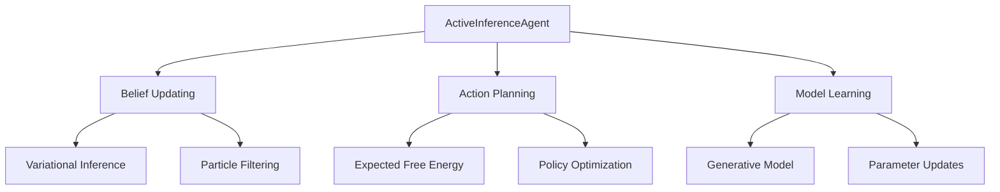

# Core Agent Implementations - AGENTS

## Module Overview

The `core` module contains the fundamental active inference agent implementations, providing the building blocks for all other functionality in the Active Inference Simulation Lab.

## Agent Architecture



## Key Classes

### ActiveInferenceAgent

The primary agent implementation following the Free Energy Principle.

**Core Algorithm:**
```python
def act(self, observation):
    # 1. Update beliefs given observation
    self.beliefs = self.inference.update_beliefs(
        self.beliefs, observation, self.generative_model
    )

    # 2. Plan action by minimizing expected free energy
    action = self.planning.plan_action(
        self.beliefs, self.generative_model, self.planning_horizon
    )

    # 3. Update generative model
    self.generative_model = self.learning.update_model(
        observation, action, self.generative_model
    )

    return action
```

**Key Features:**
- Modular design with separate inference, planning, and learning components
- Support for multiple inference methods (variational, particle filtering)
- Flexible generative model representations
- Configurable planning horizons and optimization parameters

### AdaptiveActiveInferenceAgent

Extended agent with dimensional adaptability and security validation.

**Adaptation Mechanism:**
```python
def adapt_dimensions(self, observation):
    """Automatically adapt to changing observation dimensions."""
    current_dim = len(observation)

    if current_dim != self.expected_obs_dim:
        self.logger.info(f"Adapting from {self.expected_obs_dim} to {current_dim} dimensions")

        # Resize belief state
        self.beliefs = self.resize_beliefs(self.beliefs, current_dim)

        # Update generative model
        self.generative_model = self.adapt_generative_model(
            self.generative_model, current_dim
        )

        self.expected_obs_dim = current_dim
```

**Enhanced Features:**
- Automatic dimension adaptation for varying input sizes
- Input validation and sanitization
- Security threat detection
- Error recovery mechanisms
- Performance monitoring integration

## Belief Representation

### BeliefState Class

Manages the agent's probabilistic beliefs about hidden states.

**Structure:**
```python
@dataclass
class BeliefState:
    """Probabilistic belief state."""
    mean: np.ndarray          # Expected state values
    covariance: np.ndarray    # Uncertainty representation
    precision: np.ndarray     # Inverse covariance for efficiency
    entropy: float           # Information-theoretic measure
    free_energy: float       # Free energy of current beliefs
```

**Key Operations:**
- **Update**: Incorporate new observations via Bayes' rule
- **Predict**: Forecast future states given actions
- **Marginalize**: Compute beliefs over subsets of variables
- **Fuse**: Combine multiple belief sources

### GenerativeModel Class

Represents the agent's model of the world.

**Components:**
```python
class GenerativeModel:
    """Probabilistic generative model."""
    def __init__(self):
        self.prior = PriorDistribution()        # p(s)
        self.likelihood = LikelihoodModel()     # p(o|s)
        self.transition = TransitionModel()     # p(s'|s,a)
        self.preferences = PreferenceModel()    # Goal states
```

**Learning:**
- **Parameter Updates**: Gradient-based optimization
- **Structure Learning**: Automatic model discovery
- **Meta-Learning**: Learning to learn new tasks

## Inference Methods

### Variational Inference

Approximates posterior beliefs using variational distributions.

**Algorithm:**
```python
def variational_inference(observation, prior_beliefs, model):
    """Variational free energy minimization."""
    # Initialize variational parameters
    variational_params = initialize_variational_params()

    for iteration in range(max_iterations):
        # Compute free energy
        F = compute_variational_free_energy(
            variational_params, observation, model
        )

        # Update parameters
        variational_params = update_variational_params(
            variational_params, F, learning_rate
        )

        # Check convergence
        if converged(F, previous_F):
            break

    return extract_posterior_beliefs(variational_params)
```

**Advantages:**
- Scalable to high-dimensional state spaces
- Differentiable for end-to-end learning
- Well-established convergence properties

### Particle Filtering

Samples-based inference for complex, non-Gaussian distributions.

**Algorithm:**
```python
def particle_filter(observation, particles, model):
    """Sequential Monte Carlo inference."""
    weights = []

    for particle in particles:
        # Predict step
        predicted_particle = model.transition(particle)

        # Update step
        weight = model.likelihood(observation, predicted_particle)
        weights.append(weight)

        # Move particle
        particle = predicted_particle

    # Resample based on weights
    particles = resample_particles(particles, weights)

    return particles, weights
```

**Advantages:**
- Handles arbitrary probability distributions
- Naturally parallelizable
- Robust to model misspecification

## Planning and Decision Making

### Expected Free Energy Minimization

Plans actions by minimizing expected free energy.

**Components:**
```python
def compute_expected_free_energy(beliefs, policy, model, horizon):
    """Compute G, the expected free energy."""

    epistemic_value = 0
    pragmatic_value = 0

    for t in range(horizon):
        # Epistemic affordance: information gain
        epistemic_value += compute_information_gain(
            beliefs, policy[t], model
        )

        # Pragmatic affordance: goal achievement
        pragmatic_value += compute_goal_achievement(
            beliefs, policy[t], model
        )

    # Combine epistemic and pragmatic values
    G = epistemic_value + pragmatic_value

    return G
```

**Planning Strategies:**
- **Open-loop**: Plan complete action sequences
- **Closed-loop**: Re-plan at each timestep
- **Hierarchical**: Multi-timescale planning
- **Model-based**: Use learned dynamics
- **Model-free**: Direct policy optimization

## Learning and Adaptation

### Model Learning

Updates the generative model based on experience.

**Learning Rules:**
```python
def update_generative_model(experience_buffer, model):
    """Update model parameters from experience."""

    for experience in experience_buffer:
        observation, action, reward, next_observation = experience

        # Update transition model
        model.transition = update_transition_model(
            model.transition, observation, action, next_observation
        )

        # Update likelihood model
        model.likelihood = update_likelihood_model(
            model.likelihood, next_observation, action
        )

        # Update prior preferences
        model.preferences = update_preferences(
            model.preferences, reward
        )

    return model
```

**Learning Paradigms:**
- **Supervised**: Direct parameter updates
- **Unsupervised**: Structure discovery
- **Reinforcement**: Policy gradient methods
- **Meta-learning**: Learning to learn

## Performance Optimization

### Computational Efficiency

**Optimizations:**
- **Vectorization**: NumPy array operations
- **Caching**: Belief state memoization
- **Approximation**: Fast inference methods
- **Parallelization**: Multi-core processing

### Memory Management

**Strategies:**
- **Object Pooling**: Reuse belief state objects
- **Lazy Evaluation**: Compute only when needed
- **Compression**: Efficient belief representation
- **Garbage Collection**: Automatic cleanup

## Integration Points

### Environment Interface

**Standard Protocol:**
```python
class EnvironmentProtocol:
    """Standard environment interface."""

    def reset(self) -> np.ndarray:
        """Reset environment, return initial observation."""
        pass

    def step(self, action: np.ndarray) -> Tuple[np.ndarray, float, bool, Dict]:
        """Execute action, return observation, reward, done, info."""
        pass

    def get_info(self) -> Dict:
        """Get environment information."""
        pass
```

### Monitoring Integration

**Telemetry Collection:**
```python
def act_with_monitoring(self, observation):
    """Act with performance monitoring."""
    start_time = time.time()

    # Core inference and planning
    action = self._act_core(observation)

    # Record metrics
    inference_time = time.time() - start_time
    self.telemetry.record_metric(
        "inference_time", inference_time,
        tags={"agent_id": self.agent_id}
    )

    return action
```

## Testing and Validation

### Unit Tests

**Coverage Areas:**
- Belief updating accuracy
- Planning optimality
- Learning convergence
- Error handling robustness

### Integration Tests

**Validation Scenarios:**
- Full agent-environment loops
- Multi-agent interactions
- Long-term learning stability
- Performance regression detection

### Performance Benchmarks

**Metrics:**
```python
def benchmark_agent(agent, environment, num_episodes=100):
    """Comprehensive agent benchmarking."""

    metrics = {
        'inference_time': [],
        'planning_time': [],
        'learning_time': [],
        'total_reward': [],
        'episode_length': []
    }

    for episode in range(num_episodes):
        episode_metrics = run_episode(agent, environment)
        for key, value in episode_metrics.items():
            metrics[key].append(value)

    # Compute statistics
    return {
        key: {
            'mean': np.mean(values),
            'std': np.std(values),
            'min': np.min(values),
            'max': np.max(values)
        }
        for key, values in metrics.items()
    }
```

## Configuration Management

### Agent Configuration

**Parameters:**
```python
agent_config = {
    # Inference settings
    'inference_method': 'variational',
    'inference_iterations': 10,
    'learning_rate': 0.01,

    # Planning settings
    'planning_horizon': 5,
    'num_trajectories': 100,
    'planning_method': 'expected_free_energy',

    # Learning settings
    'learning_rate_model': 0.001,
    'buffer_size': 10000,
    'batch_size': 32,

    # Performance settings
    'enable_caching': True,
    'enable_monitoring': False,
    'parallel_processing': False
}
```

### Environment-Specific Tuning

**Adaptive Configuration:**
```python
def adapt_agent_config(environment_info):
    """Adapt agent configuration based on environment."""

    if environment_info['high_dimensional']:
        config = high_dim_config()
    elif environment_info['stochastic']:
        config = robust_config()
    elif environment_info['real_time']:
        config = fast_config()
    else:
        config = default_config()

    return config
```

## Error Handling and Robustness

### Graceful Degradation

**Fallback Strategies:**
```python
def act_robust(self, observation):
    """Act with multiple fallback strategies."""

    try:
        # Primary method
        return self.act_standard(observation)

    except DimensionError:
        # Adapt dimensions
        self.adapt_dimensions(observation.shape[0])
        return self.act_standard(observation)

    except InferenceError:
        # Fallback to simpler method
        return self.act_fallback(observation)

    except Exception as e:
        # Ultimate fallback
        self.logger.error(f"Critical error: {e}")
        return self.default_action()
```

### Validation and Sanitization

**Input Checking:**
```python
def validate_observation(self, observation):
    """Comprehensive observation validation."""

    # Type checking
    if not isinstance(observation, np.ndarray):
        raise TypeError("Observation must be numpy array")

    # Shape validation
    if len(observation.shape) != 1:
        raise ValueError("Observation must be 1D array")

    # Value validation
    if not np.isfinite(observation).all():
        raise ValueError("Observation contains non-finite values")

    # Sanitization
    observation = np.clip(observation, -10, 10)  # Reasonable bounds

    return observation
```

## Future Extensions

### Advanced Inference Methods
- **Quantum-Inspired Inference**: Quantum algorithms for belief updating
- **Neural Inference**: Deep learning-based posterior approximation
- **Hierarchical Inference**: Multi-level belief propagation

### Enhanced Planning
- **Model-Based RL Integration**: Combine active inference with model-based methods
- **Multi-Agent Planning**: Coordination with other active inference agents
- **Long-Term Planning**: Extended horizons with abstraction

### Learning Improvements
- **Continual Learning**: Adaptation without catastrophic forgetting
- **Meta-Learning**: Learning efficient learning strategies
- **Curriculum Learning**: Progressive task complexity

