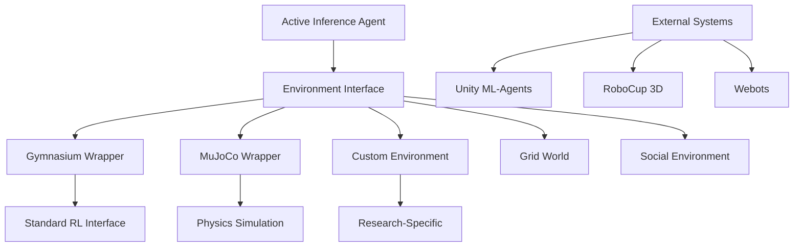

# Environment Integration - AGENTS

## Module Overview

The `environments` module provides standardized interfaces and wrappers for connecting active inference agents with various simulation environments, from simple grid worlds to complex physics simulations.

## Environment Architecture



## Core Environment Interface

### Standard Protocol

All environments implement a consistent interface for active inference compatibility:

```python
class ActiveInferenceEnvironment(ABC):
    """Standard interface for active inference environments."""

    @abstractmethod
    def reset(self) -> np.ndarray:
        """Reset environment and return initial observation."""
        pass

    @abstractmethod
    def step(self, action: np.ndarray) -> Tuple[np.ndarray, float, bool, Dict]:
        """Execute action and return observation, reward, done, info."""
        pass

    @abstractmethod
    def get_observation_space(self) -> Dict[str, Any]:
        """Get observation space specifications."""
        pass

    @abstractmethod
    def get_action_space(self) -> Dict[str, Any]:
        """Get action space specifications."""
        pass

    def get_info(self) -> Dict[str, Any]:
        """Get environment information for active inference."""
        return {}
```

## Built-in Environments

### GridWorld Environment

Simple grid-based environment for testing basic active inference capabilities.

**Features:**
- Configurable grid sizes (2D and 3D)
- Obstacle placement and navigation challenges
- Goal-directed reward structures
- Partial observability options

**Usage:**
```python
from active_inference.environments import GridWorld

env = GridWorld(
    size=(10, 10),
    obstacles=[(3, 3), (7, 7)],
    goals=[(9, 9)],
    partial_observability=True,
    observation_radius=2
)

observation = env.reset()
action = np.array([1, 0])  # Move right
next_obs, reward, done, info = env.step(action)
```

### MockEnvironment

Fast, configurable environment for testing and benchmarking.

**Features:**
- Arbitrary observation and action dimensions
- Configurable noise levels
- Temporal dynamics simulation
- Research-grade capabilities

**Usage:**
```python
from active_inference.environments import MockEnvironment

env = MockEnvironment(
    obs_dim=8,
    action_dim=2,
    reward_noise=0.1,
    observation_noise=0.05,
    temporal_dynamics=True
)

# Research configuration
env.configure_research_mode(
    enable_uncertainty=True,
    add_model_mismatch=True,
    temporal_horizon=10
)
```

### SocialEnvironment

Multi-agent environment for studying social active inference.

**Features:**
- Multiple interacting agents
- Communication channels
- Cooperative and competitive scenarios
- Theory of mind modeling

**Usage:**
```python
from active_inference.environments import SocialEnvironment

env = SocialEnvironment(
    num_agents=3,
    communication_enabled=True,
    cooperation_reward=1.0,
    competition_penalty=-0.5
)

observations = env.reset()  # Returns dict of agent observations
actions = {
    'agent_0': np.array([0.1, 0.8]),
    'agent_1': np.array([0.3, 0.6]),
    'agent_2': np.array([0.7, 0.2])
}

next_obs, rewards, done, info = env.step(actions)
```

## External Environment Wrappers

### Gymnasium Wrapper

Standard interface to Gymnasium (formerly OpenAI Gym) environments.

**Features:**
- Automatic action space conversion
- Reward shaping for active inference
- Belief-based reward bonuses
- Uncertainty estimation

**Usage:**
```python
from active_inference.environments import GymWrapper
import gymnasium as gym

# Wrap any Gymnasium environment
gym_env = gym.make("CartPole-v1")
env = GymWrapper(
    gym_env,
    add_model_uncertainty=True,
    belief_based_reward=True,
    uncertainty_bonus=0.1
)

# Active inference specific features
agent = ActiveInferenceAgent.from_env(env)
beliefs = agent.infer_beliefs(observation)
uncertainty = env.estimate_uncertainty(beliefs)
```

### MuJoCo Wrapper

Physics-based simulation with MuJoCo engine.

**Features:**
- Realistic physics simulation
- Proprioceptive and visual sensors
- Contact forces and dynamics
- Real-time control capabilities

**Usage:**
```python
from active_inference.environments import MuJoCoWrapper

env = MuJoCoWrapper(
    model_file="humanoid.xml",
    proprioceptive_noise=0.01,
    visual_occlusion=True,
    frame_skip=5
)

# Multi-modal observations
observation = env.reset()
proprioceptive = observation['proprioceptive']
visual = observation['visual']
```

## Environment Configuration

### Research Configurations

Environments can be configured for different research paradigms:

```python
# Uncertainty-driven exploration
env.configure_uncertainty_driven(
    uncertainty_threshold=0.8,
    exploration_bonus=0.2
)

# Goal-directed behavior
env.configure_goal_directed(
    goal_states=[target_state],
    goal_reward=1.0,
    shaping_reward=True
)

# Curiosity-driven learning
env.configure_curiosity_driven(
    novelty_measure="prediction_error",
    curiosity_weight=0.1
)
```

### Performance Optimization

```python
# High-performance configuration
env.configure_performance(
    vectorized_operations=True,
    cache_observations=True,
    parallel_simulation=True
)

# Memory-efficient configuration
env.configure_memory_efficient(
    observation_compression=True,
    sparse_rewards=True,
    episodic_reset=True
)
```

## Active Inference Integration

### Belief-Compatible Observations

Environments provide observations compatible with active inference:

```python
def get_belief_compatible_obs(self):
    """Get observation formatted for belief updating."""
    raw_obs = self._get_raw_observation()

    return {
        'observation': raw_obs,
        'uncertainty': self._estimate_observation_uncertainty(),
        'prediction_error': self._compute_prediction_error(),
        'goal_progress': self._measure_goal_progress()
    }
```

### Free Energy Computation Support

```python
def compute_environment_free_energy(self, beliefs, action):
    """Compute environment-specific free energy terms."""

    # Proprioceptive prediction error
    proprioceptive_error = self._compute_proprioceptive_error(beliefs)

    # Visual prediction error
    visual_error = self._compute_visual_error(beliefs)

    # Goal achievement
    goal_achievement = self._compute_goal_achievement(beliefs, action)

    return {
        'accuracy': proprioceptive_error + visual_error,
        'complexity': self._compute_complexity_penalty(beliefs),
        'goal': goal_achievement
    }
```

## Testing and Validation

### Environment Testing Suite

```python
from active_inference.environments import EnvironmentTester

tester = EnvironmentTester()

# Comprehensive environment validation
results = tester.test_environment(env, [
    'reset_functionality',
    'step_consistency',
    'reward_stability',
    'observation_space',
    'action_space',
    'active_inference_compatibility'
])

print(f"Environment tests passed: {results['passed']}/{results['total']}")
```

### Benchmarking Tools

```python
from active_inference.environments import EnvironmentBenchmarker

benchmarker = EnvironmentBenchmarker()

# Performance benchmarking
performance = benchmarker.benchmark_performance(env, num_episodes=100)

print(f"Mean episode length: {performance['episode_length']['mean']}")
print(f"Mean reward: {performance['reward']['mean']}")
print(f"Environment FPS: {performance['fps']}")
```

## Advanced Features

### Multi-Modal Environments

```python
class MultiModalEnvironment:
    """Environment with multiple sensory modalities."""

    def __init__(self, modalities=['visual', 'auditory', 'proprioceptive']):
        self.modalities = modalities
        self.sensors = {}

        for modality in modalities:
            self.sensors[modality] = self._create_sensor(modality)

    def get_multi_modal_observation(self):
        """Get observations from all modalities."""
        observation = {}
        for modality, sensor in self.sensors.items():
            observation[modality] = sensor.get_observation()

        return observation
```

### Hierarchical Environments

```python
class HierarchicalEnvironment:
    """Environment with multiple levels of abstraction."""

    def __init__(self, levels=['low', 'mid', 'high']):
        self.levels = levels
        self.current_level = 'low'
        self.level_envs = {}

        for level in levels:
            self.level_envs[level] = self._create_level_env(level)

    def switch_level(self, level):
        """Switch to different level of abstraction."""
        self.current_level = level
        return self.level_envs[level].reset()
```

## Integration Examples

### Research Pipeline

```python
from active_inference import create_research_setup

# Create complete research environment
agent, env, monitor = create_research_setup(
    environment_type="grid_world",
    agent_config={
        "inference_method": "variational",
        "planning_horizon": 10,
        "enable_monitoring": True
    },
    environment_config={
        "size": (20, 20),
        "partial_observability": True,
        "uncertainty_regions": True
    }
)

# Research loop
for episode in range(1000):
    obs = env.reset()
    episode_reward = 0

    while True:
        # Get belief-compatible observation
        belief_obs = env.get_belief_compatible_obs()

        # Agent inference and action
        action = agent.act(belief_obs)

        # Environment step
        next_obs, reward, done, info = env.step(action)
        episode_reward += reward

        # Research metrics
        metrics = agent.get_research_metrics()
        monitor.record_metrics(metrics)

        if done:
            break

    print(f"Episode {episode}: Reward = {episode_reward}")
```

### Production Deployment

```python
from active_inference import create_production_setup

# Create production environment
agent, env, health_monitor = create_production_setup(
    environment_type="mujoco",
    model_file="robot.xml",
    agent_config={
        "optimization_level": "high",
        "fault_tolerance": True,
        "monitoring_enabled": True
    }
)

# Production loop
while True:
    try:
        obs = env.get_production_obs()
        action = agent.act(obs)
        env.execute_action(action)

        # Health monitoring
        if not health_monitor.is_healthy():
            agent.trigger_recovery()

    except Exception as e:
        logger.error(f"Production error: {e}")
        agent.handle_production_error(e)
```

## Performance Characteristics

| Environment Type | Complexity | FPS | Memory (MB) | Active Inference Compatible |
|------------------|------------|-----|-------------|----------------------------|
| GridWorld | Low | 1000+ | <1 | ✅ Full |
| MockEnvironment | Configurable | 10000+ | <1 | ✅ Full |
| SocialEnvironment | Medium | 500+ | <5 | ✅ Full |
| GymWrapper | Variable | 100-1000 | 10-100 | ✅ Partial |
| MuJoCoWrapper | High | 50-200 | 100-500 | ✅ Partial |

## Future Extensions

### Advanced Simulation Integration
- **Unity Integration**: Game engine environments with active inference
- **Webots Integration**: Robotics simulation with sensor suites
- **Gazebo Integration**: ROS-compatible environments

### Research Environment Features
- **Curriculum Learning**: Progressive environment complexity
- **Meta-Learning**: Environment variation for adaptation testing
- **Multi-Agent Scenarios**: Complex social dynamics simulation

### Performance Improvements
- **GPU Acceleration**: Physics simulation on GPU
- **Distributed Simulation**: Multi-node environment execution
- **Real-time Constraints**: Hard real-time environment guarantees

