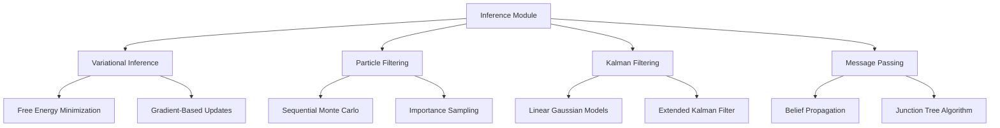

# Inference Methods - AGENTS

## Module Overview

The `inference` module implements various algorithms for updating probabilistic beliefs about hidden states given observations, forming the core of active inference perception and learning.

## Inference Architecture



## Core Inference Interface

### BeliefUpdater Protocol

Standard interface for all inference methods:

```python
class BeliefUpdater(ABC):
    """Abstract base class for belief updating algorithms."""

    @abstractmethod
    def update_beliefs(self,
                      prior_beliefs: BeliefState,
                      observation: np.ndarray,
                      model: GenerativeModel) -> BeliefState:
        """Update beliefs given observation and generative model."""
        pass

    @abstractmethod
    def compute_free_energy(self,
                           beliefs: BeliefState,
                           observation: np.ndarray,
                           model: GenerativeModel) -> float:
        """Compute variational free energy of beliefs."""
        pass

    def get_inference_stats(self) -> Dict[str, Any]:
        """Get inference performance statistics."""
        return {}
```

## Variational Inference

### Core Algorithm

Variational inference approximates intractable posterior distributions using optimization.

**Mathematical Foundation:**
```
Posterior: p(s|o) ∝ p(o|s) * p(s)
Variational: q(s) ≈ p(s|o)

Free Energy: F[q] = E_q[log q(s)] - E_q[log p(o,s)]
Minimize: F[q] w.r.t. q(s) parameters
```

**Implementation:**
```python
class VariationalInference(BeliefUpdater):
    """Variational inference for active inference."""

    def __init__(self,
                 learning_rate: float = 0.01,
                 max_iterations: int = 100,
                 convergence_threshold: float = 1e-6):
        self.learning_rate = learning_rate
        self.max_iterations = max_iterations
        self.convergence_threshold = convergence_threshold

    def update_beliefs(self, prior, observation, model):
        """Update beliefs using variational free energy minimization."""

        # Initialize variational parameters
        variational_params = self._initialize_variational_params(prior)

        free_energy_history = []

        for iteration in range(self.max_iterations):
            # Compute free energy and gradients
            free_energy, gradients = self._compute_free_energy_and_gradients(
                variational_params, observation, model
            )

            free_energy_history.append(free_energy)

            # Update variational parameters
            variational_params = self._update_parameters(
                variational_params, gradients, self.learning_rate
            )

            # Check convergence
            if self._check_convergence(free_energy_history):
                break

        # Extract posterior beliefs
        posterior_beliefs = self._extract_posterior_beliefs(variational_params)

        return posterior_beliefs
```

### Advanced Variational Methods

#### Stochastic Variational Inference
```python
class StochasticVariationalInference(VariationalInference):
    """Stochastic gradient variational inference."""

    def update_beliefs(self, prior, observation, model):
        """Stochastic variational update."""

        # Monte Carlo sampling for gradient estimation
        samples = self._sample_variational_distribution(prior, num_samples=10)

        # Compute stochastic gradients
        gradients = []
        for sample in samples:
            grad = self._compute_gradient_sample(sample, observation, model)
            gradients.append(grad)

        # Average gradients
        avg_gradient = np.mean(gradients, axis=0)

        # Update parameters
        updated_params = self._apply_gradient_update(prior, avg_gradient)

        return updated_params
```

#### Amortized Variational Inference
```python
class AmortizedVariationalInference(VariationalInference):
    """Amortized inference using neural networks."""

    def __init__(self, encoder_network, **kwargs):
        super().__init__(**kwargs)
        self.encoder = encoder_network  # Neural network encoder

    def update_beliefs(self, prior, observation, model):
        """Neural amortized variational inference."""

        # Encode observation to variational parameters
        variational_params = self.encoder(observation)

        # Single gradient step (amortized)
        free_energy, gradients = self._compute_free_energy_and_gradients(
            variational_params, observation, model
        )

        # Update encoder parameters
        self._update_encoder(gradients)

        return variational_params
```

## Particle Filtering

### Sequential Monte Carlo

Particle filtering for complex, non-Gaussian distributions.

**Algorithm:**
```python
class ParticleFilter(BeliefUpdater):
    """Particle filtering for belief state estimation."""

    def __init__(self, num_particles: int = 1000):
        self.num_particles = num_particles
        self.particles = None
        self.weights = None

    def update_beliefs(self, prior, observation, model):
        """Update beliefs using particle filtering."""

        if self.particles is None:
            # Initialize particles
            self.particles = self._initialize_particles(prior, self.num_particles)

        # Prediction step
        self.particles = self._predict_particles(self.particles, model)

        # Update step
        self.weights = self._compute_weights(self.particles, observation, model)

        # Resampling
        if self._needs_resampling(self.weights):
            self.particles, self.weights = self._resample_particles(
                self.particles, self.weights
            )

        # Extract belief state
        belief_state = self._particles_to_belief_state(self.particles, self.weights)

        return belief_state

    def _predict_particles(self, particles, model):
        """Predict particle states forward."""
        predicted_particles = []

        for particle in particles:
            # Sample action (could be from policy)
            action = self._sample_action()

            # Predict next state
            next_particle = model.transition(particle, action)
            predicted_particles.append(next_particle)

        return np.array(predicted_particles)

    def _compute_weights(self, particles, observation, model):
        """Compute importance weights."""
        weights = []

        for particle in particles:
            # Likelihood of observation given particle
            likelihood = model.likelihood(observation, particle)
            weights.append(likelihood)

        # Normalize weights
        weights = np.array(weights)
        weights /= np.sum(weights)

        return weights

    def _resample_particles(self, particles, weights):
        """Resample particles based on weights."""
        # Systematic resampling
        num_particles = len(particles)
        indices = self._systematic_resample(weights, num_particles)

        resampled_particles = particles[indices]
        resampled_weights = np.ones(num_particles) / num_particles

        return resampled_particles, resampled_weights
```

## Kalman Filtering

### Linear Gaussian Models

Optimal filtering for linear Gaussian state-space models.

**Implementation:**
```python
class KalmanFilter(BeliefUpdater):
    """Kalman filter for linear Gaussian models."""

    def update_beliefs(self, prior, observation, model):
        """Kalman filter update."""

        # Prediction step
        predicted_mean = model.transition_matrix @ prior.mean
        predicted_covariance = (model.transition_matrix @ prior.covariance @
                               model.transition_matrix.T + model.process_noise)

        # Update step
        innovation = observation - model.observation_matrix @ predicted_mean
        innovation_covariance = (model.observation_matrix @ predicted_covariance @
                                model.observation_matrix.T + model.observation_noise)

        # Kalman gain
        kalman_gain = (predicted_covariance @ model.observation_matrix.T @
                      np.linalg.inv(innovation_covariance))

        # Posterior update
        posterior_mean = predicted_mean + kalman_gain @ innovation
        posterior_covariance = (predicted_covariance -
                               kalman_gain @ model.observation_matrix @ predicted_covariance)

        return BeliefState(
            mean=posterior_mean,
            covariance=posterior_covariance,
            precision=np.linalg.inv(posterior_covariance)
        )
```

## Message Passing Algorithms

### Belief Propagation

Exact inference for tree-structured graphical models.

```python
class BeliefPropagation(BeliefUpdater):
    """Belief propagation for exact inference."""

    def update_beliefs(self, prior, observation, model):
        """Perform belief propagation."""

        # Initialize messages
        messages = self._initialize_messages(model.graph)

        # Update messages iteratively
        for iteration in range(self.max_iterations):
            messages = self._update_messages(messages, model)

            if self._messages_converged(messages):
                break

        # Compute marginal beliefs
        beliefs = self._compute_marginals(messages, model)

        return beliefs
```

## Performance Optimization

### Caching and Memoization

```python
class CachedBeliefUpdater:
    """Belief updater with intelligent caching."""

    def __init__(self, base_updater: BeliefUpdater, cache_size: int = 1000):
        self.base_updater = base_updater
        self.cache = LRUCache(cache_size)

    def update_beliefs(self, prior, observation, model):
        """Update with caching."""

        # Create cache key
        cache_key = self._create_cache_key(prior, observation, model)

        # Check cache
        if cache_key in self.cache:
            return self.cache[cache_key]

        # Compute beliefs
        beliefs = self.base_updater.update_beliefs(prior, observation, model)

        # Cache result
        self.cache[cache_key] = beliefs

        return beliefs

    def _create_cache_key(self, prior, observation, model):
        """Create deterministic cache key."""
        key_components = [
            prior.mean.tobytes(),
            prior.covariance.tobytes(),
            observation.tobytes(),
            str(model.parameters)  # Hash of model parameters
        ]
        return hashlib.md5(b''.join(key_components)).hexdigest()
```

### Vectorization and Parallelization

```python
class VectorizedVariationalInference(VariationalInference):
    """Vectorized variational inference for batch processing."""

    def update_beliefs_batch(self, priors, observations, model):
        """Batch update multiple belief states."""

        # Vectorize computations
        batch_size = len(priors)

        # Initialize variational parameters for all batches
        variational_params = np.array([
            self._initialize_variational_params(prior)
            for prior in priors
        ])

        # Vectorized free energy computation
        free_energies = self._compute_free_energy_batch(
            variational_params, observations, model
        )

        # Vectorized gradient computation
        gradients = self._compute_gradients_batch(
            variational_params, observations, model
        )

        # Vectorized parameter updates
        variational_params = self._update_parameters_batch(
            variational_params, gradients, self.learning_rate
        )

        # Extract posterior beliefs
        posterior_beliefs = [
            self._extract_posterior_beliefs(params)
            for params in variational_params
        ]

        return posterior_beliefs
```

## Research Extensions

### Quantum-Inspired Inference

```python
class QuantumInspiredInference(BeliefUpdater):
    """Quantum-inspired variational inference."""

    def update_beliefs(self, prior, observation, model):
        """Quantum-inspired belief updating."""

        # Represent beliefs as quantum states
        quantum_state = self._beliefs_to_quantum_state(prior)

        # Quantum variational circuit
        variational_circuit = self._create_variational_circuit()

        # Optimize circuit parameters
        optimized_params = self._optimize_quantum_circuit(
            variational_circuit, observation, model
        )

        # Extract classical beliefs
        posterior_beliefs = self._quantum_state_to_beliefs(
            quantum_state, optimized_params
        )

        return posterior_beliefs
```

### Neural Inference Networks

```python
class NeuralInferenceNetwork(BeliefUpdater):
    """Neural network-based inference."""

    def __init__(self, inference_network):
        self.inference_network = inference_network  # Trained neural network

    def update_beliefs(self, prior, observation, model):
        """Neural network inference."""

        # Prepare input features
        features = self._prepare_inference_features(prior, observation, model)

        # Forward pass through network
        network_output = self.inference_network(features)

        # Extract belief parameters
        mean, covariance = self._extract_belief_parameters(network_output)

        return BeliefState(mean=mean, covariance=covariance)
```

## Testing and Validation

### Inference Quality Metrics

```python
class InferenceValidator:
    """Validate inference algorithm quality."""

    def validate_inference_quality(self, updater, test_cases):
        """Validate inference quality on test cases."""

        results = []

        for test_case in test_cases:
            prior, observation, true_posterior, model = test_case

            # Run inference
            estimated_posterior = updater.update_beliefs(prior, observation, model)

            # Compute quality metrics
            kl_divergence = self._compute_kl_divergence(
                estimated_posterior, true_posterior
            )

            mse = self._compute_mse(estimated_posterior, true_posterior)

            results.append({
                'kl_divergence': kl_divergence,
                'mse': mse,
                'converged': kl_divergence < self.convergence_threshold
            })

        return results

    def _compute_kl_divergence(self, estimated, true):
        """Compute KL divergence between distributions."""
        # Implementation of KL divergence computation
        pass

    def _compute_mse(self, estimated, true):
        """Compute MSE between mean estimates."""
        return np.mean((estimated.mean - true.mean) ** 2)
```

### Performance Benchmarking

```python
class InferenceBenchmarker:
    """Benchmark inference algorithm performance."""

    def benchmark_inference(self, updater, benchmark_cases):
        """Benchmark inference performance."""

        results = []

        for case in benchmark_cases:
            prior, observation, model = case

            # Time inference
            start_time = time.time()
            result = updater.update_beliefs(prior, observation, model)
            inference_time = time.time() - start_time

            # Memory usage
            memory_usage = self._measure_memory_usage()

            results.append({
                'inference_time': inference_time,
                'memory_usage': memory_usage,
                'state_dimension': len(prior.mean),
                'converged': result is not None
            })

        return results
```

## Configuration and Tuning

### Adaptive Inference Selection

```python
class AdaptiveInferenceSelector:
    """Select optimal inference method based on problem characteristics."""

    def select_inference_method(self, problem_characteristics):
        """Select appropriate inference method."""

        state_dim = problem_characteristics['state_dimension']
        nonlinearity = problem_characteristics['nonlinearity']
        noise_level = problem_characteristics['noise_level']

        if state_dim < 10 and nonlinearity == 'linear':
            return KalmanFilter()
        elif state_dim < 50 and noise_level < 0.1:
            return VariationalInference(learning_rate=0.1)
        elif nonlinearity == 'high':
            return ParticleFilter(num_particles=1000)
        else:
            return AmortizedVariationalInference(encoder_network=self.encoder)
```

### Hyperparameter Optimization

```python
class InferenceOptimizer:
    """Optimize inference hyperparameters."""

    def optimize_hyperparameters(self, updater_class, validation_data):
        """Optimize inference hyperparameters."""

        # Define hyperparameter space
        param_space = {
            'learning_rate': [0.001, 0.01, 0.1],
            'max_iterations': [10, 50, 100],
            'convergence_threshold': [1e-6, 1e-4, 1e-2]
        }

        best_params = None
        best_score = float('inf')

        # Grid search
        for params in self._generate_parameter_combinations(param_space):
            # Create updater with parameters
            updater = updater_class(**params)

            # Evaluate on validation data
            score = self._evaluate_inference_quality(updater, validation_data)

            if score < best_score:
                best_score = score
                best_params = params

        return best_params
```

## Integration Examples

### Active Inference Agent Integration

```python
class ActiveInferenceAgent:
    """Active inference agent with pluggable inference."""

    def __init__(self, inference_method='variational', **kwargs):
        if inference_method == 'variational':
            self.inference = VariationalInference(**kwargs)
        elif inference_method == 'particle':
            self.inference = ParticleFilter(**kwargs)
        elif inference_method == 'kalman':
            self.inference = KalmanFilter(**kwargs)

    def perceive(self, observation):
        """Update beliefs given observation."""
        self.beliefs = self.inference.update_beliefs(
            self.beliefs, observation, self.generative_model
        )

        return self.beliefs
```

### Research Experiment Setup

```python
def setup_inference_experiment(inference_methods, environments):
    """Setup inference method comparison experiment."""

    results = {}

    for method_name, method_config in inference_methods.items():
        method_results = {}

        for env_name, environment in environments.items():
            # Create inference method
            inference = method_config['class'](**method_config['params'])

            # Run experiment
            env_results = run_inference_experiment(inference, environment)

            method_results[env_name] = env_results

        results[method_name] = method_results

    return results

# Example usage
inference_methods = {
    'variational': {
        'class': VariationalInference,
        'params': {'learning_rate': 0.01, 'max_iterations': 50}
    },
    'particle': {
        'class': ParticleFilter,
        'params': {'num_particles': 1000}
    },
    'kalman': {
        'class': KalmanFilter,
        'params': {}
    }
}
```

