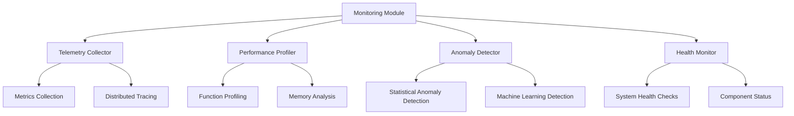

# Monitoring and Telemetry - AGENTS

## Module Overview

The `monitoring` module provides comprehensive observability capabilities for active inference systems, enabling real-time performance tracking, anomaly detection, and health monitoring.

## Monitoring Architecture



## Core Monitoring Components

### TelemetryCollector

Centralized metrics collection and distributed tracing.

**Features:**
- Real-time metrics collection
- Distributed tracing support
- Configurable output formats (JSON, Prometheus)
- Performance-optimized data structures

**Implementation:**
```python
class TelemetryCollector:
    """Comprehensive telemetry collection system."""

    def __init__(self, enable_prometheus=True, enable_jaeger=True):
        self.metrics_store = {}
        self.trace_store = {}
        self.enable_prometheus = enable_prometheus
        self.enable_jaeger = enable_jaeger

        # Initialize exporters
        if enable_prometheus:
            self.prometheus_exporter = PrometheusExporter()
        if enable_jaeger:
            self.jaeger_exporter = JaegerExporter()

    def record_metric(self, name: str, value: float,
                     tags: Dict[str, str] = None,
                     metric_type: str = 'gauge') -> bool:
        """Record a metric with optional tags."""

        metric = {
            'name': name,
            'value': value,
            'tags': tags or {},
            'type': metric_type,
            'timestamp': time.time()
        }

        # Store locally
        if name not in self.metrics_store:
            self.metrics_store[name] = []
        self.metrics_store[name].append(metric)

        # Keep only recent metrics
        if len(self.metrics_store[name]) > self.max_metrics_per_type:
            self.metrics_store[name].pop(0)

        # Export to external systems
        if self.enable_prometheus:
            self.prometheus_exporter.export_metric(metric)

        return True

    def start_trace(self, operation_name: str,
                   tags: Dict[str, str] = None) -> str:
        """Start a distributed trace."""

        trace_id = str(uuid.uuid4())
        trace = {
            'id': trace_id,
            'operation': operation_name,
            'start_time': time.time(),
            'tags': tags or {},
            'spans': []
        }

        self.trace_store[trace_id] = trace
        return trace_id

    def finish_trace(self, trace_id: str, result: str = 'success'):
        """Finish a distributed trace."""

        if trace_id in self.trace_store:
            trace = self.trace_store[trace_id]
            trace['end_time'] = time.time()
            trace['duration'] = trace['end_time'] - trace['start_time']
            trace['result'] = result

            # Export trace
            if self.enable_jaeger:
                self.jaeger_exporter.export_trace(trace)

    def log_trace_event(self, trace_id: str, event_name: str,
                       data: Dict[str, Any] = None):
        """Log an event within a trace."""

        if trace_id in self.trace_store:
            event = {
                'name': event_name,
                'timestamp': time.time(),
                'data': data or {}
            }

            self.trace_store[trace_id]['spans'].append(event)
```

### PerformanceProfiler

Detailed performance analysis and profiling.

**Capabilities:**
- Function-level execution time tracking
- Memory usage analysis
- CPU utilization monitoring
- Bottleneck identification

**Implementation:**
```python
class PerformanceProfiler:
    """Advanced performance profiling system."""

    def __init__(self):
        self.function_profiles = {}
        self.memory_snapshots = []
        self.system_metrics = []

    @contextmanager
    def profile_function(self, function_name: str,
                        tags: Dict[str, str] = None):
        """Profile a function execution."""

        start_time = time.perf_counter()
        start_memory = self._get_memory_usage()

        try:
            yield
        finally:
            end_time = time.perf_counter()
            end_memory = self._get_memory_usage()

            profile_data = {
                'function_name': function_name,
                'execution_time': end_time - start_time,
                'memory_delta': end_memory - start_memory,
                'cpu_percent': self._get_cpu_percent(),
                'tags': tags or {},
                'timestamp': time.time()
            }

            if function_name not in self.function_profiles:
                self.function_profiles[function_name] = []
            self.function_profiles[function_name].append(profile_data)

    def take_memory_snapshot(self, snapshot_name: str = None) -> Dict[str, Any]:
        """Take a memory usage snapshot."""

        try:
            import psutil
            process = psutil.Process()

            snapshot = {
                'name': snapshot_name or f'snapshot_{int(time.time())}',
                'timestamp': time.time(),
                'rss_memory': process.memory_info().rss,
                'vms_memory': process.memory_info().vms,
                'cpu_percent': process.cpu_percent(),
                'num_threads': process.num_threads(),
                'open_files': len(process.open_files()),
                'connections': len(process.connections())
            }

            self.memory_snapshots.append(snapshot)
            return snapshot

        except ImportError:
            return {'error': 'psutil not available'}

    def get_performance_report(self) -> Dict[str, Any]:
        """Generate comprehensive performance report."""

        report = {
            'function_profiles': self._analyze_function_profiles(),
            'memory_analysis': self._analyze_memory_usage(),
            'system_metrics': self._analyze_system_metrics(),
            'recommendations': self._generate_recommendations(),
            'bottlenecks': self._identify_bottlenecks()
        }

        return report

    def _analyze_function_profiles(self) -> Dict[str, Any]:
        """Analyze function performance profiles."""

        analysis = {}

        for func_name, profiles in self.function_profiles.items():
            if not profiles:
                continue

            execution_times = [p['execution_time'] for p in profiles]
            memory_deltas = [p['memory_delta'] for p in profiles]

            analysis[func_name] = {
                'call_count': len(profiles),
                'avg_execution_time': np.mean(execution_times),
                'p95_execution_time': np.percentile(execution_times, 95),
                'max_execution_time': np.max(execution_times),
                'avg_memory_delta': np.mean(memory_deltas),
                'total_memory_delta': sum(memory_deltas)
            }

        return analysis
```

### AnomalyDetector

Statistical and ML-based anomaly detection.

**Detection Methods:**
- Statistical outlier detection (Z-score, IQR)
- Time series analysis (trend, seasonality)
- Machine learning models (isolation forest, autoencoders)

**Implementation:**
```python
class AnomalyDetector:
    """Multi-method anomaly detection system."""

    def __init__(self, methods=['statistical', 'ml']):
        self.methods = methods
        self.metric_history = {}
        self.anomalies = []
        self.anomaly_callbacks = []

        # Initialize detection methods
        if 'statistical' in methods:
            self.statistical_detector = StatisticalAnomalyDetector()
        if 'ml' in methods:
            self.ml_detector = MLAnomalyDetector()

    def update_metric_for_detection(self, metric_name: str,
                                  value: float) -> Dict[str, Any]:
        """Update metric and check for anomalies."""

        # Store metric history
        if metric_name not in self.metric_history:
            self.metric_history[metric_name] = []

        timestamp = time.time()
        self.metric_history[metric_name].append({
            'value': value,
            'timestamp': timestamp
        })

        # Keep only recent history
        max_history = 1000
        if len(self.metric_history[metric_name]) > max_history:
            self.metric_history[metric_name] = self.metric_history[metric_name][-max_history:]

        # Check for anomalies
        anomaly_results = {}

        if 'statistical' in self.methods:
            anomaly_results['statistical'] = self.statistical_detector.detect(
                self.metric_history[metric_name]
            )

        if 'ml' in self.methods and len(self.metric_history[metric_name]) > 50:
            anomaly_results['ml'] = self.ml_detector.detect(
                self.metric_history[metric_name]
            )

        # Combine results
        is_anomaly = any(result.get('is_anomaly', False)
                        for result in anomaly_results.values())

        if is_anomaly:
            anomaly = {
                'metric_name': metric_name,
                'value': value,
                'timestamp': timestamp,
                'detection_methods': anomaly_results,
                'severity': self._calculate_severity(anomaly_results)
            }

            self.anomalies.append(anomaly)

            # Notify callbacks
            for callback in self.anomaly_callbacks:
                try:
                    callback(anomaly)
                except Exception as e:
                    logger.error(f"Anomaly callback failed: {e}")

            return anomaly

        return None

    def add_anomaly_callback(self, callback: Callable):
        """Add callback for anomaly notifications."""
        self.anomaly_callbacks.append(callback)

    def get_anomaly_summary(self) -> Dict[str, Any]:
        """Get summary of detected anomalies."""

        if not self.anomalies:
            return {'total_anomalies': 0}

        recent_anomalies = [
            a for a in self.anomalies
            if time.time() - a['timestamp'] < 3600  # Last hour
        ]

        severity_counts = {}
        for anomaly in recent_anomalies:
            severity = anomaly['severity']
            severity_counts[severity] = severity_counts.get(severity, 0) + 1

        return {
            'total_anomalies': len(self.anomalies),
            'recent_anomalies_1h': len(recent_anomalies),
            'severity_distribution': severity_counts,
            'most_common_anomaly': self._get_most_common_anomaly()
        }
```

### HealthMonitor

System health monitoring and alerting.

**Health Checks:**
- Component availability
- Performance thresholds
- Resource utilization
- Error rates

**Implementation:**
```python
class HealthMonitor:
    """Comprehensive system health monitoring."""

    def __init__(self, check_interval: float = 30.0):
        self.check_interval = check_interval
        self.component_health = {}
        self.health_history = []
        self.alerts = []
        self.alert_callbacks = []

    def register_component(self, component_name: str,
                          health_check: Callable,
                          critical: bool = False):
        """Register a component for health monitoring."""

        self.component_health[component_name] = {
            'health_check': health_check,
            'critical': critical,
            'last_check': None,
            'status': 'unknown',
            'response_time': None,
            'error_count': 0
        }

    def check_component_health(self, component_name: str) -> Dict[str, Any]:
        """Check health of a specific component."""

        if component_name not in self.component_health:
            return {'status': 'not_registered'}

        component = self.component_health[component_name]
        start_time = time.time()

        try:
            # Run health check
            result = component['health_check']()

            response_time = time.time() - start_time
            status = 'healthy' if result.get('healthy', True) else 'unhealthy'

            # Update component status
            component.update({
                'last_check': time.time(),
                'status': status,
                'response_time': response_time,
                'last_result': result
            })

            # Reset error count on success
            if status == 'healthy':
                component['error_count'] = 0

            return {
                'component': component_name,
                'status': status,
                'response_time': response_time,
                'details': result
            }

        except Exception as e:
            response_time = time.time() - start_time
            component['error_count'] += 1
            component.update({
                'last_check': time.time(),
                'status': 'error',
                'response_time': response_time,
                'last_error': str(e)
            })

            return {
                'component': component_name,
                'status': 'error',
                'response_time': response_time,
                'error': str(e)
            }

    def get_system_health(self) -> Dict[str, Any]:
        """Get overall system health status."""

        # Check all components
        component_statuses = {}
        for component_name in self.component_health:
            status = self.check_component_health(component_name)
            component_statuses[component_name] = status

        # Calculate overall health
        critical_components = [
            name for name, config in self.component_health.items()
            if config['critical']
        ]

        critical_healthy = all(
            component_statuses[name]['status'] == 'healthy'
            for name in critical_components
        )

        all_healthy = all(
            status['status'] == 'healthy'
            for status in component_statuses.values()
        )

        # Overall status
        if critical_healthy and all_healthy:
            overall_status = 'healthy'
        elif critical_healthy:
            overall_status = 'degraded'
        else:
            overall_status = 'critical'

        # Health metrics
        healthy_count = sum(
            1 for status in component_statuses.values()
            if status['status'] == 'healthy'
        )

        health_score = healthy_count / len(component_statuses)

        health_summary = {
            'overall_status': overall_status,
            'health_score': health_score,
            'total_components': len(component_statuses),
            'healthy_components': healthy_count,
            'component_statuses': component_statuses,
            'timestamp': time.time()
        }

        # Store in history
        self.health_history.append(health_summary)

        # Trigger alerts if needed
        if overall_status == 'critical':
            self._trigger_alert('critical_health', health_summary)

        return health_summary

    def add_alert_callback(self, callback: Callable):
        """Add callback for health alerts."""
        self.alert_callbacks.append(callback)

    def _trigger_alert(self, alert_type: str, data: Dict[str, Any]):
        """Trigger health alert."""

        alert = {
            'type': alert_type,
            'timestamp': time.time(),
            'data': data,
            'severity': 'critical' if alert_type == 'critical_health' else 'warning'
        }

        self.alerts.append(alert)

        # Notify callbacks
        for callback in self.alert_callbacks:
            try:
                callback(alert)
            except Exception as e:
                logger.error(f"Alert callback failed: {e}")
```

## Integration and Usage

### Global Monitoring Setup

```python
from active_inference.monitoring import (
    TelemetryCollector, PerformanceProfiler,
    AnomalyDetector, HealthMonitor
)

# Initialize global monitoring
telemetry = TelemetryCollector()
profiler = PerformanceProfiler()
anomaly_detector = AnomalyDetector()
health_monitor = HealthMonitor()

# Setup component monitoring
health_monitor.register_component(
    'inference_engine',
    lambda: {'healthy': True, 'response_time': 0.05}
)

# Setup anomaly detection
def anomaly_callback(anomaly):
    logger.warning(f"Anomaly detected: {anomaly}")

anomaly_detector.add_anomaly_callback(anomaly_callback)
```

### Active Inference Agent Monitoring

```python
class MonitoredActiveInferenceAgent(ActiveInferenceAgent):
    """Active inference agent with comprehensive monitoring."""

    def __init__(self, *args, **kwargs):
        super().__init__(*args, **kwargs)

        # Setup monitoring
        self.telemetry = TelemetryCollector()
        self.profiler = PerformanceProfiler()
        self.health_monitor = HealthMonitor()

    def act(self, observation):
        """Monitored action selection."""

        with self.profiler.profile_function('agent_act'):
            # Record observation
            self.telemetry.record_metric(
                'observation_size',
                len(observation),
                {'agent_id': self.agent_id}
            )

            # Core inference
            start_time = time.time()
            beliefs = self.inference.update_beliefs(
                self.beliefs, observation, self.generative_model
            )
            inference_time = time.time() - start_time

            # Record inference metrics
            self.telemetry.record_metric(
                'inference_time', inference_time,
                {'agent_id': self.agent_id}
            )

            # Check for anomalies
            anomaly = self.anomaly_detector.update_metric_for_detection(
                f'inference_time_{self.agent_id}', inference_time
            )

            # Core planning
            start_time = time.time()
            action = self.planning.plan_action(
                beliefs, self.generative_model, self.planning_horizon
            )
            planning_time = time.time() - start_time

            # Record planning metrics
            self.telemetry.record_metric(
                'planning_time', planning_time,
                {'agent_id': self.agent_id}
            )

            return action

    def get_health_status(self):
        """Get agent health status."""
        return {
            'inference_healthy': self.inference.is_healthy(),
            'planning_healthy': self.planning.is_healthy(),
            'memory_usage': self.get_memory_usage(),
            'error_rate': self.get_error_rate()
        }
```

## Performance Metrics and Dashboards

### Key Metrics

| Metric | Description | Threshold | Alert Level |
|--------|-------------|-----------|-------------|
| inference_time | Time for belief updates | <100ms | >500ms |
| planning_time | Time for action planning | <50ms | >200ms |
| memory_usage | Agent memory consumption | <100MB | >500MB |
| error_rate | Rate of failed operations | <1% | >5% |
| anomaly_score | Statistical anomaly detection | <2.0 | >3.0 |

### Dashboard Configuration

```python
# Prometheus metrics for Grafana dashboard
PROMETHEUS_METRICS = """
# Active Inference Agent Metrics
active_inference_inference_time{agent_id="$agent"} $inference_time
active_inference_planning_time{agent_id="$agent"} $planning_time
active_inference_memory_usage{agent_id="$agent"} $memory_usage
active_inference_error_rate{agent_id="$agent"} $error_rate
active_inference_anomaly_score{agent_id="$agent"} $anomaly_score
"""

# Grafana dashboard panels
DASHBOARD_PANELS = [
    {
        'title': 'Inference Performance',
        'type': 'graph',
        'targets': ['active_inference_inference_time']
    },
    {
        'title': 'System Health',
        'type': 'status_panel',
        'targets': ['active_inference_health_status']
    },
    {
        'title': 'Anomaly Detection',
        'type': 'table',
        'targets': ['active_inference_anomalies']
    }
]
```

## Alerting and Notification

### Alert Rules

```python
ALERT_RULES = [
    {
        'name': 'High Inference Latency',
        'condition': 'active_inference_inference_time > 500',
        'severity': 'warning',
        'description': 'Inference time exceeds 500ms'
    },
    {
        'name': 'Critical Memory Usage',
        'condition': 'active_inference_memory_usage > 500',
        'severity': 'critical',
        'description': 'Memory usage exceeds 500MB'
    },
    {
        'name': 'High Error Rate',
        'condition': 'active_inference_error_rate > 0.05',
        'severity': 'error',
        'description': 'Error rate exceeds 5%'
    }
]
```

### Alert Handlers

```python
def setup_alerting():
    """Setup alerting system."""

    # Email alerts
    email_handler = EmailAlertHandler(
        smtp_server='smtp.example.com',
        recipients=['admin@example.com']
    )

    # Slack notifications
    slack_handler = SlackAlertHandler(
        webhook_url='https://hooks.slack.com/...',
        channel='#alerts'
    )

    # PagerDuty integration
    pagerduty_handler = PagerDutyAlertHandler(
        integration_key='your_integration_key'
    )

    # Register handlers
    alert_manager = AlertManager()
    alert_manager.register_handler('email', email_handler)
    alert_manager.register_handler('slack', slack_handler)
    alert_manager.register_handler('pagerduty', pagerduty_handler)

    return alert_manager
```

## Scalability and Performance

### High-Throughput Monitoring

```python
class HighThroughputMonitor:
    """Monitoring optimized for high-throughput systems."""

    def __init__(self, batch_size: int = 1000):
        self.batch_size = batch_size
        self.metric_buffer = []
        self.telemetry = TelemetryCollector()

    def record_metrics_batch(self, metrics_batch: List[Dict[str, Any]]):
        """Record metrics in batches for efficiency."""

        self.metric_buffer.extend(metrics_batch)

        if len(self.metric_buffer) >= self.batch_size:
            self._flush_metrics()

    def _flush_metrics(self):
        """Flush accumulated metrics to storage."""

        # Batch write to telemetry
        for metric in self.metric_buffer:
            self.telemetry.record_metric(
                metric['name'],
                metric['value'],
                metric.get('tags', {})
            )

        # Clear buffer
        self.metric_buffer.clear()
```

### Distributed Monitoring

```python
class DistributedMonitor:
    """Monitoring across distributed active inference agents."""

    def __init__(self, coordinator_url: str):
        self.coordinator_url = coordinator_url
        self.local_monitor = HealthMonitor()
        self.cluster_metrics = {}

    def collect_cluster_metrics(self):
        """Collect metrics from all cluster nodes."""

        # Get local metrics
        local_metrics = self.local_monitor.get_system_health()

        # Aggregate cluster metrics
        cluster_response = requests.get(f"{self.coordinator_url}/cluster_metrics")
        if cluster_response.status_code == 200:
            self.cluster_metrics = cluster_response.json()

        return {
            'local': local_metrics,
            'cluster': self.cluster_metrics
        }

    def detect_cluster_anomalies(self):
        """Detect anomalies across the cluster."""

        anomalies = []

        # Check for node failures
        failed_nodes = [
            node for node, status in self.cluster_metrics.items()
            if status.get('status') != 'healthy'
        ]

        if failed_nodes:
            anomalies.append({
                'type': 'node_failure',
                'nodes': failed_nodes,
                'severity': 'critical'
            })

        return anomalies
```

## Future Enhancements

### Advanced Analytics

- **Predictive Monitoring**: ML-based failure prediction
- **Root Cause Analysis**: Automated incident analysis
- **Performance Forecasting**: Capacity planning
- **AIOps Integration**: AI-driven operations

### Extended Observability

- **Log Correlation**: Link logs with metrics and traces
- **Service Mesh Integration**: Istio and Linkerd support
- **Cloud-Native Monitoring**: Kubernetes and cloud provider integration
- **Edge Device Support**: Resource-constrained monitoring

### Research Applications

- **Online Learning Monitoring**: Adaptation quality tracking
- **Meta-Learning Metrics**: Learning-to-learn performance
- **Multi-Agent Coordination**: Emergent behavior monitoring
- **Safety Validation**: Critical system safety monitoring

