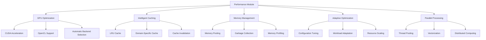

# Performance Optimization - AGENTS

## Module Overview

The `performance` module provides comprehensive optimization capabilities for active inference systems, including GPU acceleration, intelligent caching, memory management, and adaptive performance tuning.

## Performance Architecture



## GPU Optimization System

### GPUAccelerator

Hardware-accelerated computation for active inference.

**Features:**
- Automatic GPU detection and backend selection
- CUDA and OpenCL support
- Memory-efficient GPU operations
- Fallback to CPU when GPU unavailable

**Implementation:**
```python
class GPUAccelerator:
    """GPU acceleration for active inference computations."""

    def __init__(self, enable_cuda=True, enable_opencl=True,
                 memory_limit_gb=8.0):
        self.backends = {}

        # Initialize CUDA backend
        if enable_cuda and self._cuda_available():
            try:
                self.backends['cuda'] = CUDABackend(memory_limit_gb)
            except Exception as e:
                logger.warning(f"CUDA backend failed: {e}")

        # Initialize OpenCL backend
        if enable_opencl and self._opencl_available():
            try:
                self.backends['opencl'] = OpenCLBackend(memory_limit_gb)
            except Exception as e:
                logger.warning(f"OpenCL backend failed: {e}")

        # Select best available backend
        self.active_backend = self._select_best_backend()

    def _select_best_backend(self) -> str:
        """Select the best available backend."""

        if 'cuda' in self.backends:
            return 'cuda'
        elif 'opencl' in self.backends:
            return 'opencl'
        else:
            return 'cpu'

    def matrix_multiply(self, A: np.ndarray, B: np.ndarray) -> np.ndarray:
        """Accelerated matrix multiplication."""

        if self.active_backend == 'cpu':
            return np.dot(A, B)

        backend = self.backends[self.active_backend]
        return backend.matrix_multiply(A, B)

    def belief_update_gpu(self, prior_beliefs: BeliefState,
                         observation: np.ndarray,
                         model: GenerativeModel) -> BeliefState:
        """GPU-accelerated belief updating."""

        if self.active_backend == 'cpu':
            return self._cpu_belief_update(prior_beliefs, observation, model)

        backend = self.backends[self.active_backend]

        # Convert to GPU format
        gpu_prior = backend.to_gpu(prior_beliefs)
        gpu_obs = backend.to_gpu(observation)
        gpu_model = backend.to_gpu(model.parameters)

        # GPU computation
        gpu_posterior = backend.belief_update(gpu_prior, gpu_obs, gpu_model)

        # Convert back to CPU
        posterior_beliefs = backend.from_gpu(gpu_posterior)

        return posterior_beliefs

    def free_energy_computation(self, beliefs: BeliefState,
                              observation: np.ndarray,
                              model: GenerativeModel) -> float:
        """GPU-accelerated free energy computation."""

        if self.active_backend == 'cpu':
            return self._cpu_free_energy(beliefs, observation, model)

        backend = self.backends[self.active_backend]

        # GPU computation
        gpu_result = backend.free_energy_gpu(beliefs, observation, model)

        return backend.from_gpu(gpu_result)

    def get_performance_stats(self) -> Dict[str, Any]:
        """Get GPU performance statistics."""

        stats = {
            'active_backend': self.active_backend,
            'available_backends': list(self.backends.keys()),
            'memory_usage': {},
            'compute_utilization': {}
        }

        for backend_name, backend in self.backends.items():
            try:
                backend_stats = backend.get_stats()
                stats['memory_usage'][backend_name] = backend_stats.get('memory_gb', 0)
                stats['compute_utilization'][backend_name] = backend_stats.get('utilization', 0)
            except Exception:
                pass

        return stats
```

### CUDABackend

CUDA-specific GPU acceleration.

**Features:**
- cuBLAS for matrix operations
- cuDNN for neural network operations
- Memory pooling and optimization
- Asynchronous execution

### OpenCLBackend

Cross-platform GPU acceleration.

**Features:**
- Platform-independent GPU support
- Support for AMD, Intel, and NVIDIA GPUs
- CPU fallback for integrated graphics

## Intelligent Caching System

### AdaptiveCache

Domain-aware caching for active inference computations.

**Features:**
- LRU eviction policy
- Domain-specific cache keys
- Cache performance monitoring
- Intelligent invalidation

**Implementation:**
```python
class AdaptiveCache:
    """Intelligent caching system for active inference."""

    def __init__(self, max_size: int = 10000, ttl: Optional[float] = None):
        self.max_size = max_size
        self.ttl = ttl
        self.cache = OrderedDict()
        self.access_stats = {}
        self.hit_count = 0
        self.miss_count = 0

    def get(self, key: str) -> Any:
        """Retrieve item from cache."""

        # Domain-specific key generation
        cache_key = self._generate_cache_key(key)

        if cache_key in self.cache:
            # Check TTL
            if self.ttl and time.time() - self.cache[cache_key]['timestamp'] > self.ttl:
                del self.cache[cache_key]
                self.miss_count += 1
                return None

            # Update access stats
            self._update_access_stats(cache_key)

            # Move to end (most recently used)
            entry = self.cache.pop(cache_key)
            self.cache[cache_key] = entry

            self.hit_count += 1
            return entry['value']

        self.miss_count += 1
        return None

    def put(self, key: str, value: Any, metadata: Dict[str, Any] = None):
        """Store item in cache."""

        cache_key = self._generate_cache_key(key)

        # Remove existing entry if present
        if cache_key in self.cache:
            del self.cache[cache_key]

        # Add new entry
        entry = {
            'value': value,
            'timestamp': time.time(),
            'metadata': metadata or {},
            'size': self._estimate_size(value)
        }

        self.cache[cache_key] = entry

        # Enforce size limit
        while len(self.cache) > self.max_size:
            # Remove least recently used
            removed_key, _ = self.cache.popitem(last=False)
            self._cleanup_removed_entry(removed_key)

    def _generate_cache_key(self, key: str) -> str:
        """Generate domain-specific cache key."""

        # For belief states
        if isinstance(key, dict) and 'mean' in key:
            # Hash belief state parameters
            key_str = f"belief_{key['mean'].tobytes()}_{key.get('covariance', 'none')}"
            return hashlib.md5(key_str.encode()).hexdigest()

        # For observations
        elif isinstance(key, np.ndarray):
            return f"obs_{hashlib.md5(key.tobytes()).hexdigest()}"

        # For model parameters
        elif isinstance(key, GenerativeModel):
            param_hash = hashlib.md5(str(key.parameters).encode()).hexdigest()
            return f"model_{param_hash}"

        # Default string key
        else:
            return str(key)

    def get_stats(self) -> Dict[str, Any]:
        """Get cache performance statistics."""

        total_requests = self.hit_count + self.miss_count
        hit_rate = self.hit_count / total_requests if total_requests > 0 else 0

        return {
            'size': len(self.cache),
            'max_size': self.max_size,
            'hit_count': self.hit_count,
            'miss_count': self.miss_count,
            'hit_rate': hit_rate,
            'total_memory_usage': sum(
                entry['size'] for entry in self.cache.values()
            )
        }

    def clear(self):
        """Clear all cache entries."""
        self.cache.clear()
        self.access_stats.clear()
        self.hit_count = 0
        self.miss_count = 0
```

### CacheManager

Multi-level caching with different strategies.

```python
class CacheManager:
    """Multi-level cache management system."""

    def __init__(self):
        self.caches = {
            'l1': AdaptiveCache(max_size=1000, ttl=60),    # Fast, small
            'l2': AdaptiveCache(max_size=10000, ttl=300),  # Medium
            'l3': AdaptiveCache(max_size=100000, ttl=3600) # Large, persistent
        }

    def get(self, key: str, level: str = None) -> Any:
        """Get from cache with level selection."""

        if level:
            return self.caches[level].get(key)

        # Try caches in order (L1 -> L2 -> L3)
        for cache_level in ['l1', 'l2', 'l3']:
            value = self.caches[cache_level].get(key)
            if value is not None:
                # Promote to faster cache
                if cache_level in ['l2', 'l3']:
                    self.caches['l1'].put(key, value)
                return value

        return None

    def put(self, key: str, value: Any, priority: str = 'medium'):
        """Put in appropriate cache level based on priority."""

        if priority == 'high':
            # Store in all levels
            for cache in self.caches.values():
                cache.put(key, value)
        elif priority == 'medium':
            # Store in L2 and L3
            self.caches['l2'].put(key, value)
            self.caches['l3'].put(key, value)
        else:  # low
            # Store only in L3
            self.caches['l3'].put(key, value)

    def get_combined_stats(self) -> Dict[str, Any]:
        """Get combined statistics across all cache levels."""

        combined_stats = {}
        for level, cache in self.caches.items():
            stats = cache.get_stats()
            combined_stats[level] = stats

        # Overall statistics
        total_hits = sum(stats['hit_count'] for stats in combined_stats.values())
        total_misses = sum(stats['miss_count'] for stats in combined_stats.values())
        overall_hit_rate = total_hits / (total_hits + total_misses) if (total_hits + total_misses) > 0 else 0

        combined_stats['overall'] = {
            'total_hit_rate': overall_hit_rate,
            'total_memory_usage': sum(stats['total_memory_usage'] for stats in combined_stats.values())
        }

        return combined_stats
```

## Memory Management System

### MemoryPool

Efficient memory allocation and reuse.

**Features:**
- Object pooling for numpy arrays
- Memory fragmentation reduction
- Automatic cleanup and garbage collection
- Memory usage monitoring

**Implementation:**
```python
class MemoryPool:
    """Memory pool for efficient numpy array management."""

    def __init__(self, max_memory_gb: float = 4.0):
        self.max_memory_bytes = max_memory_gb * 1024**3
        self.allocated_memory = 0
        self.pool = {}  # shape -> list of available arrays
        self.lock = threading.Lock()

    def allocate(self, shape: Tuple[int, ...], dtype: np.dtype = np.float64) -> np.ndarray:
        """Allocate array from pool or create new one."""

        with self.lock:
            # Check if we have a suitable array in pool
            pool_key = (shape, dtype)
            if pool_key in self.pool and self.pool[pool_key]:
                # Reuse existing array
                array = self.pool[pool_key].pop()
                # Reset to zeros (optional, for safety)
                array.fill(0)
                return array

            # Calculate memory requirement
            element_size = np.dtype(dtype).itemsize
            total_elements = np.prod(shape)
            memory_required = element_size * total_elements

            # Check memory limit
            if self.allocated_memory + memory_required > self.max_memory_bytes:
                # Try to free some memory
                self._garbage_collect(memory_required)

                # Check again
                if self.allocated_memory + memory_required > self.max_memory_bytes:
                    raise MemoryError("Memory pool limit exceeded")

            # Allocate new array
            array = np.zeros(shape, dtype=dtype)
            self.allocated_memory += memory_required

            return array

    def deallocate(self, array: np.ndarray):
        """Return array to pool for reuse."""

        with self.lock:
            pool_key = (array.shape, array.dtype)

            if pool_key not in self.pool:
                self.pool[pool_key] = []

            # Limit pool size to prevent unbounded growth
            max_pool_size = 100
            if len(self.pool[pool_key]) < max_pool_size:
                self.pool[pool_key].append(array)
            else:
                # If pool is full, let garbage collector handle it
                pass

    def _garbage_collect(self, required_bytes: int):
        """Perform garbage collection to free memory."""

        # Remove least recently used items from pools
        bytes_freed = 0

        for pool_key in list(self.pool.keys()):
            pool_arrays = self.pool[pool_key]
            if not pool_arrays:
                continue

            # Remove half the arrays from this pool
            remove_count = max(1, len(pool_arrays) // 2)
            for _ in range(remove_count):
                if pool_arrays:
                    removed_array = pool_arrays.pop(0)
                    element_size = np.dtype(removed_array.dtype).itemsize
                    freed_bytes = element_size * np.prod(removed_array.shape)
                    bytes_freed += freed_bytes
                    self.allocated_memory -= freed_bytes

            if bytes_freed >= required_bytes:
                break

    def get_stats(self) -> Dict[str, Any]:
        """Get memory pool statistics."""

        total_pooled_arrays = sum(len(arrays) for arrays in self.pool.values())
        total_pooled_memory = sum(
            len(arrays) * np.prod(shape) * np.dtype(dtype).itemsize
            for (shape, dtype), arrays in self.pool.items()
        )

        return {
            'allocated_memory_gb': self.allocated_memory / 1024**3,
            'max_memory_gb': self.max_memory_bytes / 1024**3,
            'total_pooled_arrays': total_pooled_arrays,
            'pooled_memory_gb': total_pooled_memory / 1024**3,
            'pool_utilization': total_pooled_memory / self.allocated_memory if self.allocated_memory > 0 else 0
        }
```

## Adaptive Optimization Engine

### PerformanceOptimizer

Automatic performance tuning and optimization.

**Features:**
- Configuration optimization
- Workload adaptation
- Resource scaling decisions

**Implementation:**
```python
class PerformanceOptimizer:
    """Adaptive performance optimization engine."""

    def __init__(self):
        self.performance_history = []
        self.current_config = self._get_default_config()
        self.optimization_trials = []

    def optimize_configuration(self, workload_characteristics: Dict[str, Any]) -> Dict[str, Any]:
        """Optimize configuration based on workload."""

        # Analyze workload
        workload_analysis = self._analyze_workload(workload_characteristics)

        # Generate optimization candidates
        candidates = self._generate_optimization_candidates(workload_analysis)

        # Evaluate candidates
        best_candidate = None
        best_score = float('-inf')

        for candidate in candidates:
            # Test configuration
            test_results = self._test_configuration(candidate, workload_characteristics)

            # Score configuration
            score = self._score_configuration(test_results, workload_characteristics)

            if score > best_score:
                best_score = score
                best_candidate = candidate

        # Apply best configuration
        if best_candidate:
            self.current_config = best_candidate
            self._apply_configuration(best_candidate)

        # Record optimization trial
        trial = {
            'timestamp': time.time(),
            'workload': workload_characteristics,
            'candidates_tested': len(candidates),
            'best_candidate': best_candidate,
            'improvement_score': best_score
        }

        self.optimization_trials.append(trial)

        return best_candidate

    def _analyze_workload(self, characteristics: Dict[str, Any]) -> Dict[str, Any]:
        """Analyze workload characteristics."""

        analysis = {
            'computation_intensity': characteristics.get('flops_required', 0),
            'memory_intensity': characteristics.get('memory_required_gb', 0),
            'parallelism_available': characteristics.get('available_cores', 1),
            'real_time_constraints': characteristics.get('max_latency_ms', None),
            'data_locality': characteristics.get('data_reuse_factor', 1.0)
        }

        # Classify workload type
        if analysis['computation_intensity'] > 1e9:  # 1 GFLOP
            analysis['workload_type'] = 'compute_intensive'
        elif analysis['memory_intensity'] > 8:  # 8GB
            analysis['workload_type'] = 'memory_intensive'
        elif analysis['real_time_constraints'] and analysis['real_time_constraints'] < 100:
            analysis['workload_type'] = 'latency_critical'
        else:
            analysis['workload_type'] = 'balanced'

        return analysis

    def _generate_optimization_candidates(self, analysis: Dict[str, Any]) -> List[Dict[str, Any]]:
        """Generate optimization candidates."""

        candidates = []

        # GPU acceleration candidate
        if analysis['computation_intensity'] > 1e8:
            candidates.append({
                'gpu_acceleration': True,
                'batch_size': 64,
                'parallel_workers': analysis['parallelism_available'],
                'cache_size': 10000
            })

        # Memory optimization candidate
        if analysis['memory_intensity'] > 4:
            candidates.append({
                'memory_pooling': True,
                'cache_size': 5000,
                'batch_size': 32,
                'parallel_workers': min(4, analysis['parallelism_available'])
            })

        # Latency optimization candidate
        if analysis['real_time_constraints']:
            candidates.append({
                'low_latency_mode': True,
                'cache_size': 1000,
                'batch_size': 1,
                'parallel_workers': 1
            })

        # Balanced configuration
        candidates.append({
            'balanced_mode': True,
            'batch_size': 16,
            'cache_size': 5000,
            'parallel_workers': min(8, analysis['parallelism_available'])
        })

        return candidates

    def _test_configuration(self, config: Dict[str, Any],
                           workload: Dict[str, Any]) -> Dict[str, Any]:
        """Test a configuration candidate."""

        # Simulate configuration performance
        # In practice, this would run actual benchmarks
        test_results = {
            'latency_ms': self._estimate_latency(config, workload),
            'throughput_items_per_sec': self._estimate_throughput(config, workload),
            'memory_usage_gb': self._estimate_memory_usage(config, workload),
            'cpu_utilization': self._estimate_cpu_utilization(config, workload)
        }

        return test_results

    def _score_configuration(self, results: Dict[str, Any],
                           workload: Dict[str, Any]) -> float:
        """Score configuration based on workload requirements."""

        score = 0

        # Latency scoring
        if 'max_latency_ms' in workload:
            latency_penalty = max(0, results['latency_ms'] - workload['max_latency_ms'])
            score -= latency_penalty * 0.1

        # Throughput scoring
        if 'min_throughput' in workload:
            throughput_bonus = max(0, results['throughput_items_per_sec'] - workload['min_throughput'])
            score += throughput_bonus * 0.01

        # Memory scoring
        if 'max_memory_gb' in workload:
            memory_penalty = max(0, results['memory_usage_gb'] - workload['max_memory_gb'])
            score -= memory_penalty * 10

        # CPU efficiency scoring
        cpu_efficiency = 1.0 - (results['cpu_utilization'] - 0.7) ** 2  # Optimal around 70%
        score += cpu_efficiency * 50

        return score

    def get_optimization_history(self) -> List[Dict[str, Any]]:
        """Get history of optimization trials."""
        return self.optimization_trials.copy()
```

## Parallel Processing System

### ParallelProcessor

Multi-threaded and distributed processing capabilities.

**Features:**
- Thread pool management
- Vectorized operations
- Distributed computation support

**Implementation:**
```python
class ParallelProcessor:
    """Parallel processing for active inference computations."""

    def __init__(self, max_workers: int = None):
        self.max_workers = max_workers or min(8, mp.cpu_count())
        self.executor = ThreadPoolExecutor(max_workers=self.max_workers)

    def parallel_belief_updates(self, belief_sets: List[BeliefState],
                              observations: List[np.ndarray],
                              model: GenerativeModel) -> List[BeliefState]:
        """Parallel belief updates for multiple agents."""

        def update_single_belief(args):
            beliefs, obs = args
            return self.inference.update_beliefs(beliefs, obs, model)

        # Prepare arguments
        args_list = list(zip(belief_sets, observations))

        # Execute in parallel
        futures = [self.executor.submit(update_single_belief, args) for args in args_list]
        results = [future.result() for future in as_completed(futures)]

        return results

    def parallel_free_energy_computation(self, belief_sets: List[BeliefState],
                                       observations: List[np.ndarray],
                                       policies: List[np.ndarray],
                                       model: GenerativeModel) -> List[float]:
        """Parallel free energy computation."""

        def compute_single_free_energy(args):
            beliefs, obs, policy = args
            return self.planning.compute_expected_free_energy(beliefs, policy, model)

        args_list = list(zip(belief_sets, observations, policies))

        futures = [self.executor.submit(compute_single_free_energy, args) for args in args_list]
        results = [future.result() for future in as_completed(futures)]

        return results

    def vectorized_matrix_operations(self, matrices_a: List[np.ndarray],
                                   matrices_b: List[np.ndarray]) -> List[np.ndarray]:
        """Vectorized matrix operations."""

        # Use numpy vectorized operations
        results = []
        for a, b in zip(matrices_a, matrices_b):
            result = np.dot(a, b)  # Vectorized dot product
            results.append(result)

        return results

    def get_parallel_stats(self) -> Dict[str, Any]:
        """Get parallel processing statistics."""

        return {
            'max_workers': self.max_workers,
            'active_threads': threading.active_count(),
            'cpu_count': mp.cpu_count(),
            'executor_info': str(self.executor)
        }
```

## Performance Monitoring and Profiling

### PerformanceMonitor

Real-time performance monitoring and profiling.

```python
class PerformanceMonitor:
    """Real-time performance monitoring."""

    def __init__(self):
        self.metrics = {}
        self.profiles = {}
        self.alerts = []

    def start_monitoring(self, component_name: str):
        """Start monitoring a component."""

        self.metrics[component_name] = {
            'start_time': time.time(),
            'operation_count': 0,
            'total_time': 0.0,
            'memory_usage': [],
            'cpu_usage': []
        }

    def record_operation(self, component_name: str, operation_time: float):
        """Record operation performance."""

        if component_name in self.metrics:
            metrics = self.metrics[component_name]
            metrics['operation_count'] += 1
            metrics['total_time'] += operation_time

            # Record memory and CPU
            metrics['memory_usage'].append(self._get_memory_usage())
            metrics['cpu_usage'].append(self._get_cpu_usage())

    def get_performance_report(self, component_name: str = None) -> Dict[str, Any]:
        """Generate performance report."""

        if component_name:
            return self._generate_component_report(component_name)
        else:
            return {name: self._generate_component_report(name)
                   for name in self.metrics.keys()}

    def _generate_component_report(self, component_name: str) -> Dict[str, Any]:
        """Generate report for single component."""

        metrics = self.metrics[component_name]
        runtime = time.time() - metrics['start_time']

        return {
            'runtime_seconds': runtime,
            'operations_per_second': metrics['operation_count'] / runtime if runtime > 0 else 0,
            'average_operation_time': metrics['total_time'] / metrics['operation_count'] if metrics['operation_count'] > 0 else 0,
            'peak_memory_usage': max(metrics['memory_usage']) if metrics['memory_usage'] else 0,
            'average_cpu_usage': np.mean(metrics['cpu_usage']) if metrics['cpu_usage'] else 0,
            'total_operations': metrics['operation_count']
        }
```

## Integration and Usage

### OptimizedActiveInferenceAgent

Performance-optimized active inference agent.

```python
class OptimizedActiveInferenceAgent(ActiveInferenceAgent):
    """Performance-optimized active inference agent."""

    def __init__(self, *args, **kwargs):
        super().__init__(*args, **kwargs)

        # Initialize optimization components
        self.gpu_accelerator = GPUAccelerator()
        self.cache_manager = CacheManager()
        self.memory_pool = MemoryPool()
        self.parallel_processor = ParallelProcessor()
        self.performance_monitor = PerformanceMonitor()

        # Start monitoring
        self.performance_monitor.start_monitoring('agent')

    def act(self, observation):
        """Optimized action selection."""

        start_time = time.time()

        # Try cache first
        cache_key = f"action_{hash(observation.tobytes()):x}"
        cached_action = self.cache_manager.get(cache_key)

        if cached_action is not None:
            self.performance_monitor.record_operation('agent', time.time() - start_time)
            return cached_action

        # GPU-accelerated inference
        beliefs = self.gpu_accelerator.belief_update_gpu(
            self.beliefs, observation, self.generative_model
        )

        # Parallel planning
        action = self.parallel_processor.parallel_planning(
            beliefs, self.generative_model, self.planning_horizon
        )

        # Cache result
        self.cache_manager.put(cache_key, action)

        # Record performance
        operation_time = time.time() - start_time
        self.performance_monitor.record_operation('agent', operation_time)

        return action

    def get_performance_stats(self) -> Dict[str, Any]:
        """Get comprehensive performance statistics."""

        return {
            'gpu_stats': self.gpu_accelerator.get_performance_stats(),
            'cache_stats': self.cache_manager.get_combined_stats(),
            'memory_stats': self.memory_pool.get_stats(),
            'parallel_stats': self.parallel_processor.get_parallel_stats(),
            'performance_report': self.performance_monitor.get_performance_report('agent')
        }
```

## Performance Benchmarks

### Benchmark Suite

```python
def run_performance_benchmarks():
    """Run comprehensive performance benchmarks."""

    benchmarks = {
        'single_agent_inference': benchmark_single_agent_inference(),
        'parallel_agent_inference': benchmark_parallel_agents(),
        'gpu_acceleration': benchmark_gpu_performance(),
        'cache_effectiveness': benchmark_cache_performance(),
        'memory_efficiency': benchmark_memory_usage()
    }

    return benchmarks

def benchmark_single_agent_inference():
    """Benchmark single agent inference performance."""

    agent = OptimizedActiveInferenceAgent(state_dim=32, obs_dim=64, action_dim=4)

    observations = [np.random.randn(64) for _ in range(1000)]

    start_time = time.time()
    for obs in observations:
        action = agent.act(obs)
    total_time = time.time() - start_time

    return {
        'total_time': total_time,
        'observations_processed': len(observations),
        'throughput_obs_per_sec': len(observations) / total_time,
        'avg_latency_ms': (total_time / len(observations)) * 1000
    }
```

## Future Optimizations

### Advanced GPU Features
- **Multi-GPU Support**: Distributed GPU processing
- **GPU Memory Pooling**: Efficient GPU memory management
- **Mixed Precision**: FP16/FP32 optimization
- **Tensor Cores**: Specialized matrix operations

### Distributed Computing
- **Kubernetes Integration**: Container orchestration
- **Ray Framework**: Distributed computing support
- **Model Parallelism**: Large model distribution
- **Data Parallelism**: Batch processing optimization

### Research Optimizations
- **Quantum Acceleration**: Quantum computing integration
- **Neuromorphic Hardware**: Brain-inspired computing
- **Edge Optimization**: Resource-constrained deployment
- **Real-time Adaptation**: Online performance tuning

