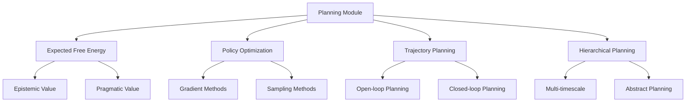

# Planning and Decision Making - AGENTS

## Module Overview

The `planning` module implements algorithms for planning actions to minimize expected free energy, enabling active inference agents to make optimal decisions in complex environments.

## Planning Architecture



## Core Planning Interface

### ActivePlanner Protocol

Standard interface for all planning algorithms:

```python
class ActivePlanner(ABC):
    """Abstract base class for active inference planning."""

    @abstractmethod
    def plan_action(self,
                   beliefs: BeliefState,
                   model: GenerativeModel,
                   horizon: int) -> np.ndarray:
        """Plan optimal action given beliefs and model."""
        pass

    @abstractmethod
    def compute_expected_free_energy(self,
                                   beliefs: BeliefState,
                                   policy: np.ndarray,
                                   model: GenerativeModel) -> float:
        """Compute expected free energy of a policy."""
        pass

    def get_planning_stats(self) -> Dict[str, Any]:
        """Get planning performance statistics."""
        return {}
```

## Expected Free Energy Minimization

### Core Algorithm

Planning by minimizing expected free energy over future trajectories.

**Mathematical Foundation:**
```
Expected Free Energy: G(π) = E_{p(o, s|π)}[log p(o, s|π) - log q(s|o)]

G(π) = E_{p(o,s|π)}[log p(o|s) + log p(s) + log p(s'|s,a) - log q(s|o)]
     = Accuracy - Complexity + Epistemic Value - Pragmatic Value

Minimize: G(π) over policies π
```

**Implementation:**
```python
class ExpectedFreeEnergyPlanner(ActivePlanner):
    """Planning by minimizing expected free energy."""

    def __init__(self,
                 horizon: int = 5,
                 num_trajectories: int = 100,
                 optimization_method: str = 'gradient'):
        self.horizon = horizon
        self.num_trajectories = num_trajectories
        self.optimization_method = optimization_method

    def plan_action(self, beliefs, model, horizon=None):
        """Plan action by minimizing expected free energy."""

        if horizon is None:
            horizon = self.horizon

        # Sample candidate action sequences
        candidate_policies = self._sample_policies(beliefs, horizon)

        # Evaluate expected free energy for each policy
        free_energies = []
        for policy in candidate_policies:
            g = self.compute_expected_free_energy(beliefs, policy, model)
            free_energies.append(g)

        # Select policy with minimum expected free energy
        best_policy_idx = np.argmin(free_energies)
        best_policy = candidate_policies[best_policy_idx]

        # Return first action of best policy
        return best_policy[0]

    def compute_expected_free_energy(self, beliefs, policy, model):
        """Compute expected free energy of a policy."""

        g_total = 0

        # Current state belief
        current_beliefs = beliefs

        for t, action in enumerate(policy):
            # Expected accuracy (negative log likelihood)
            accuracy = self._compute_expected_accuracy(
                current_beliefs, action, model
            )

            # Expected complexity (KL divergence)
            complexity = self._compute_expected_complexity(
                current_beliefs, action, model
            )

            # Epistemic affordance (information gain)
            epistemic = self._compute_epistemic_value(
                current_beliefs, action, model
            )

            # Pragmatic affordance (goal achievement)
            pragmatic = self._compute_pragmatic_value(
                current_beliefs, action, model
            )

            # Update beliefs for next timestep
            current_beliefs = self._predict_beliefs(
                current_beliefs, action, model
            )

            # Accumulate free energy components
            g_total += accuracy - complexity + epistemic - pragmatic

        return g_total
```

## Policy Optimization Methods

### Gradient-Based Optimization

```python
class GradientPolicyOptimizer(ActivePlanner):
    """Gradient-based policy optimization."""

    def plan_action(self, beliefs, model, horizon):
        """Optimize policy using gradients."""

        # Initialize policy parameters
        policy_params = self._initialize_policy_params(horizon)

        for iteration in range(self.max_iterations):
            # Compute expected free energy and gradients
            g, gradients = self._compute_free_energy_and_gradients(
                policy_params, beliefs, model
            )

            # Update policy parameters
            policy_params = self._update_policy_params(
                policy_params, gradients, self.learning_rate
            )

            # Check convergence
            if self._check_convergence(g, gradients):
                break

        # Extract optimal action
        optimal_policy = self._policy_params_to_actions(policy_params)
        return optimal_policy[0]
```

### Sampling-Based Planning

```python
class SamplingPlanner(ActivePlanner):
    """Sampling-based planning methods."""

    def __init__(self, num_samples=1000, selection_method='best'):
        self.num_samples = num_samples
        self.selection_method = selection_method

    def plan_action(self, beliefs, model, horizon):
        """Plan using sampling methods."""

        if self.selection_method == 'best':
            return self._best_first_search(beliefs, model, horizon)
        elif self.selection_method == 'random':
            return self._random_search(beliefs, model, horizon)
        elif self.selection_method == 'mcts':
            return self._monte_carlo_tree_search(beliefs, model, horizon)

    def _best_first_search(self, beliefs, model, horizon):
        """Best-first search over action sequences."""

        # Priority queue for action sequences
        queue = PriorityQueue()
        initial_sequence = []
        initial_g = 0
        queue.put((initial_g, initial_sequence))

        best_action = None
        best_score = float('inf')

        while not queue.empty() and len(queue.queue[0][1]) < horizon:
            current_g, current_sequence = queue.get()

            if len(current_sequence) == horizon:
                # Complete sequence
                if current_g < best_score:
                    best_score = current_g
                    best_action = current_sequence[0]
                continue

            # Expand sequence
            for action in self._get_candidate_actions():
                new_sequence = current_sequence + [action]
                new_g = self._evaluate_sequence(new_sequence, beliefs, model)

                if new_g < best_score:  # Pruning
                    queue.put((new_g, new_sequence))

        return best_action
```

## Trajectory Optimization

### Model Predictive Control

```python
class ModelPredictiveController(ActivePlanner):
    """Model predictive control for active inference."""

    def __init__(self, horizon=10, num_candidates=50):
        self.horizon = horizon
        self.num_candidates = num_candidates

    def plan_action(self, beliefs, model, horizon=None):
        """MPC-style planning."""

        # Generate candidate action sequences
        candidates = [
            self._sample_action_sequence(horizon or self.horizon)
            for _ in range(self.num_candidates)
        ]

        # Evaluate candidates
        scores = [
            self._evaluate_trajectory(candidate, beliefs, model)
            for candidate in candidates
        ]

        # Select best candidate
        best_idx = np.argmin(scores)
        best_trajectory = candidates[best_idx]

        return best_trajectory[0]  # Return first action
```

### Cross-Entropy Method

```python
class CrossEntropyPlanner(ActivePlanner):
    """Cross-entropy method for trajectory optimization."""

    def __init__(self, population_size=100, elite_fraction=0.1, num_iterations=10):
        self.population_size = population_size
        self.elite_fraction = elite_fraction
        self.num_iterations = num_iterations

    def plan_action(self, beliefs, model, horizon):
        """Plan using cross-entropy method."""

        # Initialize action distribution
        action_dist = self._initialize_action_distribution(horizon)

        for iteration in range(self.num_iterations):
            # Sample action trajectories
            trajectories = [
                self._sample_trajectory(action_dist)
                for _ in range(self.population_size)
            ]

            # Evaluate trajectories
            scores = [
                self._evaluate_trajectory(traj, beliefs, model)
                for traj in trajectories
            ]

            # Select elite trajectories
            elite_indices = np.argsort(scores)[:int(self.elite_fraction * self.population_size)]
            elite_trajectories = [trajectories[i] for i in elite_indices]

            # Update action distribution
            action_dist = self._update_distribution(action_dist, elite_trajectories)

        # Sample final action from optimized distribution
        final_trajectory = self._sample_trajectory(action_dist)
        return final_trajectory[0]
```

## Hierarchical Planning

### Multi-Timescale Planning

```python
class HierarchicalPlanner(ActivePlanner):
    """Hierarchical planning across multiple timescales."""

    def __init__(self, levels=['low', 'mid', 'high'], timescales=[1, 5, 15]):
        self.levels = levels
        self.timescales = timescales
        self.planners = {}

        # Create planner for each level
        for level in levels:
            self.planners[level] = ExpectedFreeEnergyPlanner(
                horizon=timescales[levels.index(level)]
            )

    def plan_action(self, beliefs, model, horizon):
        """Hierarchical planning across timescales."""

        # High-level planning (strategic)
        if self._should_replan('high'):
            self.high_level_plan = self.planners['high'].plan_action(
                beliefs, model, self.timescales[2]
            )

        # Mid-level planning (tactical)
        if self._should_replan('mid'):
            self.mid_level_plan = self.planners['mid'].plan_action(
                beliefs, model, self.timescales[1]
            )

        # Low-level planning (immediate action)
        action = self.planners['low'].plan_action(
            beliefs, model, self.timescales[0]
        )

        return action

    def _should_replan(self, level):
        """Determine if level should replan."""
        # Implementation of replanning logic
        pass
```

### Abstract Planning

```python
class AbstractPlanner(ActivePlanner):
    """Planning with abstract state representations."""

    def __init__(self, abstraction_levels=3):
        self.abstraction_levels = abstraction_levels
        self.abstract_models = {}

        # Create abstract models for each level
        for level in range(abstraction_levels):
            self.abstract_models[level] = self._create_abstract_model(level)

    def plan_action(self, beliefs, model, horizon):
        """Plan using abstract representations."""

        # Convert beliefs to abstract representation
        abstract_beliefs = self._abstract_beliefs(beliefs, self.abstraction_levels - 1)

        # Plan in abstract space
        abstract_plan = self._plan_abstract(abstract_beliefs, horizon)

        # Convert abstract plan to concrete actions
        concrete_actions = self._concretize_plan(abstract_plan)

        return concrete_actions[0]
```

## Performance Optimization

### Caching and Memoization

```python
class CachedPlanner(ActivePlanner):
    """Planning with intelligent caching."""

    def __init__(self, base_planner, cache_size=10000):
        self.base_planner = base_planner
        self.cache = LRUCache(cache_size)

    def plan_action(self, beliefs, model, horizon):
        """Plan with caching."""

        # Create cache key
        cache_key = self._create_cache_key(beliefs, model, horizon)

        # Check cache
        if cache_key in self.cache:
            return self.cache[cache_key]

        # Compute plan
        action = self.base_planner.plan_action(beliefs, model, horizon)

        # Cache result
        self.cache[cache_key] = action

        return action

    def _create_cache_key(self, beliefs, model, horizon):
        """Create deterministic cache key."""
        key_components = [
            beliefs.mean.tobytes(),
            str(model.parameters),
            str(horizon)
        ]
        return hashlib.md5(str(key_components).encode()).hexdigest()
```

### Parallel Planning

```python
class ParallelPlanner(ActivePlanner):
    """Parallel planning for multiple trajectories."""

    def __init__(self, base_planner, num_workers=None):
        self.base_planner = base_planner
        self.num_workers = num_workers or mp.cpu_count()

    def plan_action(self, beliefs, model, horizon):
        """Parallel trajectory evaluation."""

        # Generate candidate policies
        candidate_policies = [
            self._sample_policy(horizon)
            for _ in range(self.num_trajectories)
        ]

        # Evaluate policies in parallel
        with ThreadPoolExecutor(max_workers=self.num_workers) as executor:
            futures = [
                executor.submit(
                    self.base_planner.compute_expected_free_energy,
                    beliefs, policy, model
                )
                for policy in candidate_policies
            ]

            free_energies = [future.result() for future in as_completed(futures)]

        # Select best policy
        best_idx = np.argmin(free_energies)
        best_policy = candidate_policies[best_idx]

        return best_policy[0]
```

## Research Extensions

### Meta-Learning for Planning

```python
class MetaPlanner(ActivePlanner):
    """Meta-learning enhanced planning."""

    def __init__(self, base_planner, meta_learning_rate=0.001):
        self.base_planner = base_planner
        self.meta_learning_rate = meta_learning_rate
        self.planning_experience = []

    def plan_action(self, beliefs, model, horizon):
        """Meta-learning enhanced planning."""

        # Standard planning
        action = self.base_planner.plan_action(beliefs, model, horizon)

        # Meta-learning update
        self._update_meta_knowledge(beliefs, model, action, horizon)

        return action

    def _update_meta_knowledge(self, beliefs, model, action, horizon):
        """Update meta-learning knowledge."""
        # Store planning experience
        experience = {
            'beliefs': beliefs,
            'model_complexity': self._estimate_model_complexity(model),
            'horizon': horizon,
            'chosen_action': action,
            'outcome': 'to_be_determined'  # Updated later
        }

        self.planning_experience.append(experience)

        # Meta-learning update
        if len(self.planning_experience) >= self.meta_batch_size:
            self._meta_learning_update()
```

### Risk-Sensitive Planning

```python
class RiskSensitivePlanner(ActivePlanner):
    """Risk-sensitive planning with uncertainty awareness."""

    def __init__(self, base_planner, risk_sensitivity=1.0):
        self.base_planner = base_planner
        self.risk_sensitivity = risk_sensitivity

    def compute_expected_free_energy(self, beliefs, policy, model):
        """Risk-sensitive expected free energy."""

        # Standard expected free energy
        standard_g = self.base_planner.compute_expected_free_energy(
            beliefs, policy, model
        )

        # Risk adjustment based on uncertainty
        risk_penalty = self._compute_risk_penalty(beliefs, policy, model)

        return standard_g + self.risk_sensitivity * risk_penalty

    def _compute_risk_penalty(self, beliefs, policy, model):
        """Compute risk penalty based on uncertainty."""
        # Implementation of risk-sensitive adjustments
        pass
```

## Testing and Validation

### Planning Quality Metrics

```python
class PlanningValidator:
    """Validate planning algorithm quality."""

    def validate_planning_quality(self, planner, test_scenarios):
        """Validate planning quality."""

        results = []

        for scenario in test_scenarios:
            beliefs, model, optimal_action = scenario

            # Plan action
            planned_action = planner.plan_action(beliefs, model, horizon=5)

            # Compute quality metrics
            optimality_gap = self._compute_optimality_gap(
                planned_action, optimal_action
            )

            planning_time = self._measure_planning_time(
                planner, beliefs, model
            )

            results.append({
                'optimality_gap': optimality_gap,
                'planning_time': planning_time,
                'within_bounds': optimality_gap < self.acceptable_gap
            })

        return results

    def _compute_optimality_gap(self, planned, optimal):
        """Compute gap between planned and optimal actions."""
        return np.linalg.norm(planned - optimal)
```

### Benchmarking Suite

```python
class PlanningBenchmarker:
    """Benchmark planning algorithm performance."""

    def benchmark_planning(self, planners, benchmark_environments):
        """Comprehensive planning benchmark."""

        results = {}

        for planner_name, planner in planners.items():
            planner_results = {}

            for env_name, environment in benchmark_environments.items():
                # Run planning episodes
                episode_results = []

                for episode in range(self.num_episodes):
                    obs = environment.reset()
                    episode_reward = 0
                    planning_times = []

                    for step in range(self.max_steps):
                        start_time = time.time()

                        # Plan action
                        action = planner.plan_action(
                            self._obs_to_beliefs(obs),
                            environment.model,
                            horizon=5
                        )

                        planning_time = time.time() - start_time
                        planning_times.append(planning_time)

                        # Execute action
                        obs, reward, done, info = environment.step(action)
                        episode_reward += reward

                        if done:
                            break

                    episode_results.append({
                        'reward': episode_reward,
                        'avg_planning_time': np.mean(planning_times),
                        'total_planning_time': sum(planning_times)
                    })

                planner_results[env_name] = episode_results

            results[planner_name] = planner_results

        return results
```

## Configuration and Tuning

### Adaptive Planning Selection

```python
class AdaptivePlanningSelector:
    """Select optimal planning method based on problem characteristics."""

    def select_planning_method(self, problem_characteristics):
        """Select appropriate planning method."""

        horizon = problem_characteristics['planning_horizon']
        state_dim = problem_characteristics['state_dimension']
        real_time = problem_characteristics['real_time_constraint']

        if real_time and horizon <= 3:
            return ExpectedFreeEnergyPlanner(horizon=3, num_trajectories=10)
        elif state_dim > 100:
            return SamplingPlanner(num_samples=100, selection_method='mcts')
        elif horizon > 20:
            return HierarchicalPlanner()
        else:
            return ExpectedFreeEnergyPlanner(horizon=horizon, num_trajectories=50)
```

## Integration Examples

### Active Inference Agent Integration

```python
class ActiveInferenceAgent:
    """Active inference agent with pluggable planning."""

    def __init__(self, planning_method='expected_free_energy', **kwargs):
        if planning_method == 'expected_free_energy':
            self.planner = ExpectedFreeEnergyPlanner(**kwargs)
        elif planning_method == 'sampling':
            self.planner = SamplingPlanner(**kwargs)
        elif planning_method == 'hierarchical':
            self.planner = HierarchicalPlanner(**kwargs)

    def act(self, observation):
        """Act using active inference planning."""

        # Update beliefs
        self.beliefs = self.inference.update_beliefs(
            self.beliefs, observation, self.generative_model
        )

        # Plan action
        action = self.planner.plan_action(
            self.beliefs, self.generative_model, self.planning_horizon
        )

        return action
```

### Research Experiment Setup

```python
def setup_planning_comparison(planning_methods, test_environments):
    """Setup planning method comparison experiment."""

    results = {}

    for method_name, method_config in planning_methods.items():
        # Create planner
        planner = method_config['class'](**method_config['params'])

        method_results = {}

        for env_name, environment in test_environments.items():
            # Create agent with planner
            agent = ActiveInferenceAgent(planning_method=method_name)

            # Run experiment
            env_results = run_planning_experiment(agent, environment)

            method_results[env_name] = env_results

        results[method_name] = method_results

    return results

# Example usage
planning_methods = {
    'efe': {
        'class': ExpectedFreeEnergyPlanner,
        'params': {'horizon': 5, 'num_trajectories': 100}
    },
    'sampling': {
        'class': SamplingPlanner,
        'params': {'num_samples': 1000, 'selection_method': 'mcts'}
    },
    'hierarchical': {
        'class': HierarchicalPlanner,
        'params': {'levels': ['low', 'mid'], 'timescales': [1, 5]}
    }
}
```

