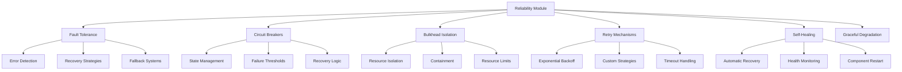

# Reliability & Fault Tolerance - AGENTS

## Module Overview

The `reliability` module provides enterprise-grade fault tolerance, error recovery, and system resilience capabilities for active inference systems, ensuring robust operation under adverse conditions.

## Reliability Architecture



## Fault Tolerance System

### FaultTolerantSystem

Comprehensive fault tolerance orchestration.

**Features:**
- Circuit breaker pattern implementation
- Bulkhead isolation for resource protection
- Retry mechanisms with exponential backoff
- Self-healing capabilities
- Health monitoring and alerting

**Implementation:**
```python
class FaultTolerantSystem:
    """Enterprise-grade fault tolerance system."""

    def __init__(self):
        self.circuit_breakers = {}
        self.bulkheads = {}
        self.retry_manager = RetryManager()
        self.health_monitor = HealthMonitor()
        self.self_healing = SelfHealingSystem()
        self.logger = get_logger("fault_tolerance")

    def create_circuit_breaker(self, name: str, config: CircuitBreakerConfig) -> CircuitBreaker:
        """Create a circuit breaker with specified configuration."""

        circuit_breaker = CircuitBreaker(name, config)
        self.circuit_breakers[name] = circuit_breaker

        # Register with health monitor
        self.health_monitor.register_component(
            f"circuit_breaker_{name}",
            lambda: circuit_breaker.get_health_status()
        )

        return circuit_breaker

    def create_bulkhead(self, name: str, max_concurrent: int,
                       queue_size: int, timeout: float) -> BulkheadIsolation:
        """Create bulkhead isolation for resource protection."""

        bulkhead = BulkheadIsolation(name, max_concurrent, queue_size, timeout)
        self.bulkheads[name] = bulkhead

        return bulkhead

    def execute_with_protection(self, func: Callable, **protection_kwargs) -> Any:
        """Execute function with comprehensive fault tolerance."""

        circuit_breaker_name = protection_kwargs.get('circuit_breaker_name')
        bulkhead_name = protection_kwargs.get('bulkhead_name')
        retry_config = protection_kwargs.get('retry_config')

        # Get protection components
        circuit_breaker = self.circuit_breakers.get(circuit_breaker_name)
        bulkhead = self.bulkheads.get(bulkhead_name)

        # Execute with protection
        return self._execute_protected(
            func, circuit_breaker, bulkhead, retry_config
        )

    def _execute_protected(self, func: Callable,
                          circuit_breaker: Optional[CircuitBreaker],
                          bulkhead: Optional[BulkheadIsolation],
                          retry_config: Optional[RetryConfig]) -> Any:
        """Execute function with all protection mechanisms."""

        # Circuit breaker protection
        if circuit_breaker:
            return circuit_breaker.call(
                lambda: self._execute_with_bulkhead_retry(
                    func, bulkhead, retry_config
                )
            )

        # Bulkhead and retry protection
        return self._execute_with_bulkhead_retry(func, bulkhead, retry_config)

    def _execute_with_bulkhead_retry(self, func: Callable,
                                    bulkhead: Optional[BulkheadIsolation],
                                    retry_config: Optional[RetryConfig]) -> Any:
        """Execute with bulkhead and retry protection."""

        protected_func = func

        # Add bulkhead protection
        if bulkhead:
            protected_func = lambda: bulkhead.execute(func)

        # Add retry protection
        if retry_config:
            protected_func = lambda: self.retry_manager.retry(protected_func, retry_config)

        return protected_func()

    def get_system_health(self) -> Dict[str, Any]:
        """Get comprehensive system health status."""

        return {
            'circuit_breakers': {
                name: cb.get_health_status()
                for name, cb in self.circuit_breakers.items()
            },
            'bulkheads': {
                name: bh.get_health_status()
                for name, bh in self.bulkheads.items()
            },
            'retry_stats': self.retry_manager.get_retry_statistics(),
            'overall_health': self._calculate_overall_health(),
            'timestamp': time.time()
        }

    def _calculate_overall_health(self) -> str:
        """Calculate overall system health."""

        # Check if any critical components are failed
        critical_failures = []

        for cb in self.circuit_breakers.values():
            if cb.state == CircuitBreakerState.OPEN:
                critical_failures.append(f"circuit_breaker_{cb.name}")

        for bh in self.bulkheads.values():
            status = bh.get_health_status()
            if status.get('failure_rate', 0) > 0.5:  # 50% failure rate
                critical_failures.append(f"bulkhead_{bh.name}")

        if critical_failures:
            return 'critical'
        elif any(cb.state == CircuitBreakerState.HALF_OPEN
                for cb in self.circuit_breakers.values()):
            return 'degraded'
        else:
            return 'healthy'

    def start_self_healing(self, check_interval: float = 60.0):
        """Start self-healing monitoring."""

        def healing_check():
            while True:
                try:
                    self._perform_self_healing_check()
                except Exception as e:
                    self.logger.error(f"Self-healing check failed: {e}")

                time.sleep(check_interval)

        healing_thread = threading.Thread(target=healing_check, daemon=True)
        healing_thread.start()

        self.logger.info(f"Self-healing started with {check_interval}s check interval")

    def _perform_self_healing_check(self):
        """Perform self-healing health checks."""

        system_health = self.get_system_health()

        # Attempt recovery for failed components
        for cb_name, cb_status in system_health['circuit_breakers'].items():
            if cb_status['state'] == 'open':
                self._attempt_circuit_breaker_recovery(cb_name)

        for bh_name, bh_status in system_health['bulkheads'].items():
            if bh_status.get('failure_rate', 0) > 0.1:  # 10% failure rate
                self._attempt_bulkhead_recovery(bh_name)

    def _attempt_circuit_breaker_recovery(self, cb_name: str):
        """Attempt to recover a failed circuit breaker."""

        if cb_name in self.circuit_breakers:
            circuit_breaker = self.circuit_breakers[cb_name]

            # Try a test call
            try:
                # Perform a lightweight health check
                test_result = self._perform_health_check(circuit_breaker.name)

                if test_result.get('healthy', False):
                    circuit_breaker.attempt_reset()
                    self.logger.info(f"Circuit breaker {cb_name} recovered")

            except Exception as e:
                self.logger.debug(f"Circuit breaker {cb_name} recovery failed: {e}")

    def _attempt_bulkhead_recovery(self, bh_name: str):
        """Attempt to recover a failed bulkhead."""

        if bh_name in self.bulkheads:
            bulkhead = self.bulkheads[bh_name]

            # Reset bulkhead statistics
            bulkhead.reset_stats()
            self.logger.info(f"Bulkhead {bh_name} statistics reset for recovery")

    def _perform_health_check(self, component_name: str) -> Dict[str, Any]:
        """Perform a health check on a component."""

        # Default health check - override for specific components
        return {'healthy': True, 'response_time': 0.001}
```

## Circuit Breaker Pattern

### CircuitBreaker

Implements the circuit breaker pattern for fault tolerance.

**States:**
- **CLOSED**: Normal operation, requests pass through
- **OPEN**: Failure threshold exceeded, requests fail fast
- **HALF_OPEN**: Testing recovery, limited requests allowed

**Implementation:**
```python
class CircuitBreaker:
    """Circuit breaker implementation with state management."""

    def __init__(self, name: str, config: CircuitBreakerConfig):
        self.name = name
        self.config = config
        self.state = CircuitBreakerState.CLOSED
        self.failure_count = 0
        self.success_count = 0
        self.last_failure_time = None
        self.next_attempt_time = None
        self.lock = threading.Lock()

    def call(self, func: Callable) -> Any:
        """Execute function through circuit breaker."""

        with self.lock:
            if self.state == CircuitBreakerState.OPEN:
                if self._should_attempt_reset():
                    self.state = CircuitBreakerState.HALF_OPEN
                    self.logger.info(f"Circuit breaker {self.name} attempting reset")
                else:
                    raise CircuitBreakerOpenException(
                        f"Circuit breaker {self.name} is OPEN"
                    )

            try:
                result = func()
                self._record_success()
                return result

            except Exception as e:
                self._record_failure()
                raise e

    def _record_success(self):
        """Record successful operation."""

        self.success_count += 1

        if self.state == CircuitBreakerState.HALF_OPEN:
            # Successful call in half-open state - reset to closed
            self.state = CircuitBreakerState.CLOSED
            self.failure_count = 0
            self.logger.info(f"Circuit breaker {self.name} reset to CLOSED")

    def _record_failure(self):
        """Record failed operation."""

        self.failure_count += 1
        self.last_failure_time = time.time()

        if self.state == CircuitBreakerState.HALF_OPEN:
            # Failed call in half-open state - back to open
            self.state = CircuitBreakerState.OPEN
            self._schedule_next_attempt()
            self.logger.warning(f"Circuit breaker {self.name} back to OPEN")

        elif (self.state == CircuitBreakerState.CLOSED and
              self.failure_count >= self.config.failure_threshold):
            # Failure threshold exceeded - open circuit
            self.state = CircuitBreakerState.OPEN
            self._schedule_next_attempt()
            self.logger.warning(
                f"Circuit breaker {self.name} opened after {self.failure_count} failures"
            )

    def _should_attempt_reset(self) -> bool:
        """Check if we should attempt to reset the circuit breaker."""

        if self.next_attempt_time is None:
            return False

        return time.time() >= self.next_attempt_time

    def _schedule_next_attempt(self):
        """Schedule next reset attempt."""

        self.next_attempt_time = (
            time.time() + self.config.recovery_timeout
        )

    def get_health_status(self) -> Dict[str, Any]:
        """Get circuit breaker health status."""

        return {
            'name': self.name,
            'state': self.state.value,
            'failure_count': self.failure_count,
            'success_count': self.success_count,
            'failure_rate': (
                self.failure_count /
                (self.failure_count + self.success_count)
                if (self.failure_count + self.success_count) > 0 else 0
            ),
            'last_failure_time': self.last_failure_time,
            'next_attempt_time': self.next_attempt_time
        }

    def get_statistics(self) -> Dict[str, Any]:
        """Get detailed circuit breaker statistics."""

        total_calls = self.failure_count + self.success_count
        success_rate = (
            self.success_count / total_calls if total_calls > 0 else 0
        )

        return {
            'name': self.name,
            'state': self.state.value,
            'total_calls': total_calls,
            'success_count': self.success_count,
            'failure_count': self.failure_count,
            'success_rate': success_rate,
            'failure_rate': 1 - success_rate,
            'time_since_last_failure': (
                time.time() - self.last_failure_time
                if self.last_failure_time else None
            ),
            'recovery_timeout': self.config.recovery_timeout,
            'failure_threshold': self.config.failure_threshold
        }
```

## Bulkhead Isolation

### BulkheadIsolation

Resource isolation to prevent cascade failures.

**Features:**
- Concurrent request limiting
- Queue management for overflow
- Timeout handling
- Resource usage monitoring

**Implementation:**
```python
class BulkheadIsolation:
    """Bulkhead isolation for resource protection."""

    def __init__(self, name: str, max_concurrent: int,
                 queue_size: int, timeout: float):
        self.name = name
        self.max_concurrent = max_concurrent
        self.queue_size = queue_size
        self.timeout = timeout

        self.semaphore = threading.Semaphore(max_concurrent)
        self.queue = Queue(maxsize=queue_size)

        self.stats = {
            'total_requests': 0,
            'completed_requests': 0,
            'rejected_requests': 0,
            'timed_out_requests': 0,
            'active_requests': 0,
            'queue_size_current': 0,
            'avg_response_time': 0.0
        }

        self.lock = threading.Lock()

    def execute(self, func: Callable) -> Any:
        """Execute function within bulkhead isolation."""

        start_time = time.time()

        # Try to acquire semaphore (non-blocking)
        if not self.semaphore.acquire(blocking=False):
            # Max concurrent requests reached
            with self.lock:
                self.stats['rejected_requests'] += 1
                self.stats['total_requests'] += 1

            raise BulkheadFullException(
                f"Bulkhead {self.name} at maximum capacity ({self.max_concurrent})"
            )

        try:
            with self.lock:
                self.stats['total_requests'] += 1
                self.stats['active_requests'] += 1

            # Execute function with timeout
            result = self._execute_with_timeout(func, self.timeout)

            execution_time = time.time() - start_time

            with self.lock:
                self.stats['completed_requests'] += 1
                self.stats['active_requests'] -= 1

                # Update average response time
                total_completed = self.stats['completed_requests']
                self.stats['avg_response_time'] = (
                    (self.stats['avg_response_time'] * (total_completed - 1)) +
                    execution_time
                ) / total_completed

            return result

        except Exception as e:
            with self.lock:
                self.stats['active_requests'] -= 1

            if isinstance(e, TimeoutError):
                self.stats['timed_out_requests'] += 1

            raise e

        finally:
            # Always release semaphore
            self.semaphore.release()

    def _execute_with_timeout(self, func: Callable, timeout: float) -> Any:
        """Execute function with timeout."""

        result = [None]
        exception = [None]

        def target():
            try:
                result[0] = func()
            except Exception as e:
                exception[0] = e

        thread = threading.Thread(target=target)
        thread.daemon = True
        thread.start()
        thread.join(timeout)

        if thread.is_alive():
            raise TimeoutError(f"Function execution exceeded timeout {timeout}s")

        if exception[0]:
            raise exception[0]

        return result[0]

    def get_health_status(self) -> Dict[str, Any]:
        """Get bulkhead health status."""

        with self.lock:
            total_requests = self.stats['total_requests']
            rejected_requests = self.stats['rejected_requests']
            timed_out_requests = self.stats['timed_out_requests']

            failure_rate = (
                (rejected_requests + timed_out_requests) / total_requests
                if total_requests > 0 else 0
            )

            return {
                'name': self.name,
                'max_concurrent': self.max_concurrent,
                'current_active': self.stats['active_requests'],
                'queue_size': self.queue_size,
                'current_queue_size': self.stats['queue_size_current'],
                'total_requests': total_requests,
                'completed_requests': self.stats['completed_requests'],
                'rejected_requests': rejected_requests,
                'timed_out_requests': timed_out_requests,
                'failure_rate': failure_rate,
                'avg_response_time': self.stats['avg_response_time'],
                'utilization': self.stats['active_requests'] / self.max_concurrent
            }

    def reset_stats(self):
        """Reset bulkhead statistics."""

        with self.lock:
            self.stats = {
                'total_requests': 0,
                'completed_requests': 0,
                'rejected_requests': 0,
                'timed_out_requests': 0,
                'active_requests': self.stats['active_requests'],  # Keep current
                'queue_size_current': self.stats['queue_size_current'],
                'avg_response_time': 0.0
            }
```

## Retry Mechanisms

### RetryManager

Sophisticated retry logic with multiple strategies.

**Features:**
- Exponential backoff
- Jitter for desynchronization
- Custom retry conditions
- Maximum retry limits

**Implementation:**
```python
class RetryManager:
    """Advanced retry mechanism with multiple strategies."""

    def __init__(self):
        self.retry_stats = {
            'total_retries': 0,
            'successful_retries': 0,
            'failed_retries': 0,
            'retry_delays': []
        }

    def retry(self, func: Callable, config: RetryConfig) -> Any:
        """Execute function with retry logic."""

        last_exception = None

        for attempt in range(config.max_attempts):
            try:
                result = func()
                if attempt > 0:  # This was a retry
                    self.retry_stats['successful_retries'] += 1
                return result

            except Exception as e:
                last_exception = e

                if attempt < config.max_attempts - 1:  # More attempts left
                    delay = self._calculate_delay(attempt, config)
                    self.retry_stats['total_retries'] += 1
                    self.retry_stats['retry_delays'].append(delay)

                    time.sleep(delay)
                else:
                    # Final attempt failed
                    self.retry_stats['failed_retries'] += 1
                    break

        # All attempts failed
        raise last_exception

    def _calculate_delay(self, attempt: int, config: RetryConfig) -> float:
        """Calculate delay for retry attempt."""

        if config.backoff_strategy == 'exponential':
            delay = config.base_delay * (2 ** attempt)
        elif config.backoff_strategy == 'linear':
            delay = config.base_delay * (attempt + 1)
        elif config.backoff_strategy == 'constant':
            delay = config.base_delay
        else:
            delay = config.base_delay

        # Add jitter to prevent thundering herd
        if config.jitter:
            jitter_range = delay * 0.1  # 10% jitter
            delay += random.uniform(-jitter_range, jitter_range)
            delay = max(0.001, delay)  # Minimum 1ms delay

        return delay

    def get_retry_statistics(self) -> Dict[str, Any]:
        """Get retry mechanism statistics."""

        total_attempts = (
            self.retry_stats['successful_retries'] +
            self.retry_stats['failed_retries']
        )

        success_rate = (
            self.retry_stats['successful_retries'] / total_attempts
            if total_attempts > 0 else 0
        )

        avg_delay = (
            np.mean(self.retry_stats['retry_delays'])
            if self.retry_stats['retry_delays'] else 0
        )

        return {
            'total_retries': self.retry_stats['total_retries'],
            'successful_retries': self.retry_stats['successful_retries'],
            'failed_retries': self.retry_stats['failed_retries'],
            'success_rate': success_rate,
            'avg_retry_delay': avg_delay,
            'total_retry_delays': self.retry_stats['retry_delays']
        }
```

## Self-Healing System

### SelfHealingSystem

Automatic system recovery and optimization.

**Features:**
- Component health monitoring
- Automatic recovery procedures
- Performance degradation detection
- Resource optimization

**Implementation:**
```python
class SelfHealingSystem:
    """Self-healing system for automatic recovery."""

    def __init__(self):
        self.healing_actions = {}
        self.healing_history = []
        self.monitoring_thread = None
        self.stop_monitoring = False

    def register_healing_action(self, component_name: str,
                               condition_check: Callable,
                               healing_action: Callable):
        """Register a healing action for a component."""

        self.healing_actions[component_name] = {
            'condition_check': condition_check,
            'healing_action': healing_action,
            'last_healing_attempt': None,
            'healing_count': 0
        }

    def start_monitoring(self, check_interval: float = 60.0):
        """Start self-healing monitoring."""

        def monitoring_loop():
            while not self.stop_monitoring:
                try:
                    self._perform_healing_checks()
                except Exception as e:
                    logger.error(f"Self-healing monitoring error: {e}")

                time.sleep(check_interval)

        self.monitoring_thread = threading.Thread(target=monitoring_loop, daemon=True)
        self.monitoring_thread.start()

        logger.info(f"Self-healing monitoring started (interval: {check_interval}s)")

    def stop_monitoring(self):
        """Stop self-healing monitoring."""
        self.stop_monitoring = True
        if self.monitoring_thread:
            self.monitoring_thread.join(timeout=5.0)

    def _perform_healing_checks(self):
        """Perform healing checks for all registered components."""

        for component_name, healing_config in self.healing_actions.items():
            try:
                # Check if healing is needed
                needs_healing = healing_config['condition_check']()

                if needs_healing:
                    # Check cooldown period (don't heal too frequently)
                    last_attempt = healing_config['last_healing_attempt']
                    cooldown_period = 300  # 5 minutes

                    if (last_attempt is None or
                        time.time() - last_attempt > cooldown_period):

                        # Perform healing
                        success = self._perform_healing(component_name, healing_config)

                        # Record healing attempt
                        healing_record = {
                            'component': component_name,
                            'timestamp': time.time(),
                            'success': success,
                            'needs_healing': needs_healing
                        }

                        self.healing_history.append(healing_record)

                        healing_config['last_healing_attempt'] = time.time()
                        healing_config['healing_count'] += 1

            except Exception as e:
                logger.error(f"Healing check failed for {component_name}: {e}")

    def _perform_healing(self, component_name: str, healing_config: Dict) -> bool:
        """Perform healing action for a component."""

        try:
            logger.info(f"Attempting to heal component: {component_name}")

            # Execute healing action
            result = healing_config['healing_action']()

            success = result.get('success', True) if isinstance(result, dict) else True

            if success:
                logger.info(f"Successfully healed component: {component_name}")
            else:
                logger.warning(f"Healing failed for component: {component_name}")

            return success

        except Exception as e:
            logger.error(f"Healing action failed for {component_name}: {e}")
            return False

    def get_healing_statistics(self) -> Dict[str, Any]:
        """Get self-healing statistics."""

        total_healing_attempts = len(self.healing_history)
        successful_healing = sum(1 for h in self.healing_history if h['success'])

        healing_rate = (
            successful_healing / total_healing_attempts
            if total_healing_attempts > 0 else 0
        )

        return {
            'total_healing_attempts': total_healing_attempts,
            'successful_healing': successful_healing,
            'healing_success_rate': healing_rate,
            'registered_components': list(self.healing_actions.keys()),
            'recent_healing_history': self.healing_history[-10:]  # Last 10 attempts
        }
```

## Graceful Degradation

### GracefulDegradationManager

System adaptation under resource constraints.

**Features:**
- Progressive feature reduction
- Quality vs performance trade-offs
- Resource-aware operation

**Implementation:**
```python
class GracefulDegradationManager:
    """Graceful degradation under resource constraints."""

    def __init__(self):
        self.degradation_levels = {
            'normal': {'features': ['full_inference', 'full_planning', 'monitoring']},
            'degraded': {'features': ['basic_inference', 'simple_planning']},
            'minimal': {'features': ['basic_inference']}
        }

        self.current_level = 'normal'
        self.resource_monitors = {}

    def register_resource_monitor(self, resource_name: str, monitor_func: Callable):
        """Register a resource monitor."""

        self.resource_monitors[resource_name] = monitor_func

    def assess_system_resources(self) -> str:
        """Assess system resources and determine degradation level."""

        # Check resource levels
        cpu_usage = self._get_cpu_usage()
        memory_usage = self._get_memory_usage()
        disk_usage = self._get_disk_usage()

        # Determine degradation level
        if cpu_usage > 90 or memory_usage > 90 or disk_usage > 95:
            return 'minimal'
        elif cpu_usage > 70 or memory_usage > 80:
            return 'degraded'
        else:
            return 'normal'

    def apply_degradation_level(self, level: str):
        """Apply degradation level configuration."""

        if level not in self.degradation_levels:
            raise ValueError(f"Unknown degradation level: {level}")

        config = self.degradation_levels[level]

        # Apply feature configuration
        self._configure_features(config['features'])

        self.current_level = level
        logger.info(f"Applied degradation level: {level}")

    def _configure_features(self, enabled_features: List[str]):
        """Configure system features based on degradation level."""

        # Disable monitoring in minimal mode
        if 'monitoring' not in enabled_features:
            self._disable_monitoring()

        # Simplify planning in degraded mode
        if 'full_planning' not in enabled_features:
            self._simplify_planning()

        # Use basic inference in minimal/degraded modes
        if 'full_inference' not in enabled_features:
            self._use_basic_inference()

    def get_degradation_status(self) -> Dict[str, Any]:
        """Get current degradation status."""

        return {
            'current_level': self.current_level,
            'enabled_features': self.degradation_levels[self.current_level]['features'],
            'resource_status': {
                'cpu_usage': self._get_cpu_usage(),
                'memory_usage': self._get_memory_usage(),
                'disk_usage': self._get_disk_usage()
            },
            'available_levels': list(self.degradation_levels.keys())
        }
```

## Integration and Usage

### FaultTolerantActiveInferenceAgent

Fault-tolerant active inference agent.

```python
class FaultTolerantActiveInferenceAgent(ActiveInferenceAgent):
    """Fault-tolerant active inference agent."""

    def __init__(self, *args, **kwargs):
        super().__init__(*args, **kwargs)

        # Initialize fault tolerance
        self.fault_system = FaultTolerantSystem()

        # Setup circuit breaker for inference
        inference_cb_config = CircuitBreakerConfig(
            failure_threshold=5,
            recovery_timeout=30.0
        )
        self.inference_cb = self.fault_system.create_circuit_breaker(
            'inference_cb', inference_cb_config
        )

        # Setup bulkhead for planning
        self.planning_bulkhead = self.fault_system.create_bulkhead(
            'planning_bulkhead', max_concurrent=3, queue_size=10, timeout=5.0
        )

        # Setup retry configuration
        self.retry_config = RetryConfig(
            max_attempts=3,
            base_delay=0.1,
            backoff_strategy='exponential',
            jitter=True
        )

    def act(self, observation):
        """Fault-tolerant action selection."""

        try:
            # Protected inference
            beliefs = self.fault_system.execute_with_protection(
                lambda: self.inference.update_beliefs(
                    self.beliefs, observation, self.generative_model
                ),
                circuit_breaker_name='inference_cb',
                retry_config=self.retry_config
            )

            # Protected planning
            action = self.fault_system.execute_with_protection(
                lambda: self.planning.plan_action(
                    beliefs, self.generative_model, self.planning_horizon
                ),
                bulkhead_name='planning_bulkhead',
                retry_config=self.retry_config
            )

            return action

        except Exception as e:
            # Fallback to random action
            logger.warning(f"Agent action failed, using fallback: {e}")
            return self._fallback_action()

    def get_fault_tolerance_status(self) -> Dict[str, Any]:
        """Get fault tolerance status."""

        return {
            'circuit_breakers': self.fault_system.get_system_health()['circuit_breakers'],
            'bulkheads': self.fault_system.get_system_health()['bulkheads'],
            'retry_stats': self.fault_system.retry_manager.get_retry_statistics(),
            'overall_health': self.fault_system.get_system_health()['overall_health']
        }
```

## Monitoring and Alerting

### ReliabilityDashboard

Real-time reliability monitoring dashboard.

```python
class ReliabilityDashboard:
    """Real-time reliability monitoring and alerting."""

    def __init__(self, fault_system: FaultTolerantSystem):
        self.fault_system = fault_system
        self.alerts = []
        self.metrics_history = []

    def get_dashboard_data(self) -> Dict[str, Any]:
        """Get comprehensive dashboard data."""

        system_health = self.fault_system.get_system_health()

        return {
            'system_health': system_health['overall_health'],
            'circuit_breakers': system_health['circuit_breakers'],
            'bulkheads': system_health['bulkheads'],
            'retry_statistics': system_health['retry_stats'],
            'active_alerts': self._get_active_alerts(),
            'performance_metrics': self._get_performance_metrics(),
            'timestamp': time.time()
        }

    def _get_active_alerts(self) -> List[Dict[str, Any]]:
        """Get currently active alerts."""

        alerts = []

        system_health = self.fault_system.get_system_health()

        # Check circuit breaker alerts
        for cb_name, cb_status in system_health['circuit_breakers'].items():
            if cb_status['state'] == 'open':
                alerts.append({
                    'type': 'circuit_breaker_open',
                    'component': cb_name,
                    'severity': 'critical',
                    'message': f"Circuit breaker {cb_name} is OPEN"
                })

        # Check bulkhead alerts
        for bh_name, bh_status in system_health['bulkheads'].items():
            if bh_status.get('failure_rate', 0) > 0.5:
                alerts.append({
                    'type': 'bulkhead_high_failure_rate',
                    'component': bh_name,
                    'severity': 'warning',
                    'message': f"Bulkhead {bh_name} has high failure rate: {bh_status['failure_rate']:.1%}"
                })

        return alerts

    def _get_performance_metrics(self) -> Dict[str, Any]:
        """Get performance metrics."""

        # Aggregate metrics over time window
        recent_metrics = [
            m for m in self.metrics_history
            if time.time() - m['timestamp'] < 3600  # Last hour
        ]

        if not recent_metrics:
            return {}

        # Calculate averages
        avg_response_time = np.mean([m.get('response_time', 0) for m in recent_metrics])
        avg_error_rate = np.mean([m.get('error_rate', 0) for m in recent_metrics])

        return {
            'avg_response_time': avg_response_time,
            'avg_error_rate': avg_error_rate,
            'total_requests': len(recent_metrics),
            'time_window_hours': 1
        }
```

## Testing and Validation

### ReliabilityTestSuite

Comprehensive reliability testing.

```python
class ReliabilityTestSuite:
    """Comprehensive reliability testing suite."""

    def __init__(self, fault_system: FaultTolerantSystem):
        self.fault_system = fault_system

    def run_chaos_tests(self) -> Dict[str, Any]:
        """Run chaos engineering tests."""

        test_results = {
            'circuit_breaker_tests': self._test_circuit_breakers(),
            'bulkhead_tests': self._test_bulkheads(),
            'retry_tests': self._test_retry_mechanisms(),
            'self_healing_tests': self._test_self_healing(),
            'load_tests': self._test_under_load()
        }

        return test_results

    def _test_circuit_breakers(self) -> Dict[str, Any]:
        """Test circuit breaker functionality."""

        results = {}

        for cb_name, circuit_breaker in self.fault_system.circuit_breakers.items():
            # Test normal operation
            try:
                result = circuit_breaker.call(lambda: "success")
                normal_operation = result == "success"
            except:
                normal_operation = False

            # Force failures to trigger circuit breaker
            for _ in range(circuit_breaker.config.failure_threshold + 1):
                try:
                    circuit_breaker.call(lambda: (_ for _ in ()).throw(RuntimeError()))
                except:
                    pass

            # Test circuit breaker opens
            try:
                circuit_breaker.call(lambda: "should_fail")
                opens_correctly = False
            except CircuitBreakerOpenException:
                opens_correctly = True

            results[cb_name] = {
                'normal_operation': normal_operation,
                'opens_correctly': opens_correctly,
                'final_state': circuit_breaker.state.value
            }

        return results

    def _test_under_load(self) -> Dict[str, Any]:
        """Test system behavior under load."""

        # Simulate high load
        import concurrent.futures

        def load_task():
            try:
                return self.fault_system.execute_with_protection(
                    lambda: time.sleep(0.01) or "success",
                    circuit_breaker_name=list(self.fault_system.circuit_breakers.keys())[0]
                )
            except:
                return "failed"

        # Run concurrent load
        with concurrent.futures.ThreadPoolExecutor(max_workers=50) as executor:
            futures = [executor.submit(load_task) for _ in range(200)]
            results = [future.result() for future in concurrent.futures.as_completed(futures)]

        successful = sum(1 for r in results if r == "success")
        failed = len(results) - successful

        return {
            'total_requests': len(results),
            'successful': successful,
            'failed': failed,
            'success_rate': successful / len(results) if results else 0,
            'system_health_under_load': self.fault_system.get_system_health()
        }
```

## Future Enhancements

### Advanced Reliability Features
- **Predictive Failure Detection**: ML-based failure prediction
- **Automated Testing**: Self-testing system components
- **Distributed Consensus**: Fault-tolerant distributed systems
- **Quantum-Resistant Security**: Post-quantum cryptography

### Research Integration
- **Uncertainty Quantification**: Probabilistic reliability metrics
- **Meta-Learning Recovery**: Learning optimal recovery strategies
- **Cognitive Architectures**: Self-aware reliability systems
- **Human-AI Collaboration**: Human oversight for critical failures

