# Research & Advanced Algorithms - AGENTS

## Module Overview

The `research` module contains cutting-edge algorithms and experimental implementations that extend active inference beyond the core framework, pushing the boundaries of cognitive architectures and machine learning integration.

## Research Architecture

```mermaid
graph TD
    A[Research Module] --> B[Cognitive Architectures]
    A --> C[Continual Learning]
    A --> D[Advanced Algorithms]
    A --> E[Benchmarks & Validation]
    A --> F[Analysis Tools]

    B --> G[Hybrid Symbolic-Connectionist]
    B --> H[Compositional Reasoning]
    B --> I[Causal Active Inference]

    C --> J[Elastic Weight Consolidation]
    C --> K[Memory-Augmented Learning]
    C --> L[Progressive Neural Networks]

    D --> M[Hierarchical Temporal Models]
    D --> N[Meta-Active Inference]
    D --> O[Quantum-Inspired Methods]

    E --> P[Novel Benchmark Suites]
    E --> Q[Statistical Validation]
    E --> R[Comparative Analysis]

    F --> S[Experiment Tracking]
    F --> T[Performance Analysis]
    F --> U[Visualization Tools]
```



## Cognitive Architectures

### HybridSymbolicConnectionistAI

Integration of symbolic reasoning with neural networks in active inference.

**Key Innovation:**
- Symbolic rules guide neural learning
- Neural patterns inform symbolic reasoning
- Bidirectional knowledge transfer
- Explainable AI capabilities

**Implementation:**
```python
class HybridSymbolicConnectionistAI:
    """Hybrid symbolic-connectionist active inference architecture."""

    def __init__(self, base_agent, max_symbolic_rules=50, rule_learning_rate=0.1):
        self.base_agent = base_agent
        self.max_symbolic_rules = max_symbolic_rules
        self.rule_learning_rate = rule_learning_rate

        # Symbolic knowledge base
        self.symbolic_rules = []
        self.rule_confidence = {}

        # Neural-symbolic interfaces
        self.symbolic_to_neural = SymbolicToNeuralMapper()
        self.neural_to_symbolic = NeuralToSymbolicMapper()

        # Learning statistics
        self.hybrid_learning_stats = {
            'rules_discovered': 0,
            'neural_patterns_symbolized': 0,
            'bidirectional_transfers': 0,
            'explanations_generated': 0
        }

    def hybrid_decision_making(self, observation, context=None):
        """Make decisions using hybrid symbolic-connectionist reasoning."""

        context = context or {}

        # 1. Symbolic reasoning phase
        symbolic_result = self._symbolic_reasoning(observation, context)

        # 2. Neural processing phase
        neural_input = self.symbolic_to_neural.map(symbolic_result)
        neural_result = self.base_agent.act(neural_input)

        # 3. Symbolic interpretation of neural output
        symbolic_interpretation = self.neural_to_symbolic.map(neural_result)

        # 4. Rule learning and updating
        self._learn_from_hybrid_decision(observation, symbolic_result,
                                       neural_result, symbolic_interpretation)

        # 5. Generate explanation
        explanation = self._generate_hybrid_explanation(
            symbolic_result, neural_result, symbolic_interpretation
        )

        result = {
            'action': neural_result,
            'symbolic_confidence': symbolic_result.get('confidence', 0),
            'neural_confidence': self._estimate_neural_confidence(neural_result),
            'symbolic_rules_activated': len(symbolic_result.get('activated_rules', [])),
            'explanation': explanation,
            'processing_time': time.time() - time.time()  # Would track actual time
        }

        return result

    def _symbolic_reasoning(self, observation, context):
        """Perform symbolic reasoning on observation."""

        activated_rules = []
        reasoning_trace = []

        # Match observation against symbolic rules
        for rule in self.symbolic_rules:
            if self._rule_matches(rule, observation, context):
                activated_rules.append(rule)
                reasoning_trace.append({
                    'rule': rule,
                    'match_score': self._calculate_rule_match(rule, observation),
                    'inferred_action': rule.get('action')
                })

        # Combine rule inferences
        combined_inference = self._combine_rule_inferences(activated_rules, observation)

        # Calculate confidence
        confidence = min(1.0, len(activated_rules) / max(1, len(self.symbolic_rules) * 0.1))

        return {
            'activated_rules': activated_rules,
            'combined_inference': combined_inference,
            'reasoning_trace': reasoning_trace,
            'confidence': confidence
        }

    def _learn_from_hybrid_decision(self, observation, symbolic_result,
                                  neural_result, symbolic_interpretation):
        """Learn from hybrid decision making process."""

        # Learn new symbolic rules from neural patterns
        if symbolic_result['confidence'] < 0.5:
            new_rule = self._induce_rule_from_neural(observation, neural_result)
            if new_rule:
                self._add_symbolic_rule(new_rule)
                self.hybrid_learning_stats['rules_discovered'] += 1

        # Update existing rule confidence
        for rule in symbolic_result['activated_rules']:
            rule_key = self._rule_to_key(rule)
            current_confidence = self.rule_confidence.get(rule_key, 0.5)

            # Update confidence based on neural agreement
            neural_agreement = self._calculate_neural_symbolic_agreement(
                rule, neural_result
            )

            new_confidence = (1 - self.rule_learning_rate) * current_confidence + \
                           self.rule_learning_rate * neural_agreement

            self.rule_confidence[rule_key] = new_confidence

        # Track bidirectional knowledge transfer
        if symbolic_result['confidence'] > 0.8 and neural_result is not None:
            self.hybrid_learning_stats['bidirectional_transfers'] += 1

    def _generate_hybrid_explanation(self, symbolic_result, neural_result, symbolic_interpretation):
        """Generate explanation combining symbolic and neural reasoning."""

        explanation_parts = []

        # Symbolic explanation
        if symbolic_result['activated_rules']:
            explanation_parts.append(
                f"Activated {len(symbolic_result['activated_rules'])} symbolic rules"
            )

            # Most confident rule
            best_rule = max(symbolic_result['activated_rules'],
                          key=lambda r: self.rule_confidence.get(self._rule_to_key(r), 0))
            explanation_parts.append(f"Primary rule: {best_rule.get('description', 'Unknown')}")

        # Neural explanation
        if hasattr(neural_result, 'attention_weights'):
            top_attention = np.argmax(neural_result.attention_weights)
            explanation_parts.append(f"Neural focus on feature {top_attention}")

        # Combined insight
        if symbolic_result['confidence'] > 0.7 and self._estimate_neural_confidence(neural_result) > 0.7:
            explanation_parts.append("High agreement between symbolic and neural reasoning")
        elif abs(symbolic_result['confidence'] - self._estimate_neural_confidence(neural_result)) > 0.5:
            explanation_parts.append("Disagreement between symbolic and neural reasoning")

        self.hybrid_learning_stats['explanations_generated'] += 1

        return " | ".join(explanation_parts)

    def _add_symbolic_rule(self, rule):
        """Add new symbolic rule to knowledge base."""

        if len(self.symbolic_rules) < self.max_symbolic_rules:
            self.symbolic_rules.append(rule)
            self.rule_confidence[self._rule_to_key(rule)] = 0.5  # Initial confidence
        else:
            # Replace least confident rule
            least_confident = min(self.rule_confidence.items(), key=lambda x: x[1])
            rule_to_remove = least_confident[0]

            # Find and remove the rule
            for i, r in enumerate(self.symbolic_rules):
                if self._rule_to_key(r) == rule_to_remove:
                    self.symbolic_rules[i] = rule
                    break

            # Update confidence
            del self.rule_confidence[rule_to_remove]
            self.rule_confidence[self._rule_to_key(rule)] = 0.5

    def get_hybrid_statistics(self):
        """Get comprehensive hybrid learning statistics."""

        return {
            'symbolic_rules': len(self.symbolic_rules),
            'rule_confidence_distribution': list(self.rule_confidence.values()),
            'avg_rule_confidence': np.mean(list(self.rule_confidence.values())) if self.rule_confidence else 0,
            'learning_stats': self.hybrid_learning_stats.copy(),
            'neural_symbolic_coverage': self._calculate_coverage()
        }

    def _calculate_coverage(self):
        """Calculate coverage of hybrid system."""

        # Estimate how well symbolic and neural systems complement each other
        symbolic_coverage = len(self.symbolic_rules) / self.max_symbolic_rules
        neural_coverage = 0.8  # Would be calculated from neural network metrics

        return {
            'symbolic_coverage': symbolic_coverage,
            'neural_coverage': neural_coverage,
            'combined_coverage': min(1.0, symbolic_coverage + neural_coverage),
            'overlap_estimate': abs(symbolic_coverage - neural_coverage) * 0.5
        }
```

### CompositionalActiveInference

Hierarchical skill composition and modular reasoning.

**Key Innovation:**
- Decomposable skills and behaviors
- Hierarchical task planning
- Compositional generalization
- Modular knowledge representation

**Implementation:**
```python
class CompositionalActiveInference:
    """Compositional active inference with hierarchical skill learning."""

    def __init__(self, base_agent, max_composition_depth=5):
        self.base_agent = base_agent
        self.max_composition_depth = max_composition_depth

        # Skill library
        self.skill_library = {}
        self.skill_compositions = {}
        self.composition_hierarchy = {}

        # Learning statistics
        self.compositional_stats = {
            'skills_learned': 0,
            'compositions_created': 0,
            'generalization_successes': 0,
            'hierarchical_transfers': 0
        }

    def compositional_reasoning(self, observation, goal, max_composition_depth=None):
        """Perform compositional reasoning towards a goal."""

        max_depth = max_composition_depth or self.max_composition_depth

        # 1. Goal decomposition
        goal_components = self._decompose_goal(goal)

        # 2. Skill retrieval and composition
        required_skills = []
        for component in goal_components:
            skills = self._retrieve_relevant_skills(component, observation)
            required_skills.extend(skills)

        # 3. Composition planning
        if len(required_skills) > 1:
            composition_plan = self._plan_skill_composition(
                required_skills, goal, max_depth
            )
        else:
            composition_plan = required_skills[0] if required_skills else None

        # 4. Execution planning
        if composition_plan:
            execution_plan = self._create_execution_plan(composition_plan, observation)
        else:
            execution_plan = self._fallback_execution_plan(goal, observation)

        # 5. Learning from composition
        self._learn_from_composition(goal_components, required_skills, composition_plan)

        result = {
            'goal_components': goal_components,
            'required_skills': [s['name'] for s in required_skills],
            'composition_complexity': self._calculate_composition_complexity(composition_plan),
            'execution_plan': execution_plan,
            'reasoning_time': time.time() - time.time(),  # Would track actual time
            'composition_success': composition_plan is not None
        }

        return result

    def _decompose_goal(self, goal):
        """Decompose high-level goal into components."""

        # Simple rule-based decomposition (would use NLP in production)
        decompositions = {
            "navigate to target": ["move_forward", "turn_towards_target"],
            "explore environment": ["scan_surroundings", "move_to_interesting_area"],
            "approach and observe": ["move_closer", "observe_target"],
            "solve puzzle": ["analyze_problem", "try_solution", "learn_from_feedback"]
        }

        return decompositions.get(goal, [goal])

    def _retrieve_relevant_skills(self, goal_component, observation):
        """Retrieve skills relevant to goal component."""

        relevant_skills = []

        for skill_name, skill in self.skill_library.items():
            relevance = self._calculate_skill_relevance(skill, goal_component, observation)

            if relevance > 0.5:  # Relevance threshold
                relevant_skills.append({
                    'name': skill_name,
                    'skill': skill,
                    'relevance': relevance
                })

        # Sort by relevance
        relevant_skills.sort(key=lambda x: x['relevance'], reverse=True)

        return relevant_skills

    def _plan_skill_composition(self, skills, goal, max_depth):
        """Plan composition of multiple skills."""

        if len(skills) == 1:
            return skills[0]

        # Build composition tree
        composition_tree = self._build_composition_tree(skills, max_depth)

        # Optimize composition
        optimized_composition = self._optimize_composition(composition_tree, goal)

        # Store successful composition
        composition_key = self._composition_to_key(skills, goal)
        self.skill_compositions[composition_key] = optimized_composition

        self.compositional_stats['compositions_created'] += 1

        return optimized_composition

    def _build_composition_tree(self, skills, max_depth):
        """Build hierarchical composition tree."""

        if len(skills) <= 2 or max_depth <= 1:
            # Base case: direct composition
            return {
                'type': 'direct_composition',
                'skills': skills,
                'depth': 1
            }

        # Recursive composition
        mid = len(skills) // 2
        left_subtree = self._build_composition_tree(skills[:mid], max_depth - 1)
        right_subtree = self._build_composition_tree(skills[mid:], max_depth - 1)

        return {
            'type': 'hierarchical_composition',
            'left': left_subtree,
            'right': right_subtree,
            'combination_rule': self._find_combination_rule(left_subtree, right_subtree),
            'depth': max(left_subtree['depth'], right_subtree['depth']) + 1
        }

    def _optimize_composition(self, composition_tree, goal):
        """Optimize composition for goal achievement."""

        # Evaluate different composition strategies
        strategies = [
            self._sequential_composition,
            self._parallel_composition,
            self._conditional_composition
        ]

        best_strategy = None
        best_score = -float('inf')

        for strategy in strategies:
            score = self._evaluate_composition_strategy(strategy, composition_tree, goal)
            if score > best_score:
                best_score = score
                best_strategy = strategy

        return best_strategy(composition_tree)

    def _learn_from_composition(self, goal_components, skills, composition):
        """Learn from successful compositions."""

        # Update skill relevance models
        for skill_info in skills:
            skill = skill_info['skill']
            goal_matches = [gc for gc in goal_components
                          if self._calculate_skill_relevance(skill, gc, None) > 0.3]

            if goal_matches:
                skill['success_count'] = skill.get('success_count', 0) + 1
                skill['generalization_score'] = skill['success_count'] / skill.get('usage_count', 1)

        # Update composition hierarchy
        if composition:
            self._update_composition_hierarchy(composition, goal_components)

        # Track learning progress
        self.compositional_stats['skills_learned'] = len(self.skill_library)

    def add_skill(self, skill_name, skill_definition, preconditions=None, effects=None):
        """Add new skill to library."""

        skill = {
            'name': skill_name,
            'definition': skill_definition,
            'preconditions': preconditions or [],
            'effects': effects or [],
            'usage_count': 0,
            'success_count': 0,
            'generalization_score': 0.0,
            'learned_at': time.time()
        }

        self.skill_library[skill_name] = skill

    def get_compositional_statistics(self):
        """Get comprehensive compositional learning statistics."""

        skill_stats = []
        for skill_name, skill in self.skill_library.items():
            skill_stats.append({
                'name': skill_name,
                'usage_count': skill.get('usage_count', 0),
                'success_count': skill.get('success_count', 0),
                'generalization_score': skill.get('generalization_score', 0),
                'age_days': (time.time() - skill.get('learned_at', time.time())) / 86400
            })

        return {
            'total_skills': len(self.skill_library),
            'total_compositions': len(self.skill_compositions),
            'skill_statistics': skill_stats,
            'composition_hierarchy_depth': self._calculate_hierarchy_depth(),
            'learning_stats': self.compositional_stats.copy(),
            'generalization_index': self._calculate_generalization_index()
        }

    def _calculate_generalization_index(self):
        """Calculate overall generalization capability."""

        if not self.skill_library:
            return 0.0

        generalization_scores = [s.get('generalization_score', 0)
                               for s in self.skill_library.values()]

        return np.mean(generalization_scores)
```

### CausalActiveInference

Causal reasoning and interventional planning in active inference.

**Key Innovation:**
- Causal graph modeling
- Counterfactual reasoning
- Interventional planning
- Causal discovery from data

**Implementation:**
```python
class CausalActiveInference:
    """Causal active inference with interventional planning."""

    def __init__(self, base_agent):
        self.base_agent = base_agent

        # Causal model
        self.causal_graph = nx.DiGraph()
        self.intervention_history = []
        self.counterfactual_cache = {}

        # Learning statistics
        self.causal_stats = {
            'relations_discovered': 0,
            'interventions_performed': 0,
            'counterfactuals_computed': 0,
            'causal_strength_mean': 0.0
        }

    def causal_reasoning_and_planning(self, observation, goal_state, intervention_budget=3):
        """Perform causal reasoning and interventional planning."""

        # 1. Update causal model
        self._update_causal_model(observation)

        # 2. Identify causal pathways to goal
        causal_pathways = self._identify_causal_pathways(observation, goal_state)

        # 3. Plan interventions
        intervention_plan = self._plan_interventions(
            causal_pathways, intervention_budget
        )

        # 4. Evaluate counterfactual outcomes
        counterfactual_analysis = self._analyze_counterfactuals(
            intervention_plan, observation, goal_state
        )

        # 5. Select optimal intervention
        optimal_intervention = self._select_optimal_intervention(
            intervention_plan, counterfactual_analysis
        )

        # 6. Execute intervention (planning phase)
        intervention_result = self._execute_intervention_planning(optimal_intervention)

        result = {
            'causal_model_update': self._get_causal_model_status(),
            'intervention_plan': intervention_plan,
            'counterfactual_analysis': counterfactual_analysis,
            'optimal_intervention': optimal_intervention,
            'execution_result': intervention_result,
            'reasoning_time': time.time() - time.time()  # Would track actual time
        }

        return result

    def _update_causal_model(self, observation):
        """Update causal graph from observation."""

        # Simple causal discovery (would use more sophisticated methods in production)
        obs_dict = self._observation_to_dict(observation)

        # Add nodes for observed variables
        for var_name in obs_dict.keys():
            if var_name not in self.causal_graph:
                self.causal_graph.add_node(var_name, type='observed')

        # Infer causal relationships (simplified)
        potential_causes = self._infer_causal_relationships(obs_dict)

        for cause, effect, strength in potential_causes:
            if not self.causal_graph.has_edge(cause, effect):
                self.causal_graph.add_edge(cause, effect, weight=strength)
                self.causal_stats['relations_discovered'] += 1
            else:
                # Update edge weight
                current_weight = self.causal_graph[cause][effect]['weight']
                new_weight = 0.9 * current_weight + 0.1 * strength  # Exponential moving average
                self.causal_graph[cause][effect]['weight'] = new_weight

    def _identify_causal_pathways(self, current_state, goal_state):
        """Identify causal pathways from current to goal state."""

        pathways = []

        # Convert states to variable assignments
        current_vars = self._state_to_variables(current_state)
        goal_vars = self._state_to_variables(goal_state)

        # Find variables that need to change
        target_changes = {}
        for var in goal_vars:
            if var in current_vars and abs(goal_vars[var] - current_vars[var]) > 0.1:
                target_changes[var] = goal_vars[var] - current_vars[var]

        # Find causal paths for each target change
        for target_var, desired_change in target_changes.items():
            paths = self._find_causal_paths(target_var, desired_change)
            pathways.extend(paths)

        return pathways

    def _plan_interventions(self, causal_pathways, budget):
        """Plan sequence of interventions within budget."""

        # Sort pathways by expected causal effect
        sorted_pathways = sorted(
            causal_pathways,
            key=lambda p: p.get('expected_effect', 0),
            reverse=True
        )

        # Select interventions within budget
        selected_interventions = []
        total_cost = 0

        for pathway in sorted_pathways:
            intervention_cost = pathway.get('intervention_cost', 1)

            if total_cost + intervention_cost <= budget:
                selected_interventions.append(pathway)
                total_cost += intervention_cost
            else:
                break

        return {
            'selected_interventions': selected_interventions,
            'total_cost': total_cost,
            'budget_remaining': budget - total_cost,
            'efficiency': len(selected_interventions) / max(1, total_cost)
        }

    def _analyze_counterfactuals(self, intervention_plan, current_obs, goal_state):
        """Analyze counterfactual outcomes of interventions."""

        counterfactuals = {}

        # Baseline: no intervention
        baseline_outcome = self._simulate_outcome(current_obs, goal_state, [])
        counterfactuals['baseline'] = baseline_outcome

        # Each intervention
        for i, intervention in enumerate(intervention_plan['selected_interventions']):
            intervention_outcome = self._simulate_outcome(
                current_obs, goal_state, [intervention]
            )
            counterfactuals[f'intervention_{i}'] = intervention_outcome

        # Combined interventions
        if len(intervention_plan['selected_interventions']) > 1:
            combined_outcome = self._simulate_outcome(
                current_obs, goal_state, intervention_plan['selected_interventions']
            )
            counterfactuals['combined_interventions'] = combined_outcome

        # Calculate intervention effects
        effects = {}
        for name, outcome in counterfactuals.items():
            if name != 'baseline':
                effect = outcome.get('goal_achievement', 0) - baseline_outcome.get('goal_achievement', 0)
                effects[name] = effect

        return {
            'counterfactuals': counterfactuals,
            'intervention_effects': effects,
            'best_intervention': max(effects.items(), key=lambda x: x[1]) if effects else None
        }

    def _simulate_outcome(self, current_obs, goal_state, interventions):
        """Simulate outcome of interventions (simplified)."""

        # Cache key for counterfactual
        cache_key = self._counterfactual_cache_key(current_obs, goal_state, interventions)

        if cache_key in self.counterfactual_cache:
            return self.counterfactual_cache[cache_key]

        # Simulate intervention effects
        simulated_state = self._apply_interventions(current_obs, interventions)

        # Calculate goal achievement
        goal_achievement = self._calculate_goal_achievement(simulated_state, goal_state)

        # Estimate uncertainty
        uncertainty = self._estimate_outcome_uncertainty(simulated_state, interventions)

        outcome = {
            'final_state': simulated_state,
            'goal_achievement': goal_achievement,
            'uncertainty': uncertainty,
            'intervention_count': len(interventions)
        }

        # Cache result
        self.counterfactual_cache[cache_key] = outcome
        self.causal_stats['counterfactuals_computed'] += 1

        return outcome

    def _apply_interventions(self, state, interventions):
        """Apply interventions to state (simplified physics)."""

        new_state = state.copy()

        for intervention in interventions:
            var_name = intervention.get('target_variable')
            new_value = intervention.get('target_value')

            if var_name and new_value is not None:
                # Simple direct intervention
                new_state[var_name] = new_value

                # Propagate causal effects
                self._propagate_causal_effects(new_state, var_name)

        return new_state

    def _propagate_causal_effects(self, state, changed_var):
        """Propagate causal effects through the graph."""

        # Simple forward propagation
        affected_vars = list(self.causal_graph.successors(changed_var))

        for affected_var in affected_vars:
            if affected_var in state:
                # Simple causal effect (would be learned in practice)
                edge_weight = self.causal_graph[changed_var][affected_var]['weight']
                causal_effect = edge_weight * (state[changed_var] - state.get(affected_var, 0))
                state[affected_var] += causal_effect * 0.1  # Dampened effect

    def get_causal_statistics(self):
        """Get comprehensive causal learning statistics."""

        graph_stats = {
            'nodes': len(self.causal_graph.nodes()),
            'edges': len(self.causal_graph.edges()),
            'avg_edge_weight': np.mean([d['weight'] for _, _, d in self.causal_graph.edges(data=True)]) if self.causal_graph.edges() else 0,
            'graph_density': nx.density(self.causal_graph)
        }

        intervention_stats = {
            'total_interventions': len(self.intervention_history),
            'successful_interventions': sum(1 for i in self.intervention_history if i.get('success', False)),
            'avg_intervention_effect': np.mean([i.get('effect', 0) for i in self.intervention_history]) if self.intervention_history else 0
        }

        return {
            'causal_graph': graph_stats,
            'interventions': intervention_stats,
            'learning_stats': self.causal_stats.copy(),
            'counterfactual_cache_size': len(self.counterfactual_cache),
            'causal_reasoning_maturity': self._calculate_causal_maturity()
        }

    def _calculate_causal_maturity(self):
        """Calculate maturity of causal model."""

        if len(self.causal_graph.nodes()) == 0:
            return 0.0

        # Factors contributing to maturity
        factors = {
            'graph_size': min(1.0, len(self.causal_graph.nodes()) / 20),  # Up to 20 variables
            'edge_density': min(1.0, len(self.causal_graph.edges()) / (len(self.causal_graph.nodes()) * 2)),
            'intervention_experience': min(1.0, len(self.intervention_history) / 100),
            'counterfactual_knowledge': min(1.0, len(self.counterfactual_cache) / 1000)
        }

        return np.mean(list(factors.values()))
```

## Continual Learning Systems

### ElasticWeightConsolidationAI

Prevents catastrophic forgetting in continual learning scenarios.

**Key Innovation:**
- Importance-weighted parameter updates
- Selective consolidation of critical weights
- Adaptive regularization strength

**Implementation:**
```python
class ElasticWeightConsolidationAI:
    """Elastic Weight Consolidation for continual learning in active inference."""

    def __init__(self, base_agent, ewc_lambda=1000.0, fisher_sample_size=1000):
        self.base_agent = base_agent
        self.ewc_lambda = ewc_lambda
        self.fisher_sample_size = fisher_sample_size

        # Stored parameters for previous tasks
        self.previous_task_params = {}
        self.fisher_information_matrices = {}

        # Learning statistics
        self.ewc_stats = {
            'tasks_consolidated': 0,
            'parameters_protected': 0,
            'forgetting_prevented': 0.0,
            'adaptation_preserved': 0.0
        }

    def begin_new_task(self, task_id, task_description):
        """Begin learning a new task with EWC protection."""

        # Store current parameters before new task
        current_params = self._get_current_parameters()

        if self.previous_task_params:  # Not the first task
            # Calculate Fisher Information Matrix for previous task
            fisher_matrix = self._calculate_fisher_information()
            self.fisher_information_matrices[task_id] = fisher_matrix

        # Store parameters for future consolidation
        self.previous_task_params[task_id] = current_params.copy()

        self.ewc_stats['tasks_consolidated'] += 1

        return {
            'task_id': task_id,
            'parameters_stored': len(current_params),
            'ewc_protection_active': bool(self.previous_task_params),
            'consolidation_strength': self.ewc_lambda
        }

    def ewc_regularized_update(self, observation, action, reward):
        """Perform EWC-regularized parameter update."""

        # Get current parameters
        current_params = self._get_current_parameters()

        # Calculate standard gradient
        standard_loss, standard_gradients = self._calculate_standard_gradients(
            observation, action, reward, current_params
        )

        # Calculate EWC regularization
        ewc_penalty = 0.0
        ewc_gradients = {}

        for task_id, task_params in self.previous_task_params.items():
            if task_id in self.fisher_information_matrices:
                fisher_matrix = self.fisher_information_matrices[task_id]

                # Calculate EWC penalty for this task
                task_penalty, task_gradients = self._calculate_ewc_penalty(
                    current_params, task_params, fisher_matrix
                )

                ewc_penalty += task_penalty

                # Accumulate gradients
                for param_name, gradient in task_gradients.items():
                    if param_name not in ewc_gradients:
                        ewc_gradients[param_name] = gradient
                    else:
                        ewc_gradients[param_name] += gradient

        # Combine losses
        total_loss = standard_loss + self.ewc_lambda * ewc_penalty

        # Combine gradients
        combined_gradients = {}
        for param_name in standard_gradients:
            combined_gradients[param_name] = (
                standard_gradients[param_name] +
                self.ewc_lambda * ewc_gradients.get(param_name, 0)
            )

        # Apply parameter updates
        updated_params = self._apply_parameter_updates(
            current_params, combined_gradients
        )

        # Update agent parameters
        self._set_agent_parameters(updated_params)

        return {
            'total_loss': total_loss,
            'standard_loss': standard_loss,
            'ewc_penalty': ewc_penalty,
            'parameters_updated': len(updated_params),
            'forgetting_protection_active': bool(self.previous_task_params)
        }

    def _calculate_fisher_information(self):
        """Calculate Fisher Information Matrix for current task."""

        fisher_matrix = {}
        parameter_samples = []

        # Sample parameters during task performance
        for _ in range(self.fisher_sample_size):
            # Sample from parameter posterior (simplified)
            sample = self._sample_parameter_posterior()
            parameter_samples.append(sample)

        # Calculate Fisher information for each parameter
        for param_name in parameter_samples[0].keys():
            param_values = [sample[param_name] for sample in parameter_samples]
            param_mean = np.mean(param_values)
            param_var = np.var(param_values)

            # Fisher information ≈ 1/variance for Gaussian posterior
            fisher_matrix[param_name] = 1.0 / max(param_var, 1e-8)

        return fisher_matrix

    def _calculate_ewc_penalty(self, current_params, task_params, fisher_matrix):
        """Calculate EWC penalty and gradients for a task."""

        penalty = 0.0
        gradients = {}

        for param_name, fisher_value in fisher_matrix.items():
            if param_name in current_params and param_name in task_params:
                param_diff = current_params[param_name] - task_params[param_name]

                # EWC penalty: 0.5 * F(θ - θ*)²
                param_penalty = 0.5 * fisher_value * (param_diff ** 2)
                penalty += param_penalty

                # Gradient: F(θ - θ*)
                gradients[param_name] = fisher_value * param_diff

        return penalty, gradients

    def evaluate_transfer_learning(self):
        """Evaluate transfer learning performance across tasks."""

        if len(self.previous_task_params) < 2:
            return {'insufficient_data': True}

        transfer_metrics = {}

        # Calculate parameter stability
        param_stability = self._calculate_parameter_stability()
        transfer_metrics['parameter_stability'] = param_stability

        # Calculate task performance retention
        performance_retention = self._calculate_performance_retention()
        transfer_metrics['performance_retention'] = performance_retention

        # Calculate adaptation capability
        adaptation_capability = self._calculate_adaptation_capability()
        transfer_metrics['adaptation_capability'] = adaptation_capability

        # Overall transfer learning score
        transfer_score = (
            0.4 * param_stability +
            0.4 * performance_retention +
            0.2 * adaptation_capability
        )

        transfer_metrics['overall_transfer_score'] = transfer_score

        return transfer_metrics

    def _calculate_parameter_stability(self):
        """Calculate stability of important parameters across tasks."""

        if len(self.previous_task_params) < 2:
            return 0.0

        stability_scores = []

        # Compare parameters across consecutive tasks
        task_ids = list(self.previous_task_params.keys())

        for i in range(len(task_ids) - 1):
            current_task = task_ids[i]
            next_task = task_ids[i + 1]

            current_params = self.previous_task_params[current_task]
            next_params = self.previous_task_params[next_task]

            # Calculate parameter changes
            param_changes = []
            for param_name in current_params:
                if param_name in next_params:
                    change = abs(current_params[param_name] - next_params[param_name])
                    relative_change = change / max(abs(current_params[param_name]), 1e-8)
                    param_changes.append(relative_change)

            if param_changes:
                avg_change = np.mean(param_changes)
                stability = max(0, 1.0 - avg_change)  # Lower change = higher stability
                stability_scores.append(stability)

        return np.mean(stability_scores) if stability_scores else 0.0

    def get_ewc_statistics(self):
        """Get comprehensive EWC learning statistics."""

        return {
            'tasks_learned': len(self.previous_task_params),
            'parameters_protected': sum(len(params) for params in self.previous_task_params.values()),
            'fisher_matrices_computed': len(self.fisher_information_matrices),
            'learning_stats': self.ewc_stats.copy(),
            'transfer_learning_metrics': self.evaluate_transfer_learning(),
            'ewc_effectiveness': self._calculate_ewc_effectiveness()
        }

    def _calculate_ewc_effectiveness(self):
        """Calculate effectiveness of EWC protection."""

        if not self.previous_task_params:
            return 0.0

        # Effectiveness based on transfer learning performance
        transfer_metrics = self.evaluate_transfer_learning()

        if 'overall_transfer_score' in transfer_metrics:
            return transfer_metrics['overall_transfer_score']
        else:
            return 0.0
```

## Memory-Augmented Active Inference

Episodic memory integration for improved learning and reasoning.

**Key Innovation:**
- External memory storage and retrieval
- Episodic replay for stable learning
- Memory-guided decision making
- Adaptive memory management

## Advanced Algorithm Implementations

### HierarchicalTemporalActiveInference

Multi-timescale hierarchical processing for complex temporal reasoning.

### MetaActiveInference

Meta-learning capabilities for rapid adaptation to new tasks.

### QuantumInspiredVariationalInference

Quantum computing inspired optimization methods.

### MultiModalActiveInference

Integration of multiple sensory modalities.

## Benchmarking and Validation

### Novel Benchmark Suites

Research-grade benchmarking for cognitive architectures.

### Statistical Validation Framework

Rigorous statistical testing and validation methods.

### Comparative Analysis Tools

Systematic comparison against baseline methods.

## Integration Examples

### Complete Research Pipeline

```python
# Setup advanced research agent
from active_inference.research import (
    HybridSymbolicConnectionistAI,
    CompositionalActiveInference,
    CausalActiveInference,
    ElasticWeightConsolidationAI
)

# Create multi-capability research agent
base_agent = ActiveInferenceAgent(state_dim=16, obs_dim=32, action_dim=4)

# Add cognitive architectures
hybrid_agent = HybridSymbolicConnectionistAI(base_agent)
compositional_agent = CompositionalActiveInference(base_agent)
causal_agent = CausalActiveInference(base_agent)

# Add continual learning
ewc_agent = ElasticWeightConsolidationAI(base_agent)

# Research experiment loop
tasks = ['navigation', 'manipulation', 'social_interaction']
for task in tasks:
    # Begin new task with EWC protection
    ewc_agent.begin_new_task(task, f"Learning {task} capabilities")

    for episode in range(100):
        observation = env.reset()

        # Use different architectures based on task requirements
        if task == 'navigation':
            # Use causal reasoning for navigation
            result = causal_agent.causal_reasoning_and_planning(observation, goal_state)
            action = result['optimal_intervention']
        elif task == 'manipulation':
            # Use compositional reasoning for manipulation
            result = compositional_agent.compositional_reasoning(observation, goal)
            action = result['execution_plan'][0]
        else:
            # Use hybrid reasoning for social tasks
            result = hybrid_agent.hybrid_decision_making(observation)
            action = result['action']

        # Execute action and learn
        next_obs, reward, done, info = env.step(action)
        ewc_agent.ewc_regularized_update(observation, action, reward)

        observation = next_obs
        if done:
            break

# Analyze research results
research_results = {
    'hybrid_performance': hybrid_agent.get_hybrid_statistics(),
    'compositional_capabilities': compositional_agent.get_compositional_statistics(),
    'causal_reasoning': causal_agent.get_causal_statistics(),
    'continual_learning': ewc_agent.get_ewc_statistics()
}
```

## Future Research Directions

### Cognitive Neuroscience Integration
- Biologically-inspired neural architectures
- Consciousness and self-awareness models
- Emotional and motivational systems

### Advanced Machine Learning Integration
- Transformer-based sequence modeling
- Graph neural networks for relational reasoning
- Generative adversarial networks for imagination

### Real-world Applications
- Autonomous robotics with active inference
- Clinical decision support systems
- Educational adaptive systems
- Creative AI systems

### Theoretical Advances
- Higher-order active inference theories
- Quantum active inference frameworks
- Multi-agent active inference societies
- Temporal active inference for long-horizon planning

