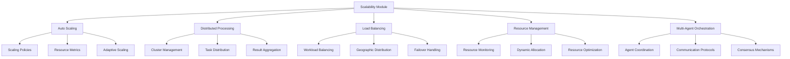

# Scalability & Distributed Processing - AGENTS

## Module Overview

The `scalability` module provides comprehensive scaling capabilities for active inference systems, enabling horizontal scaling, distributed processing, and adaptive resource management for high-performance, large-scale deployments.

## Scalability Architecture



## Auto-Scaling System

### ResourceMetrics

Comprehensive resource monitoring and metrics collection.

**Features:**
- CPU, memory, and I/O utilization tracking
- Request throughput and latency monitoring
- Resource prediction and forecasting
- Custom metric collection hooks

**Implementation:**
```python
class ResourceMetrics:
    """Comprehensive resource metrics collection."""

    def __init__(self):
        self.cpu_percent = 0.0
        self.memory_percent = 0.0
        self.memory_available_gb = 0.0
        self.active_instances = 0
        self.queue_depth = 0
        self.avg_response_time = 0.0
        self.requests_per_second = 0.0
        self.error_rate = 0.0
        self.timestamp = time.time()

        self._custom_metrics = {}

    @classmethod
    def collect_system_metrics(cls) -> 'ResourceMetrics':
        """Collect current system resource metrics."""

        metrics = cls()

        try:
            import psutil
            process = psutil.Process()

            # CPU metrics
            metrics.cpu_percent = psutil.cpu_percent(interval=0.1)

            # Memory metrics
            memory = psutil.virtual_memory()
            metrics.memory_percent = memory.percent
            metrics.memory_available_gb = memory.available / (1024**3)

            # Process-specific metrics
            process_memory = process.memory_info()
            metrics.process_memory_mb = process_memory.rss / (1024**2)

            # System load
            load_avg = psutil.getloadavg()
            metrics.system_load_1m = load_avg[0]
            metrics.system_load_5m = load_avg[1]
            metrics.system_load_15m = load_avg[2]

        except ImportError:
            # Fallback without psutil
            metrics.cpu_percent = 50.0  # Mock value
            metrics.memory_percent = 60.0
            metrics.memory_available_gb = 8.0

        return metrics

    def add_custom_metric(self, name: str, value: Any):
        """Add custom metric."""
        self._custom_metrics[name] = value

    def get_custom_metric(self, name: str) -> Any:
        """Get custom metric value."""
        return self._custom_metrics.get(name)

    def to_dict(self) -> Dict[str, Any]:
        """Convert metrics to dictionary."""
        base_metrics = {
            'cpu_percent': self.cpu_percent,
            'memory_percent': self.memory_percent,
            'memory_available_gb': self.memory_available_gb,
            'active_instances': self.active_instances,
            'queue_depth': self.queue_depth,
            'avg_response_time': self.avg_response_time,
            'requests_per_second': self.requests_per_second,
            'error_rate': self.error_rate,
            'timestamp': self.timestamp
        }

        # Add optional metrics if they exist
        optional_metrics = {}
        for attr in ['process_memory_mb', 'system_load_1m', 'system_load_5m', 'system_load_15m']:
            if hasattr(self, attr):
                optional_metrics[attr] = getattr(self, attr)

        return {**base_metrics, **optional_metrics, **self._custom_metrics}
```

### ScalingRule

Intelligent scaling decision making.

**Features:**
- Multi-threshold scaling policies
- Cooldown periods to prevent thrashing
- Predictive scaling based on trends
- Custom scaling conditions

**Implementation:**
```python
class ScalingRule:
    """Intelligent scaling rule with multiple triggers."""

    def __init__(self,
                 name: str,
                 scale_up_threshold: float,
                 scale_down_threshold: float,
                 min_instances: int = 1,
                 max_instances: int = 10,
                 cooldown_period: int = 300,
                 evaluation_period: int = 60):
        self.name = name
        self.scale_up_threshold = scale_up_threshold
        self.scale_down_threshold = scale_down_threshold
        self.min_instances = min_instances
        self.max_instances = max_instances
        self.cooldown_period = cooldown_period
        self.evaluation_period = evaluation_period

        self.last_scale_time = 0
        self.metrics_history = []
        self.scale_decisions = []

    def should_scale_up(self, metrics: ResourceMetrics) -> bool:
        """Determine if scaling up is needed."""

        # Check cooldown period
        if time.time() - self.last_scale_time < self.cooldown_period:
            return False

        # Check if already at max instances
        if metrics.active_instances >= self.max_instances:
            return False

        # Evaluate scaling condition
        scale_up_needed = self._evaluate_scale_condition(metrics, 'up')

        if scale_up_needed:
            self.scale_decisions.append({
                'timestamp': time.time(),
                'decision': 'scale_up',
                'metrics': metrics.to_dict(),
                'reason': self._get_scale_reason(metrics, 'up')
            })

        return scale_up_needed

    def should_scale_down(self, metrics: ResourceMetrics) -> bool:
        """Determine if scaling down is needed."""

        # Check cooldown period
        if time.time() - self.last_scale_time < self.cooldown_period:
            return False

        # Check if already at min instances
        if metrics.active_instances <= self.min_instances:
            return False

        # Evaluate scaling condition
        scale_down_needed = self._evaluate_scale_condition(metrics, 'down')

        if scale_down_needed:
            self.scale_decisions.append({
                'timestamp': time.time(),
                'decision': 'scale_down',
                'metrics': metrics.to_dict(),
                'reason': self._get_scale_reason(metrics, 'down')
            })

        return scale_down_needed

    def _evaluate_scale_condition(self, metrics: ResourceMetrics, direction: str) -> bool:
        """Evaluate scaling condition based on metrics."""

        # Store metrics for trend analysis
        self.metrics_history.append(metrics)
        if len(self.metrics_history) > 100:  # Keep last 100 measurements
            self.metrics_history.pop(0)

        # Simple threshold-based scaling
        if direction == 'up':
            # Scale up if any critical metric exceeds threshold
            conditions = [
                metrics.cpu_percent > self.scale_up_threshold,
                metrics.memory_percent > self.scale_up_threshold,
                metrics.avg_response_time > self.scale_up_threshold,
                metrics.queue_depth > 5  # Queue depth threshold
            ]
            return any(conditions)

        elif direction == 'down':
            # Scale down if all metrics are below threshold
            conditions = [
                metrics.cpu_percent < self.scale_down_threshold,
                metrics.memory_percent < self.scale_down_threshold,
                metrics.avg_response_time < self.scale_down_threshold,
                metrics.queue_depth < 2  # Low queue depth
            ]
            return all(conditions)

        return False

    def _get_scale_reason(self, metrics: ResourceMetrics, direction: str) -> str:
        """Get detailed reason for scaling decision."""

        reasons = []

        if direction == 'up':
            if metrics.cpu_percent > self.scale_up_threshold:
                reasons.append(f"CPU usage {metrics.cpu_percent:.1f}% > {self.scale_up_threshold}%")
            if metrics.memory_percent > self.scale_up_threshold:
                reasons.append(f"Memory usage {metrics.memory_percent:.1f}% > {self.scale_up_threshold}%")
            if metrics.avg_response_time > self.scale_up_threshold:
                reasons.append(f"Response time {metrics.avg_response_time:.1f}ms > {self.scale_up_threshold}ms")
            if metrics.queue_depth > 5:
                reasons.append(f"Queue depth {metrics.queue_depth} > 5")

        return "; ".join(reasons) if reasons else "Threshold exceeded"

    def record_scale_action(self, action: str, new_instances: int):
        """Record scaling action."""

        self.last_scale_time = time.time()
        self.scale_decisions.append({
            'timestamp': self.last_scale_time,
            'decision': action,
            'new_instances': new_instances,
            'rule_name': self.name
        })

    def get_scaling_history(self) -> List[Dict[str, Any]]:
        """Get scaling decision history."""
        return self.scale_decisions.copy()

    def get_scaling_statistics(self) -> Dict[str, Any]:
        """Get scaling statistics."""

        scale_up_count = sum(1 for d in self.scale_decisions if d['decision'] == 'scale_up')
        scale_down_count = sum(1 for d in self.scale_decisions if d['decision'] == 'scale_down')

        return {
            'rule_name': self.name,
            'scale_up_events': scale_up_count,
            'scale_down_events': scale_down_count,
            'total_scale_events': len(self.scale_decisions),
            'last_scale_time': self.last_scale_time,
            'cooldown_period': self.cooldown_period,
            'current_cooldown_remaining': max(0, self.cooldown_period - (time.time() - self.last_scale_time))
        }
```

### AutoScaler

Intelligent auto-scaling engine with multiple policies.

**Features:**
- Multiple scaling policies
- Predictive scaling
- Cost optimization
- Performance-based scaling

**Implementation:**
```python
class AutoScaler:
    """Intelligent auto-scaling engine."""

    def __init__(self):
        self.scaling_rules = {}
        self.active_instances = 1
        self.scaling_history = []
        self.prediction_model = None

    def add_scaling_rule(self, rule: ScalingRule):
        """Add a scaling rule."""
        self.scaling_rules[rule.name] = rule

    def evaluate_scaling(self, metrics: ResourceMetrics) -> Dict[str, Any]:
        """Evaluate all scaling rules and make decisions."""

        scaling_decisions = {
            'scale_up_recommended': False,
            'scale_down_recommended': False,
            'recommended_instances': self.active_instances,
            'rule_evaluations': {},
            'reasoning': []
        }

        # Evaluate each scaling rule
        for rule_name, rule in self.scaling_rules.items():
            rule_evaluation = {
                'should_scale_up': rule.should_scale_up(metrics),
                'should_scale_down': rule.should_scale_down(metrics),
                'statistics': rule.get_scaling_statistics()
            }

            scaling_decisions['rule_evaluations'][rule_name] = rule_evaluation

            # Collect reasons
            recent_decisions = rule.scale_decisions[-5:]  # Last 5 decisions
            for decision in recent_decisions:
                if decision['decision'] in ['scale_up', 'scale_down']:
                    scaling_decisions['reasoning'].append({
                        'rule': rule_name,
                        'decision': decision['decision'],
                        'reason': decision.get('reason', 'Threshold exceeded'),
                        'timestamp': decision['timestamp']
                    })

        # Make overall scaling decision
        scale_up_votes = sum(1 for r in scaling_decisions['rule_evaluations'].values()
                           if r['should_scale_up'])
        scale_down_votes = sum(1 for r in scaling_decisions['rule_evaluations'].values()
                             if r['should_scale_down'])

        # Majority voting with tie-breaker
        if scale_up_votes > scale_down_votes:
            scaling_decisions['scale_up_recommended'] = True
            scaling_decisions['recommended_instances'] = min(
                self.active_instances + 1,
                max(r.max_instances for r in self.scaling_rules.values())
            )
        elif scale_down_votes > scale_up_votes:
            scaling_decisions['scale_down_recommended'] = True
            scaling_decisions['recommended_instances'] = max(
                self.active_instances - 1,
                min(r.min_instances for r in self.scaling_rules.values())
            )

        # Predictive scaling (if model available)
        if self.prediction_model:
            predicted_load = self._predict_future_load(metrics)
            if predicted_load > 1.5:  # 50% increase expected
                scaling_decisions['scale_up_recommended'] = True
                scaling_decisions['reasoning'].append({
                    'type': 'predictive',
                    'reason': f'Predicted load increase: {predicted_load:.2f}x'
                })

        return scaling_decisions

    def apply_scaling_decision(self, decision: Dict[str, Any]) -> bool:
        """Apply scaling decision."""

        if decision['scale_up_recommended']:
            new_instances = decision['recommended_instances']
            success = self._scale_to_instances(new_instances)

            if success:
                self._record_scaling_event('scale_up', new_instances, decision)
                # Update rules
                for rule in self.scaling_rules.values():
                    rule.record_scale_action('scale_up', new_instances)

        elif decision['scale_down_recommended']:
            new_instances = decision['recommended_instances']
            success = self._scale_to_instances(new_instances)

            if success:
                self._record_scaling_event('scale_down', new_instances, decision)
                # Update rules
                for rule in self.scaling_rules.values():
                    rule.record_scale_action('scale_down', new_instances)

        return success

    def _scale_to_instances(self, target_instances: int) -> bool:
        """Scale to target number of instances."""

        if target_instances == self.active_instances:
            return True

        try:
            if target_instances > self.active_instances:
                # Scale up
                instances_to_add = target_instances - self.active_instances
                self._provision_instances(instances_to_add)
            else:
                # Scale down
                instances_to_remove = self.active_instances - target_instances
                self._deprovision_instances(instances_to_remove)

            self.active_instances = target_instances
            return True

        except Exception as e:
            logger.error(f"Scaling failed: {e}")
            return False

    def _provision_instances(self, count: int):
        """Provision new instances."""
        # Implementation depends on deployment platform
        logger.info(f"Provisioning {count} new instances")

    def _deprovision_instances(self, count: int):
        """Deprovision instances."""
        # Implementation depends on deployment platform
        logger.info(f"Deprovisioning {count} instances")

    def _record_scaling_event(self, action: str, new_instances: int, decision: Dict):
        """Record scaling event."""

        event = {
            'timestamp': time.time(),
            'action': action,
            'old_instances': self.active_instances,
            'new_instances': new_instances,
            'reasoning': decision.get('reasoning', []),
            'rule_evaluations': decision.get('rule_evaluations', {})
        }

        self.scaling_history.append(event)

    def _predict_future_load(self, current_metrics: ResourceMetrics) -> float:
        """Predict future load using simple trend analysis."""

        # Simple prediction based on recent trends
        if len(self.scaling_history) < 3:
            return 1.0  # No trend data

        recent_loads = []
        for event in self.scaling_history[-10:]:  # Last 10 events
            # Extract load indicators from event
            rule_evals = event.get('rule_evaluations', {})
            avg_cpu = np.mean([r.get('statistics', {}).get('cpu_percent', 50)
                             for r in rule_evals.values()])
            recent_loads.append(avg_cpu)

        if not recent_loads:
            return 1.0

        # Simple linear trend
        trend = np.polyfit(range(len(recent_loads)), recent_loads, 1)[0]
        predicted_increase = trend * 5  # 5 steps ahead

        return max(1.0, 1.0 + predicted_increase / 100.0)

    def get_scaling_status(self) -> Dict[str, Any]:
        """Get current scaling status."""

        return {
            'active_instances': self.active_instances,
            'scaling_rules': {
                name: rule.get_scaling_statistics()
                for name, rule in self.scaling_rules.items()
            },
            'recent_scaling_events': self.scaling_history[-5:],
            'total_scaling_events': len(self.scaling_history),
            'uptime_since_last_scale': time.time() - (
                self.scaling_history[-1]['timestamp'] if self.scaling_history else 0
            )
        }
```

## Distributed Processing System

### DistributedActiveInferenceCluster

Distributed processing cluster for large-scale active inference.

**Features:**
- Master-worker architecture
- Task distribution and result aggregation
- Fault tolerance and recovery
- Load balancing across workers

**Implementation:**
```python
class DistributedActiveInferenceCluster:
    """Distributed active inference processing cluster."""

    def __init__(self, coordinator_address: str = "localhost:8786"):
        self.coordinator_address = coordinator_address
        self.workers = []
        self.tasks = {}
        self.results = {}
        self.cluster_status = "stopped"

    def start_cluster(self, num_workers: int = 4, worker_config: Dict = None):
        """Start distributed cluster."""

        try:
            from dask.distributed import Client, LocalCluster

            # Start local cluster
            cluster = LocalCluster(
                n_workers=num_workers,
                threads_per_worker=2,
                memory_limit='2GB',
                **(worker_config or {})
            )

            self.client = Client(cluster)
            self.cluster = cluster
            self.cluster_status = "running"

            logger.info(f"Started distributed cluster with {num_workers} workers")

        except ImportError:
            logger.warning("Dask not available, falling back to local processing")
            self.cluster_status = "local_fallback"

    def stop_cluster(self):
        """Stop distributed cluster."""

        if hasattr(self, 'client'):
            self.client.close()

        if hasattr(self, 'cluster'):
            self.cluster.close()

        self.cluster_status = "stopped"
        logger.info("Distributed cluster stopped")

    def submit_inference_task(self, agent_id: str, observation: np.ndarray,
                            model_params: Dict) -> str:
        """Submit inference task to cluster."""

        task_id = f"{agent_id}_{int(time.time())}_{hash(str(observation))}"

        if self.cluster_status == "running":
            # Submit to distributed cluster
            future = self.client.submit(
                self._distributed_inference,
                observation, model_params
            )

            self.tasks[task_id] = {
                'future': future,
                'agent_id': agent_id,
                'status': 'running',
                'submitted_at': time.time()
            }

        else:
            # Local fallback
            result = self._distributed_inference(observation, model_params)
            self.results[task_id] = {
                'result': result,
                'agent_id': agent_id,
                'completed_at': time.time()
            }

        return task_id

    def get_task_result(self, task_id: str) -> Dict[str, Any]:
        """Get result of completed task."""

        if task_id in self.tasks:
            task = self.tasks[task_id]

            if self.cluster_status == "running":
                if task['future'].done():
                    try:
                        result = task['future'].result()
                        return {
                            'status': 'completed',
                            'result': result,
                            'execution_time': time.time() - task['submitted_at']
                        }
                    except Exception as e:
                        return {
                            'status': 'failed',
                            'error': str(e)
                        }
                else:
                    return {'status': 'running'}
            else:
                # Local result
                if task_id in self.results:
                    result_data = self.results[task_id]
                    return {
                        'status': 'completed',
                        'result': result_data['result'],
                        'execution_time': result_data['completed_at'] - task['submitted_at']
                    }

        return {'status': 'not_found'}

    def _distributed_inference(self, observation: np.ndarray,
                             model_params: Dict) -> Dict[str, Any]:
        """Execute inference task (runs on worker)."""

        # Import here to avoid circular imports
        from ..core.agent import ActiveInferenceAgent

        try:
            # Create agent with model parameters
            agent = ActiveInferenceAgent(
                state_dim=model_params.get('state_dim', 4),
                obs_dim=observation.shape[0],
                action_dim=model_params.get('action_dim', 2)
            )

            # Perform inference
            start_time = time.time()
            action = agent.act(observation)
            inference_time = time.time() - start_time

            return {
                'action': action,
                'inference_time': inference_time,
                'beliefs': agent.beliefs.mean.tolist() if hasattr(agent.beliefs, 'mean') else None,
                'success': True
            }

        except Exception as e:
            return {
                'error': str(e),
                'success': False
            }

    def get_cluster_performance(self) -> Dict[str, Any]:
        """Get cluster performance metrics."""

        if self.cluster_status != "running":
            return {'status': 'not_running'}

        try:
            # Get worker information
            worker_info = self.client.scheduler_info()['workers']

            performance_data = {
                'status': 'running',
                'coordinator_address': self.coordinator_address,
                'total_workers': len(worker_info),
                'active_workers': sum(1 for w in worker_info.values() if w['status'] == 'running'),
                'worker_details': {}
            }

            for addr, info in worker_info.items():
                performance_data['worker_details'][addr] = {
                    'status': info['status'],
                    'cpu': info.get('metrics', {}).get('cpu', 0),
                    'memory': info.get('metrics', {}).get('memory', 0),
                    'tasks_completed': info.get('metrics', {}).get('tasks_completed', 0)
                }

            return performance_data

        except Exception as e:
            return {
                'status': 'error',
                'error': str(e)
            }

    def submit_batch_inference(self, batch_data: List[Dict[str, Any]]) -> List[str]:
        """Submit batch of inference tasks."""

        task_ids = []

        for item in batch_data:
            task_id = self.submit_inference_task(
                item['agent_id'],
                item['observation'],
                item.get('model_params', {})
            )
            task_ids.append(task_id)

        return task_ids

    def wait_for_batch_completion(self, task_ids: List[str],
                                timeout: float = 30.0) -> Dict[str, Any]:
        """Wait for batch completion."""

        start_time = time.time()
        completed_results = {}

        while time.time() - start_time < timeout:
            all_completed = True

            for task_id in task_ids:
                if task_id not in completed_results:
                    result = self.get_task_result(task_id)

                    if result['status'] == 'completed':
                        completed_results[task_id] = result
                    elif result['status'] == 'failed':
                        completed_results[task_id] = result
                    else:
                        all_completed = False

            if all_completed:
                break

            time.sleep(0.1)  # Small delay to avoid busy waiting

        return {
            'completed_tasks': len(completed_results),
            'total_tasks': len(task_ids),
            'completion_rate': len(completed_results) / len(task_ids),
            'results': completed_results,
            'timeout_exceeded': time.time() - start_time >= timeout
        }
```

## Multi-Agent Orchestration

### MultiAgentOrchestrator

Coordination system for multiple active inference agents.

**Features:**
- Agent discovery and registration
- Task allocation and load balancing
- Inter-agent communication
- Consensus mechanisms

**Implementation:**
```python
class MultiAgentOrchestrator:
    """Multi-agent orchestration system."""

    def __init__(self):
        self.registered_agents = {}
        self.agent_capabilities = {}
        self.task_queue = Queue()
        self.result_aggregator = {}
        self.communication_channels = {}

    def register_agent(self, agent_id: str, agent, capabilities: Dict[str, Any]):
        """Register agent with the orchestrator."""

        self.registered_agents[agent_id] = agent
        self.agent_capabilities[agent_id] = capabilities

        # Setup communication channel
        self.communication_channels[agent_id] = Queue()

        logger.info(f"Registered agent {agent_id} with capabilities: {capabilities}")

    def unregister_agent(self, agent_id: str):
        """Unregister agent."""

        if agent_id in self.registered_agents:
            del self.registered_agents[agent_id]
            del self.agent_capabilities[agent_id]
            del self.communication_channels[agent_id]

            logger.info(f"Unregistered agent {agent_id}")

    def submit_task(self, task: Dict[str, Any]) -> str:
        """Submit task for execution by agents."""

        task_id = f"task_{int(time.time())}_{hash(str(task))}"

        # Add task to queue
        self.task_queue.put({
            'task_id': task_id,
            'task': task,
            'submitted_at': time.time(),
            'status': 'queued'
        })

        # Trigger task assignment
        self._assign_pending_tasks()

        return task_id

    def get_task_status(self, task_id: str) -> Dict[str, Any]:
        """Get status of submitted task."""

        # Check result aggregator
        if task_id in self.result_aggregator:
            return self.result_aggregator[task_id]

        # Check task queue (not yet assigned)
        # Implementation would check queue for pending tasks

        return {'status': 'unknown_task'}

    def _assign_pending_tasks(self):
        """Assign pending tasks to available agents."""

        # Get available agents
        available_agents = [
            agent_id for agent_id in self.registered_agents.keys()
            if self._is_agent_available(agent_id)
        ]

        if not available_agents:
            return

        # Assign tasks to agents
        assigned_count = 0
        max_assignments = min(len(available_agents), 5)  # Limit concurrent assignments

        for _ in range(max_assignments):
            try:
                task_data = self.task_queue.get_nowait()

                # Select best agent for task
                best_agent = self._select_agent_for_task(task_data['task'], available_agents)

                if best_agent:
                    # Assign task to agent
                    self._assign_task_to_agent(task_data, best_agent)
                    assigned_count += 1

            except Empty:
                break  # No more tasks

        if assigned_count > 0:
            logger.info(f"Assigned {assigned_count} tasks to agents")

    def _select_agent_for_task(self, task: Dict[str, Any],
                             available_agents: List[str]) -> str:
        """Select best agent for task based on capabilities."""

        best_agent = None
        best_score = -1

        task_requirements = task.get('requirements', {})

        for agent_id in available_agents:
            capabilities = self.agent_capabilities[agent_id]

            # Calculate match score
            score = self._calculate_capability_match(task_requirements, capabilities)

            if score > best_score:
                best_score = score
                best_agent = agent_id

        return best_agent

    def _calculate_capability_match(self, requirements: Dict[str, Any],
                                  capabilities: Dict[str, Any]) -> float:
        """Calculate how well agent capabilities match task requirements."""

        score = 0.0
        total_requirements = len(requirements)

        if total_requirements == 0:
            return 1.0  # No requirements, perfect match

        for req_name, req_value in requirements.items():
            if req_name in capabilities:
                cap_value = capabilities[req_name]

                # Simple matching logic
                if isinstance(req_value, (int, float)):
                    # Numerical requirements
                    if cap_value >= req_value:
                        score += 1.0
                    else:
                        score += cap_value / req_value  # Partial match
                else:
                    # Categorical requirements
                    if cap_value == req_value:
                        score += 1.0

        return score / total_requirements

    def _assign_task_to_agent(self, task_data: Dict[str, Any], agent_id: str):
        """Assign task to specific agent."""

        # Send task to agent's communication channel
        task_message = {
            'type': 'task_assignment',
            'task_id': task_data['task_id'],
            'task': task_data['task'],
            'assigned_at': time.time()
        }

        self.communication_channels[agent_id].put(task_message)

        # Update task status
        task_data['status'] = 'assigned'
        task_data['assigned_to'] = agent_id
        task_data['assigned_at'] = time.time()

    def submit_agent_result(self, agent_id: str, task_id: str, result: Any):
        """Submit result from agent."""

        result_data = {
            'task_id': task_id,
            'agent_id': agent_id,
            'result': result,
            'submitted_at': time.time(),
            'status': 'completed'
        }

        self.result_aggregator[task_id] = result_data

        logger.info(f"Received result for task {task_id} from agent {agent_id}")

    def get_agent_communication(self, agent_id: str) -> Any:
        """Get communication channel for agent."""

        if agent_id in self.communication_channels:
            try:
                return self.communication_channels[agent_id].get_nowait()
            except Empty:
                return None

        return None

    def get_orchestrator_status(self) -> Dict[str, Any]:
        """Get orchestrator status."""

        return {
            'registered_agents': len(self.registered_agents),
            'agent_capabilities': self.agent_capabilities,
            'pending_tasks': self.task_queue.qsize(),
            'completed_tasks': len(self.result_aggregator),
            'total_tasks_processed': len(self.result_aggregator)
        }

    def _is_agent_available(self, agent_id: str) -> bool:
        """Check if agent is available for task assignment."""

        # Simple availability check
        # In practice, this would check agent status, load, etc.
        return agent_id in self.registered_agents
```

## Load Balancing

### AdaptiveLoadBalancer

Intelligent load distribution across agents and resources.

**Features:**
- Least-loaded routing
- Geographic load balancing
- Predictive load balancing
- Health-aware routing

**Implementation:**
```python
class AdaptiveLoadBalancer:
    """Adaptive load balancing for distributed systems."""

    def __init__(self):
        self.backends = {}
        self.backend_health = {}
        self.routing_history = []
        self.load_predictor = None

    def add_backend(self, backend_id: str, backend_info: Dict[str, Any]):
        """Add backend to load balancer."""

        self.backends[backend_id] = backend_info
        self.backend_health[backend_id] = {
            'healthy': True,
            'load': 0.0,
            'last_health_check': time.time(),
            'response_time': 0.0
        }

    def route_request(self, request: Dict[str, Any]) -> str:
        """Route request to appropriate backend."""

        available_backends = [
            bid for bid, health in self.backend_health.items()
            if health['healthy']
        ]

        if not available_backends:
            raise Exception("No healthy backends available")

        # Select backend using load balancing strategy
        selected_backend = self._select_backend(available_backends, request)

        # Record routing decision
        self.routing_history.append({
            'timestamp': time.time(),
            'request': request,
            'selected_backend': selected_backend,
            'available_backends': len(available_backends)
        })

        # Update backend load
        self.backend_health[selected_backend]['load'] += 1

        return selected_backend

    def _select_backend(self, available_backends: List[str],
                       request: Dict[str, Any]) -> str:
        """Select backend using load balancing algorithm."""

        # Least loaded strategy
        backend_loads = {
            bid: self.backend_health[bid]['load']
            for bid in available_backends
        }

        # Find backend with minimum load
        selected_backend = min(backend_loads, key=backend_loads.get)

        return selected_backend

    def update_backend_health(self, backend_id: str, health_info: Dict[str, Any]):
        """Update backend health information."""

        if backend_id in self.backend_health:
            self.backend_health[backend_id].update(health_info)
            self.backend_health[backend_id]['last_health_check'] = time.time()

    def get_load_balancer_status(self) -> Dict[str, Any]:
        """Get load balancer status."""

        total_backends = len(self.backends)
        healthy_backends = sum(1 for h in self.backend_health.values() if h['healthy'])

        backend_loads = {
            bid: health['load']
            for bid, health in self.backend_health.items()
        }

        return {
            'total_backends': total_backends,
            'healthy_backends': healthy_backends,
            'health_rate': healthy_backends / total_backends if total_backends > 0 else 0,
            'backend_loads': backend_loads,
            'total_requests_routed': len(self.routing_history),
            'avg_requests_per_backend': len(self.routing_history) / total_backends if total_backends > 0 else 0
        }

    def predict_optimal_routing(self, future_requests: List[Dict[str, Any]]) -> Dict[str, Any]:
        """Predict optimal routing for future requests."""

        if not self.load_predictor:
            return {'prediction': 'not_available'}

        # Use predictor to forecast load
        predictions = {}

        for backend_id in self.backends:
            predicted_load = self.load_predictor.predict_load(
                backend_id, future_requests
            )
            predictions[backend_id] = predicted_load

        # Recommend routing adjustments
        recommendations = self._generate_routing_recommendations(predictions)

        return {
            'predictions': predictions,
            'recommendations': recommendations
        }

    def _generate_routing_recommendations(self, predictions: Dict[str, float]) -> List[str]:
        """Generate routing recommendations based on predictions."""

        recommendations = []

        # Identify overloaded backends
        overloaded = [
            bid for bid, load in predictions.items()
            if load > 0.8  # 80% capacity
        ]

        if overloaded:
            recommendations.append(
                f"Consider scaling up or redirecting load from backends: {overloaded}"
            )

        # Identify underutilized backends
        underutilized = [
            bid for bid, load in predictions.items()
            if load < 0.3  # 30% capacity
        ]

        if underutilized:
            recommendations.append(
                f"Consider scaling down or increasing load on backends: {underutilized}"
            )

        return recommendations
```

## Performance Optimization

### ScalabilityOptimizer

Automatic optimization for scalable deployments.

```python
class ScalabilityOptimizer:
    """Optimization engine for scalable systems."""

    def __init__(self):
        self.performance_metrics = {}
        self.optimization_history = []

    def analyze_scalability_bottlenecks(self, system_metrics: Dict[str, Any]) -> List[str]:
        """Analyze system for scalability bottlenecks."""

        bottlenecks = []

        # Check CPU bottlenecks
        if system_metrics.get('cpu_percent', 0) > 90:
            bottlenecks.append("High CPU utilization - consider horizontal scaling")

        # Check memory bottlenecks
        if system_metrics.get('memory_percent', 0) > 85:
            bottlenecks.append("High memory usage - consider memory optimization or scaling")

        # Check network bottlenecks
        if system_metrics.get('network_latency', 0) > 100:  # ms
            bottlenecks.append("High network latency - consider geographic distribution")

        # Check queue depth
        if system_metrics.get('queue_depth', 0) > 10:
            bottlenecks.append("High queue depth - consider increasing worker count")

        return bottlenecks

    def recommend_scaling_actions(self, current_metrics: Dict[str, Any],
                                scaling_history: List[Dict[str, Any]]) -> List[str]:
        """Recommend scaling actions based on metrics and history."""

        recommendations = []

        # Analyze recent scaling effectiveness
        recent_scales = scaling_history[-5:]  # Last 5 scaling events

        for scale_event in recent_scales:
            # Check if scaling improved performance
            if scale_event['action'] == 'scale_up':
                # Check if CPU/memory usage decreased after scaling
                # Implementation would analyze metrics before/after scaling
                pass

        # Current state recommendations
        cpu_usage = current_metrics.get('cpu_percent', 0)
        if cpu_usage > 80:
            recommendations.append("Scale up: CPU usage above 80%")
        elif cpu_usage < 30:
            recommendations.append("Consider scale down: CPU usage below 30%")

        memory_usage = current_metrics.get('memory_percent', 0)
        if memory_usage > 80:
            recommendations.append("Scale up: Memory usage above 80%")

        return recommendations

    def optimize_resource_allocation(self, workload_pattern: Dict[str, Any]) -> Dict[str, Any]:
        """Optimize resource allocation based on workload patterns."""

        optimization = {
            'recommended_instance_type': 't3.medium',  # Default
            'recommended_instance_count': 1,
            'resource_allocation': {}
        }

        # Analyze workload characteristics
        compute_intensity = workload_pattern.get('compute_intensity', 0.5)
        memory_intensity = workload_pattern.get('memory_intensity', 0.5)

        if compute_intensity > 0.7:
            # CPU-intensive workload
            optimization['recommended_instance_type'] = 'c5.large'
            optimization['resource_allocation']['cpu_weight'] = 0.8
        elif memory_intensity > 0.7:
            # Memory-intensive workload
            optimization['recommended_instance_type'] = 'r5.large'
            optimization['resource_allocation']['memory_weight'] = 0.8

        # Estimate instance count
        workload_size = workload_pattern.get('requests_per_second', 100)
        if workload_size > 1000:
            optimization['recommended_instance_count'] = max(1, workload_size // 500)

        return optimization
```

## Testing and Validation

### ScalabilityTestSuite

Comprehensive scalability testing and validation.

```python
class ScalabilityTestSuite:
    """Comprehensive scalability testing suite."""

    def __init__(self, target_system):
        self.target_system = target_system

    def run_load_tests(self, test_configs: List[Dict[str, Any]]) -> Dict[str, Any]:
        """Run load tests with different configurations."""

        test_results = {}

        for config in test_configs:
            test_name = config['name']
            logger.info(f"Running load test: {test_name}")

            # Configure test parameters
            num_requests = config.get('num_requests', 1000)
            concurrent_users = config.get('concurrent_users', 10)
            request_rate = config.get('request_rate', 100)

            # Run test
            result = self._execute_load_test(
                num_requests, concurrent_users, request_rate
            )

            test_results[test_name] = result

        return test_results

    def _execute_load_test(self, num_requests: int, concurrent_users: int,
                          request_rate: float) -> Dict[str, Any]:
        """Execute individual load test."""

        import concurrent.futures
        import time

        results = []
        errors = []

        def make_request(request_id):
            try:
                start_time = time.time()

                # Simulate request to target system
                if hasattr(self.target_system, 'process_request'):
                    response = self.target_system.process_request({
                        'id': request_id,
                        'data': np.random.randn(10)
                    })
                else:
                    # Mock request
                    time.sleep(np.random.exponential(0.1))
                    response = {'success': True}

                response_time = time.time() - start_time

                return {
                    'request_id': request_id,
                    'response_time': response_time,
                    'success': True,
                    'response': response
                }

            except Exception as e:
                return {
                    'request_id': request_id,
                    'error': str(e),
                    'success': False
                }

        # Rate limiting
        import threading
        semaphore = threading.Semaphore(concurrent_users)

        def rate_limited_request(request_id):
            with semaphore:
                time.sleep(1.0 / request_rate)  # Rate limiting
                return make_request(request_id)

        # Execute requests
        start_time = time.time()

        with concurrent.futures.ThreadPoolExecutor(max_workers=concurrent_users) as executor:
            futures = [
                executor.submit(rate_limited_request, i)
                for i in range(num_requests)
            ]

            for future in concurrent.futures.as_completed(futures):
                result = future.result()
                if result['success']:
                    results.append(result)
                else:
                    errors.append(result)

        total_time = time.time() - start_time

        # Calculate statistics
        successful_requests = len(results)
        failed_requests = len(errors)

        if results:
            response_times = [r['response_time'] for r in results]
            avg_response_time = np.mean(response_times)
            p95_response_time = np.percentile(response_times, 95)
            throughput = successful_requests / total_time
        else:
            avg_response_time = 0
            p95_response_time = 0
            throughput = 0

        return {
            'total_requests': num_requests,
            'successful_requests': successful_requests,
            'failed_requests': failed_requests,
            'success_rate': successful_requests / num_requests if num_requests > 0 else 0,
            'total_time': total_time,
            'avg_response_time': avg_response_time,
            'p95_response_time': p95_response_time,
            'throughput': throughput,
            'errors': errors[:10]  # First 10 errors
        }

    def run_scalability_analysis(self, scaling_test_configs: List[Dict[str, Any]]) -> Dict[str, Any]:
        """Run scalability analysis with different scales."""

        analysis_results = {}

        for config in scaling_test_configs:
            scale_name = config['name']
            num_instances = config.get('num_instances', 1)

            logger.info(f"Testing scalability at {num_instances} instances")

            # Configure system for scale
            self._configure_system_scale(num_instances)

            # Run performance test
            perf_result = self._run_performance_test()

            # Calculate scalability metrics
            scalability_metrics = self._calculate_scalability_metrics(
                perf_result, num_instances
            )

            analysis_results[scale_name] = {
                'num_instances': num_instances,
                'performance': perf_result,
                'scalability_metrics': scalability_metrics
            }

        return analysis_results

    def _calculate_scalability_metrics(self, performance: Dict[str, Any],
                                     num_instances: int) -> Dict[str, Any]:
        """Calculate scalability metrics."""

        # Ideal linear scaling
        ideal_throughput = performance.get('baseline_throughput', 100) * num_instances

        actual_throughput = performance.get('throughput', 0)
        efficiency = actual_throughput / ideal_throughput if ideal_throughput > 0 else 0

        # Overhead calculation
        baseline_latency = performance.get('baseline_latency', 0.01)
        scaled_latency = performance.get('avg_response_time', 0)
        overhead = (scaled_latency - baseline_latency) / baseline_latency if baseline_latency > 0 else 0

        return {
            'efficiency': efficiency,
            'ideal_throughput': ideal_throughput,
            'actual_throughput': actual_throughput,
            'communication_overhead': overhead,
            'scalability_score': min(1.0, efficiency * (1 - overhead))
        }
```

## Integration Examples

### Complete Scalable Active Inference System

```python
def create_scalable_active_inference_system(config: Dict[str, Any]) -> Dict[str, Any]:
    """Create complete scalable active inference system."""

    # Initialize components
    auto_scaler = AutoScaler()
    cluster = DistributedActiveInferenceCluster()
    orchestrator = MultiAgentOrchestrator()
    load_balancer = AdaptiveLoadBalancer()

    # Configure scaling rules
    cpu_rule = ScalingRule(
        name="cpu_scaling",
        scale_up_threshold=70.0,
        scale_down_threshold=30.0,
        min_instances=1,
        max_instances=10
    )

    memory_rule = ScalingRule(
        name="memory_scaling",
        scale_up_threshold=80.0,
        scale_down_threshold=40.0,
        min_instances=1,
        max_instances=8
    )

    auto_scaler.add_scaling_rule(cpu_rule)
    auto_scaler.add_scaling_rule(memory_rule)

    # Start distributed cluster
    cluster.start_cluster(num_workers=config.get('initial_workers', 2))

    # Create load balancer backends
    for i in range(config.get('initial_instances', 2)):
        backend_id = f"instance_{i}"
        load_balancer.add_backend(backend_id, {
            'address': f"worker_{i}:8080",
            'capabilities': ['inference', 'planning']
        })

    return {
        'auto_scaler': auto_scaler,
        'cluster': cluster,
        'orchestrator': orchestrator,
        'load_balancer': load_balancer,
        'status': 'initialized'
    }

# Usage example
system = create_scalable_active_inference_system({
    'initial_workers': 4,
    'initial_instances': 2,
    'max_instances': 20
})

# Submit inference task
task_id = system['cluster'].submit_inference_task(
    agent_id="agent_1",
    observation=np.random.randn(8),
    model_params={'state_dim': 4, 'action_dim': 2}
)

# Monitor system
status = system['auto_scaler'].get_scaling_status()
cluster_perf = system['cluster'].get_cluster_performance()
```

## Future Enhancements

### Advanced Scalability Features
- **Serverless Integration**: Function-as-a-Service scaling
- **Edge Computing**: Distributed edge deployment
- **Federated Learning**: Privacy-preserving distributed training
- **Quantum Computing**: Quantum-enhanced distributed processing

### Research Scaling Capabilities
- **Hierarchical Scaling**: Multi-level agent organization
- **Adaptive Topologies**: Dynamic network reconfiguration
- **Cognitive Load Balancing**: Intelligence-aware task distribution
- **Meta-Scaling**: Learning optimal scaling strategies

