# Security & Threat Detection - AGENTS

## Module Overview

The `security` module provides comprehensive security capabilities for active inference systems, including input validation, threat detection, anomaly identification, and secure communication protocols.

## Security Architecture

```mermaid
graph TD
    A[Security Module] --> B[Input Validation]
    A --> C[Threat Detection]
    A --> D[Anomaly Detection]
    A --> E[Access Control]
    A --> F[Secure Communication]
    A --> G[Audit Logging]

    B --> H[Type Validation]
    B --> I[Bounds Checking]
    B --> J[Semantic Validation]

    C --> K[ML-Based Detection]
    C --> L[Rule-Based Detection]
    C --> M[Behavioral Analysis]

    D --> N[Statistical Methods]
    D --> O[Machine Learning]
    D --> P[Time Series Analysis]

    E --> Q[Authentication]
    E --> R[Authorization]
    E --> S[Session Management]

    F --> T[Encryption]
    F --> U[Secure Channels]
    F --> V[Key Management]

    G --> W[Event Logging]
    G --> X[Compliance]
    G --> Y[Forensic Analysis]
```



## Input Validation System

### AdvancedValidator

Comprehensive input validation with security focus.

**Features:**
- Multi-layer validation (type, bounds, semantic)
- Security threat detection
- Performance impact assessment
- Configurable strictness levels

**Implementation:**
```python
class AdvancedValidator:
    """Advanced validation system with security focus."""

    def __init__(self, security_level: str = "standard"):
        self.security_level = security_level
        self.validation_rules = self._initialize_validation_rules()
        self.threat_patterns = self._initialize_threat_patterns()
        self.validation_history = []
        self.security_incidents = []

    def _initialize_validation_rules(self) -> Dict[str, Callable]:
        """Initialize validation rules for different data types."""

        return {
            'observation': self._validate_observation,
            'action': self._validate_action,
            'model_parameters': self._validate_model_parameters,
            'agent_configuration': self._validate_agent_config,
            'user_input': self._validate_user_input
        }

    def _initialize_threat_patterns(self) -> List[Dict[str, Any]]:
        """Initialize threat detection patterns."""

        return [
            {
                'name': 'injection_attack',
                'pattern': r'[\'";\\]',
                'severity': 'high',
                'description': 'Potential code injection characters'
            },
            {
                'name': 'buffer_overflow',
                'pattern': lambda x: len(str(x)) > 10000,
                'severity': 'medium',
                'description': 'Excessively large input'
            },
            {
                'name': 'malformed_data',
                'pattern': lambda x: self._detect_malformed_data(x),
                'severity': 'medium',
                'description': 'Structurally invalid data'
            },
            {
                'name': 'suspicious_patterns',
                'pattern': r'(?i)(script|javascript|vbscript|onload|onerror)',
                'severity': 'high',
                'description': 'Script injection patterns'
            }
        ]

    def validate_secure(self, data: Any, data_type: str,
                       context: Dict[str, Any] = None) -> ValidationResult:
        """Perform secure validation with threat detection."""

        result = ValidationResult(is_valid=True)
        start_time = time.time()

        try:
            # Basic validation
            if data_type in self.validation_rules:
                basic_result = self.validation_rules[data_type](data, context)
                self._merge_validation_results(result, basic_result)

            # Security validation
            security_result = self._perform_security_validation(data, data_type)
            self._merge_validation_results(result, security_result)

            # Threat detection
            threat_result = self._detect_threats(data, data_type, context)
            if threat_result.get('threats_detected', False):
                result.is_valid = False
                result.errors.extend(threat_result['threat_messages'])

                # Log security incident
                self._log_security_incident(threat_result, data_type, context)

            # Performance validation
            if self.security_level == "strict":
                perf_result = self._validate_performance_impact(data)
                self._merge_validation_results(result, perf_result)

            # Compute confidence score
            result.confidence_score = self._compute_security_confidence(result)

        except Exception as e:
            result.is_valid = False
            result.errors.append(f"Validation system error: {str(e)}")
            result.confidence_score = 0.0

        result.validation_time = time.time() - start_time

        # Record validation history
        self.validation_history.append({
            'timestamp': time.time(),
            'data_type': data_type,
            'is_valid': result.is_valid,
            'error_count': len(result.errors),
            'threats_detected': len([e for e in result.errors if 'threat' in e.lower()]),
            'validation_time': result.validation_time
        })

        return result

    def _perform_security_validation(self, data: Any, data_type: str) -> ValidationResult:
        """Perform security-focused validation."""

        result = ValidationResult(is_valid=True)

        # Type safety validation
        if not self._is_type_safe(data, data_type):
            result.is_valid = False
            result.errors.append(f"Type safety violation for {data_type}")

        # Bounds validation
        bounds_result = self._validate_bounds(data, data_type)
        if not bounds_result.is_valid:
            result.is_valid = False
            result.errors.extend(bounds_result.errors)

        # Content validation
        content_result = self._validate_content(data, data_type)
        if not content_result.is_valid:
            result.is_valid = False
            result.errors.extend(content_result.errors)

        return result

    def _detect_threats(self, data: Any, data_type: str,
                       context: Dict[str, Any] = None) -> Dict[str, Any]:
        """Detect potential security threats."""

        threats_detected = []
        threat_messages = []

        data_str = str(data)

        for threat_pattern in self.threat_patterns:
            try:
                if callable(threat_pattern['pattern']):
                    # Callable pattern (e.g., length check)
                    if threat_pattern['pattern'](data):
                        threats_detected.append(threat_pattern)
                        threat_messages.append(
                            f"Security threat detected: {threat_pattern['description']}"
                        )
                else:
                    # Regex pattern
                    if re.search(threat_pattern['pattern'], data_str, re.IGNORECASE):
                        threats_detected.append(threat_pattern)
                        threat_messages.append(
                            f"Security threat detected: {threat_pattern['description']}"
                        )
            except Exception as e:
                # Log pattern matching error but don't fail validation
                logger.warning(f"Threat pattern matching error: {e}")

        # Additional behavioral analysis
        behavioral_threats = self._analyze_behavioral_patterns(data, data_type, context)
        threats_detected.extend(behavioral_threats)

        return {
            'threats_detected': len(threats_detected) > 0,
            'threat_count': len(threats_detected),
            'threats': threats_detected,
            'threat_messages': threat_messages
        }

    def _analyze_behavioral_patterns(self, data: Any, data_type: str,
                                   context: Dict[str, Any] = None) -> List[Dict[str, Any]]:
        """Analyze behavioral patterns for threats."""

        threats = []

        # Rate limiting analysis
        if context and 'request_history' in context:
            request_rate = self._calculate_request_rate(context['request_history'])
            if request_rate > 100:  # requests per minute
                threats.append({
                    'name': 'rate_limit_exceeded',
                    'severity': 'medium',
                    'description': f'Suspicious request rate: {request_rate} req/min'
                })

        # Data pattern analysis
        if hasattr(data, '__len__') and len(data) > 0:
            # Check for repetitive patterns (potential DoS)
            if self._has_repetitive_pattern(data):
                threats.append({
                    'name': 'repetitive_pattern',
                    'severity': 'low',
                    'description': 'Repetitive data patterns detected'
                })

        # Context-based analysis
        if context:
            user_id = context.get('user_id')
            if user_id and self._is_suspicious_user(user_id):
                threats.append({
                    'name': 'suspicious_user',
                    'severity': 'high',
                    'description': f'Suspicious activity from user {user_id}'
                })

        return threats

    def _log_security_incident(self, threat_result: Dict[str, Any],
                              data_type: str, context: Dict[str, Any]):
        """Log security incident for audit and analysis."""

        incident = {
            'timestamp': time.time(),
            'data_type': data_type,
            'threat_count': threat_result['threat_count'],
            'threats': threat_result['threats'],
            'context': context or {},
            'severity': max([t.get('severity', 'low') for t in threat_result['threats']],
                          key=lambda x: {'low': 0, 'medium': 1, 'high': 2}.get(x, 0))
        }

        self.security_incidents.append(incident)

        # Log to security system
        logger.warning(f"Security incident detected: {incident}")

    def get_security_status(self) -> Dict[str, Any]:
        """Get comprehensive security status."""

        recent_incidents = [
            i for i in self.security_incidents
            if time.time() - i['timestamp'] < 3600  # Last hour
        ]

        validation_summary = self._analyze_validation_history()

        return {
            'security_level': self.security_level,
            'total_incidents': len(self.security_incidents),
            'recent_incidents': len(recent_incidents),
            'validation_summary': validation_summary,
            'threat_prevention_rate': self._calculate_threat_prevention_rate(),
            'last_incident_time': max([i['timestamp'] for i in self.security_incidents]) if self.security_incidents else None
        }

    def _analyze_validation_history(self) -> Dict[str, Any]:
        """Analyze validation history for security insights."""

        if not self.validation_history:
            return {'total_validations': 0}

        total_validations = len(self.validation_history)
        successful_validations = sum(1 for v in self.validation_history if v['is_valid'])
        threat_validations = sum(1 for v in self.validation_history if v['threats_detected'])

        return {
            'total_validations': total_validations,
            'successful_rate': successful_validations / total_validations if total_validations > 0 else 0,
            'threat_detection_rate': threat_validations / total_validations if total_validations > 0 else 0,
            'avg_validation_time': np.mean([v['validation_time'] for v in self.validation_history])
        }

    def _calculate_threat_prevention_rate(self) -> float:
        """Calculate the rate of threat prevention."""

        if not self.validation_history:
            return 0.0

        threat_validations = sum(1 for v in self.validation_history if v['threats_detected'])
        blocked_threats = sum(v['threats_detected'] for v in self.validation_history)

        # Assuming each threat validation prevents at least one threat
        return blocked_threats / len(self.validation_history) if self.validation_history else 0.0
```

## Threat Detection System

### AdaptiveThreatDetector

Machine learning-based threat detection with adaptive learning.

**Features:**
- Statistical anomaly detection
- Machine learning classification
- Behavioral pattern analysis
- Adaptive threshold adjustment

**Implementation:**
```python
class AdaptiveThreatDetector:
    """Adaptive threat detection with machine learning."""

    def __init__(self, detection_methods: List[str] = None):
        self.detection_methods = detection_methods or ['statistical', 'ml', 'behavioral']
        self.threat_history = []
        self.normal_behavior_model = None
        self.threat_patterns = {}
        self.adaptation_rate = 0.01

    def detect_threats(self, client_id: str, input_data: Any,
                      processing_time: float) -> List[Threat]:
        """Detect threats in input data and behavior."""

        threats = []
        detection_results = {}

        # Statistical anomaly detection
        if 'statistical' in self.detection_methods:
            stat_threats = self._statistical_anomaly_detection(input_data, processing_time)
            threats.extend(stat_threats)
            detection_results['statistical'] = len(stat_threats)

        # Machine learning detection
        if 'ml' in self.detection_methods:
            ml_threats = self._ml_threat_detection(client_id, input_data, processing_time)
            threats.extend(ml_threats)
            detection_results['ml'] = len(ml_threats)

        # Behavioral analysis
        if 'behavioral' in self.detection_methods:
            behavioral_threats = self._behavioral_threat_detection(client_id, input_data)
            threats.extend(behavioral_threats)
            detection_results['behavioral'] = len(behavioral_threats)

        # Update threat history
        threat_record = {
            'timestamp': time.time(),
            'client_id': client_id,
            'threat_count': len(threats),
            'detection_results': detection_results,
            'input_size': self._estimate_input_size(input_data),
            'processing_time': processing_time
        }

        self.threat_history.append(threat_record)

        # Adaptive learning
        self._update_behavior_model(threat_record)

        return threats

    def _statistical_anomaly_detection(self, input_data: Any,
                                     processing_time: float) -> List[Threat]:
        """Statistical anomaly detection using Z-score and IQR."""

        threats = []

        # Processing time anomaly
        if len(self.threat_history) > 10:
            recent_times = [h['processing_time'] for h in self.threat_history[-20:]]
            mean_time = np.mean(recent_times)
            std_time = np.std(recent_times)

            if std_time > 0:
                z_score = abs(processing_time - mean_time) / std_time
                if z_score > 3.0:  # 3-sigma rule
                    threats.append(Threat(
                        threat_type="processing_time_anomaly",
                        threat_level=ThreatLevel.MEDIUM,
                        confidence_score=min(z_score / 5.0, 1.0),
                        description=f"Unusual processing time: {processing_time:.3f}s (z-score: {z_score:.2f})"
                    ))

        # Input size anomaly
        input_size = self._estimate_input_size(input_data)
        if len(self.threat_history) > 10:
            recent_sizes = [h['input_size'] for h in self.threat_history[-20:]]
            q75, q25 = np.percentile(recent_sizes, [75, 25])
            iqr = q75 - q25

            if iqr > 0 and input_size > q75 + 1.5 * iqr:
                threats.append(Threat(
                    threat_type="input_size_anomaly",
                    threat_level=ThreatLevel.LOW,
                    confidence_score=0.7,
                    description=f"Large input size: {input_size} (IQR outlier)"
                ))

        return threats

    def _ml_threat_detection(self, client_id: str, input_data: Any,
                           processing_time: float) -> List[Threat]:
        """Machine learning-based threat detection."""

        threats = []

        # Extract features for ML classification
        features = self._extract_ml_features(client_id, input_data, processing_time)

        # Simple rule-based ML (in production, this would be a trained model)
        threat_probability = self._calculate_threat_probability(features)

        if threat_probability > 0.8:
            threats.append(Threat(
                threat_type="ml_detected_threat",
                threat_level=ThreatLevel.HIGH,
                confidence_score=threat_probability,
                description=f"ML threat detection: {threat_probability:.2f} probability"
            ))
        elif threat_probability > 0.6:
            threats.append(Threat(
                threat_type="ml_suspicious_activity",
                threat_level=ThreatLevel.MEDIUM,
                confidence_score=threat_probability,
                description=f"ML suspicious activity: {threat_probability:.2f} probability"
            ))

        return threats

    def _behavioral_threat_detection(self, client_id: str, input_data: Any) -> List[Threat]:
        """Behavioral pattern analysis for threat detection."""

        threats = []

        # Analyze client behavior patterns
        client_history = [h for h in self.threat_history if h['client_id'] == client_id]

        if len(client_history) > 5:
            # Check for rapid successive requests (potential DoS)
            recent_requests = client_history[-5:]
            time_diffs = [recent_requests[i+1]['timestamp'] - recent_requests[i]['timestamp']
                         for i in range(len(recent_requests)-1)]

            avg_time_diff = np.mean(time_diffs)
            if avg_time_diff < 0.1:  # Less than 100ms between requests
                threats.append(Threat(
                    threat_type="rapid_requests",
                    threat_level=ThreatLevel.MEDIUM,
                    confidence_score=0.8,
                    description=f"Rapid successive requests from {client_id} (avg {avg_time_diff:.3f}s)"
                ))

            # Check for increasing input sizes (potential buffer overflow attempts)
            input_sizes = [h['input_size'] for h in recent_requests]
            if len(input_sizes) >= 3:
                # Check if sizes are consistently increasing
                increasing = all(input_sizes[i] <= input_sizes[i+1] for i in range(len(input_sizes)-1))
                size_increase = input_sizes[-1] / input_sizes[0] if input_sizes[0] > 0 else 1

                if increasing and size_increase > 2.0:
                    threats.append(Threat(
                        threat_type="increasing_input_sizes",
                        threat_level=ThreatLevel.MEDIUM,
                        confidence_score=0.7,
                        description=f"Increasing input sizes from {client_id} ({size_increase:.1f}x increase)"
                    ))

        return threats

    def _extract_ml_features(self, client_id: str, input_data: Any,
                           processing_time: float) -> Dict[str, float]:
        """Extract features for machine learning threat detection."""

        features = {
            'input_size': float(self._estimate_input_size(input_data)),
            'processing_time': processing_time,
            'client_request_frequency': 0.0,
            'input_complexity': 0.0,
            'time_of_day': time.time() % 86400 / 3600,  # Hour of day
        }

        # Client request frequency
        client_history = [h for h in self.threat_history if h['client_id'] == client_id]
        if client_history:
            time_window = 300  # 5 minutes
            recent_requests = [h for h in client_history
                             if time.time() - h['timestamp'] < time_window]
            features['client_request_frequency'] = len(recent_requests) / (time_window / 60)  # per minute

        # Input complexity (simplified)
        if hasattr(input_data, '__len__'):
            features['input_complexity'] = min(len(input_data) / 1000, 1.0)

        return features

    def _calculate_threat_probability(self, features: Dict[str, float]) -> float:
        """Calculate threat probability using simple rules (would be ML model in production)."""

        score = 0.0

        # High request frequency
        if features['client_request_frequency'] > 10:
            score += 0.3

        # Unusual processing time
        if features['processing_time'] > 1.0:
            score += 0.2

        # Large input size
        if features['input_size'] > 10000:
            score += 0.2

        # High input complexity
        if features['input_complexity'] > 0.8:
            score += 0.1

        # Time-based patterns (e.g., unusual hours)
        hour = features['time_of_day']
        if hour < 6 or hour > 22:  # Unusual hours
            score += 0.1

        return min(score, 1.0)

    def _update_behavior_model(self, threat_record: Dict[str, Any]):
        """Update normal behavior model for adaptive detection."""

        # Simple adaptive threshold update
        if self.normal_behavior_model is None:
            self.normal_behavior_model = {
                'avg_processing_time': threat_record['processing_time'],
                'avg_input_size': threat_record['input_size'],
                'adaptation_count': 1
            }
        else:
            # Exponential moving average update
            alpha = self.adaptation_rate
            model = self.normal_behavior_model

            model['avg_processing_time'] = (1 - alpha) * model['avg_processing_time'] + alpha * threat_record['processing_time']
            model['avg_input_size'] = (1 - alpha) * model['avg_input_size'] + alpha * threat_record['input_size']
            model['adaptation_count'] += 1

    def get_threat_summary(self) -> Dict[str, Any]:
        """Get comprehensive threat detection summary."""

        if not self.threat_history:
            return {'total_threats_detected': 0}

        recent_threats = [
            h for h in self.threat_history
            if time.time() - h['timestamp'] < 3600  # Last hour
        ]

        threat_counts = {}
        for record in recent_threats:
            for method, count in record['detection_results'].items():
                threat_counts[method] = threat_counts.get(method, 0) + count

        unique_clients = len(set(h['client_id'] for h in recent_threats))

        return {
            'total_threats_detected': sum(threat_counts.values()),
            'threat_counts_by_method': threat_counts,
            'recent_threats_1h': len(recent_threats),
            'active_clients': unique_clients,
            'threat_detection_rate': len(recent_threats) / len(self.threat_history) if self.threat_history else 0
        }
```

## Access Control System

### SecureAccessManager

Comprehensive access control with authentication and authorization.

**Features:**
- Multi-factor authentication
- Role-based access control (RBAC)
- Session management
- Audit logging

**Implementation:**
```python
class SecureAccessManager:
    """Secure access control and authentication system."""

    def __init__(self, auth_method: str = "token"):
        self.auth_method = auth_method
        self.user_sessions = {}
        self.role_permissions = self._initialize_role_permissions()
        self.audit_log = []
        self.failed_attempts = defaultdict(int)

    def authenticate_user(self, credentials: Dict[str, Any]) -> AuthenticationResult:
        """Authenticate user with provided credentials."""

        username = credentials.get('username')
        password = credentials.get('password')
        token = credentials.get('token')

        result = AuthenticationResult(success=False, user_id=None, roles=[])

        # Check for account lockout
        if self.failed_attempts[username] >= 5:
            result.error_message = "Account locked due to multiple failed attempts"
            self._log_audit_event('authentication_failed', username, 'account_locked')
            return result

        # Authentication logic
        if self.auth_method == "token":
            user_info = self._validate_token(token)
        elif self.auth_method == "password":
            user_info = self._validate_password(username, password)
        else:
            user_info = self._validate_credentials(credentials)

        if user_info:
            result.success = True
            result.user_id = user_info['user_id']
            result.roles = user_info['roles']
            result.session_token = self._create_session_token(user_info['user_id'])

            # Reset failed attempts on successful login
            if username in self.failed_attempts:
                del self.failed_attempts[username]

            self._log_audit_event('authentication_success', username, 'login')
        else:
            # Record failed attempt
            self.failed_attempts[username] += 1
            result.error_message = "Invalid credentials"

            self._log_audit_event('authentication_failed', username, 'invalid_credentials')

        return result

    def authorize_action(self, user_id: str, action: str,
                        resource: str, context: Dict[str, Any] = None) -> AuthorizationResult:
        """Authorize user action on resource."""

        result = AuthorizationResult(allowed=False, reason="")

        # Get user roles
        user_roles = self.user_sessions.get(user_id, {}).get('roles', [])

        # Check permissions for each role
        allowed = False
        for role in user_roles:
            if role in self.role_permissions:
                permissions = self.role_permissions[role]
                if self._check_permission(permissions, action, resource, context):
                    allowed = True
                    break

        result.allowed = allowed
        result.reason = "Authorized" if allowed else "Insufficient permissions"

        # Log authorization decision
        self._log_audit_event(
            'authorization_' + ('success' if allowed else 'failed'),
            user_id,
            f"{action}:{resource}"
        )

        return result

    def _initialize_role_permissions(self) -> Dict[str, Dict[str, Any]]:
        """Initialize role-based permissions."""

        return {
            'admin': {
                'actions': ['*'],  # All actions
                'resources': ['*'],  # All resources
                'restrictions': {}
            },
            'researcher': {
                'actions': ['read', 'write', 'execute'],
                'resources': ['agents', 'experiments', 'models'],
                'restrictions': {'production_access': False}
            },
            'viewer': {
                'actions': ['read'],
                'resources': ['agents', 'experiments', 'metrics'],
                'restrictions': {'write_access': False, 'execute_access': False}
            }
        }

    def _check_permission(self, permissions: Dict[str, Any], action: str,
                         resource: str, context: Dict[str, Any]) -> bool:
        """Check if permission allows the action."""

        # Check actions
        allowed_actions = permissions.get('actions', [])
        if '*' not in allowed_actions and action not in allowed_actions:
            return False

        # Check resources
        allowed_resources = permissions.get('resources', [])
        if '*' not in allowed_resources and resource not in allowed_resources:
            return False

        # Check restrictions
        restrictions = permissions.get('restrictions', {})
        for restriction, value in restrictions.items():
            if context and context.get(restriction) == True and value == False:
                return False

        return True

    def _create_session_token(self, user_id: str) -> str:
        """Create secure session token."""

        import secrets
        token = secrets.token_urlsafe(32)

        # Store session
        self.user_sessions[user_id] = {
            'token': token,
            'created_at': time.time(),
            'last_activity': time.time(),
            'roles': []  # Would be populated from user data
        }

        return token

    def validate_session(self, token: str) -> SessionValidationResult:
        """Validate session token."""

        # Find user by token
        for user_id, session in self.user_sessions.items():
            if session['token'] == token:
                # Check session expiry (24 hours)
                if time.time() - session['created_at'] > 86400:
                    del self.user_sessions[user_id]
                    return SessionValidationResult(valid=False, reason="Session expired")

                # Update last activity
                session['last_activity'] = time.time()

                return SessionValidationResult(
                    valid=True,
                    user_id=user_id,
                    roles=session.get('roles', [])
                )

        return SessionValidationResult(valid=False, reason="Invalid token")

    def _log_audit_event(self, event_type: str, user_id: str, details: str):
        """Log audit event for security monitoring."""

        audit_entry = {
            'timestamp': time.time(),
            'event_type': event_type,
            'user_id': user_id,
            'details': details,
            'ip_address': 'unknown',  # Would be populated from request
            'user_agent': 'unknown'   # Would be populated from request
        }

        self.audit_log.append(audit_entry)

        # Keep only recent audit logs
        if len(self.audit_log) > 10000:
            self.audit_log = self.audit_log[-5000:]  # Keep last 5000 entries

    def get_security_audit_report(self, time_window_hours: int = 24) -> Dict[str, Any]:
        """Generate security audit report."""

        cutoff_time = time.time() - (time_window_hours * 3600)
        recent_events = [e for e in self.audit_log if e['timestamp'] > cutoff_time]

        # Analyze events
        event_counts = defaultdict(int)
        failed_auth_attempts = 0
        suspicious_activities = []

        for event in recent_events:
            event_counts[event['event_type']] += 1

            if 'failed' in event['event_type']:
                failed_auth_attempts += 1

            # Detect suspicious patterns
            if event['event_type'] == 'authentication_failed':
                suspicious_activities.append(event)

        return {
            'time_window_hours': time_window_hours,
            'total_events': len(recent_events),
            'event_counts': dict(event_counts),
            'failed_auth_attempts': failed_auth_attempts,
            'suspicious_activities': suspicious_activities[:10],  # Last 10
            'unique_users': len(set(e['user_id'] for e in recent_events))
        }
```

## Secure Communication

### SecureChannelManager

Encrypted communication channels with key management.

**Features:**
- TLS/SSL encryption
- Key rotation
- Certificate management
- Secure API endpoints

**Implementation:**
```python
class SecureChannelManager:
    """Secure communication channel management."""

    def __init__(self, cert_file: str = None, key_file: str = None):
        self.cert_file = cert_file
        self.key_file = key_file
        self.active_channels = {}
        self.encryption_keys = {}
        self.channel_metrics = {}

    def create_secure_channel(self, channel_id: str,
                            peer_address: str,
                            encryption: str = "TLS") -> SecureChannel:
        """Create encrypted communication channel."""

        channel = SecureChannel(
            channel_id=channel_id,
            peer_address=peer_address,
            encryption_method=encryption,
            cert_file=self.cert_file,
            key_file=self.key_file
        )

        # Establish connection
        channel.establish()

        # Generate session keys
        session_key = self._generate_session_key()
        self.encryption_keys[channel_id] = session_key

        self.active_channels[channel_id] = channel
        self.channel_metrics[channel_id] = {
            'created_at': time.time(),
            'bytes_sent': 0,
            'bytes_received': 0,
            'messages_sent': 0,
            'messages_received': 0
        }

        return channel

    def send_secure_message(self, channel_id: str, message: Dict[str, Any]) -> bool:
        """Send encrypted message through secure channel."""

        if channel_id not in self.active_channels:
            raise ValueError(f"Channel {channel_id} not found")

        channel = self.active_channels[channel_id]
        session_key = self.encryption_keys[channel_id]

        # Encrypt message
        encrypted_message = self._encrypt_message(message, session_key)

        # Send through channel
        success = channel.send(encrypted_message)

        if success:
            self.channel_metrics[channel_id]['messages_sent'] += 1
            self.channel_metrics[channel_id]['bytes_sent'] += len(str(encrypted_message))

        return success

    def receive_secure_message(self, channel_id: str, timeout: float = 5.0) -> Dict[str, Any]:
        """Receive and decrypt message from secure channel."""

        if channel_id not in self.active_channels:
            raise ValueError(f"Channel {channel_id} not found")

        channel = self.active_channels[channel_id]
        session_key = self.encryption_keys[channel_id]

        # Receive encrypted message
        encrypted_message = channel.receive(timeout=timeout)

        if encrypted_message:
            # Decrypt message
            decrypted_message = self._decrypt_message(encrypted_message, session_key)

            self.channel_metrics[channel_id]['messages_received'] += 1
            self.channel_metrics[channel_id]['bytes_received'] += len(str(encrypted_message))

            return decrypted_message

        return None

    def rotate_keys(self, channel_id: str):
        """Rotate encryption keys for added security."""

        if channel_id in self.encryption_keys:
            # Generate new session key
            new_key = self._generate_session_key()

            # Send key rotation message (would use existing key to encrypt)
            rotation_message = {
                'type': 'key_rotation',
                'new_key_hash': hashlib.sha256(new_key.encode()).hexdigest()
            }

            # Update key
            self.encryption_keys[channel_id] = new_key

            logger.info(f"Rotated encryption keys for channel {channel_id}")

    def get_channel_status(self, channel_id: str = None) -> Dict[str, Any]:
        """Get status of communication channels."""

        if channel_id:
            if channel_id in self.active_channels:
                channel = self.active_channels[channel_id]
                metrics = self.channel_metrics[channel_id]

                return {
                    'channel_id': channel_id,
                    'status': 'active',
                    'peer_address': channel.peer_address,
                    'encryption': channel.encryption_method,
                    'metrics': metrics,
                    'uptime': time.time() - metrics['created_at']
                }
            else:
                return {'channel_id': channel_id, 'status': 'not_found'}
        else:
            # Return all channels
            return {
                'total_channels': len(self.active_channels),
                'active_channels': list(self.active_channels.keys()),
                'channel_summaries': {
                    cid: {
                        'status': 'active',
                        'uptime': time.time() - self.channel_metrics[cid]['created_at']
                    }
                    for cid in self.active_channels.keys()
                }
            }

    def _generate_session_key(self) -> str:
        """Generate secure session key."""
        import secrets
        return secrets.token_hex(32)  # 256-bit key

    def _encrypt_message(self, message: Dict[str, Any], key: str) -> bytes:
        """Encrypt message using session key."""
        # Simplified encryption (would use proper AES in production)
        import base64
        message_str = json.dumps(message)
        # XOR encryption for demonstration
        encrypted = ''.join(chr(ord(c) ^ ord(key[i % len(key)])) for i, c in enumerate(message_str))
        return base64.b64encode(encrypted.encode())

    def _decrypt_message(self, encrypted_data: bytes, key: str) -> Dict[str, Any]:
        """Decrypt message using session key."""
        # Simplified decryption
        import base64
        encrypted_str = base64.b64decode(encrypted_data).decode()
        decrypted = ''.join(chr(ord(c) ^ ord(key[i % len(key)])) for i, c in enumerate(encrypted_str))
        return json.loads(decrypted)
```

## Integration and Usage

### SecureActiveInferenceSystem

Complete secure active inference system integration.

```python
class SecureActiveInferenceSystem:
    """Secure active inference system with comprehensive security."""

    def __init__(self, security_config: Dict[str, Any]):
        self.security_config = security_config

        # Initialize security components
        self.validator = AdvancedValidator(security_level=security_config.get('level', 'standard'))
        self.threat_detector = AdaptiveThreatDetector()
        self.access_manager = SecureAccessManager(auth_method=security_config.get('auth_method', 'token'))
        self.channel_manager = SecureChannelManager(
            cert_file=security_config.get('cert_file'),
            key_file=security_config.get('key_file')
        )

        # Initialize active inference components
        self.agent = None  # Would be initialized with secure configuration

        # Security monitoring
        self.security_events = []

    def process_secure_request(self, request: Dict[str, Any],
                             credentials: Dict[str, Any]) -> Dict[str, Any]:
        """Process request with comprehensive security validation."""

        request_id = request.get('request_id', str(uuid.uuid4()))

        try:
            # 1. Authentication
            auth_result = self.access_manager.authenticate_user(credentials)
            if not auth_result.success:
                self._log_security_event('authentication_failed', request_id, auth_result.error_message)
                return {'status': 'error', 'message': 'Authentication failed'}

            user_id = auth_result.user_id

            # 2. Authorization
            action = request.get('action', 'unknown')
            resource = request.get('resource', 'agent')
            authz_result = self.access_manager.authorize_action(user_id, action, resource)
            if not authz_result.allowed:
                self._log_security_event('authorization_failed', request_id, authz_result.reason)
                return {'status': 'error', 'message': 'Authorization failed'}

            # 3. Input validation and threat detection
            observation = request.get('observation')
            if observation is not None:
                validation_result = self.validator.validate_secure(observation, 'observation')
                if not validation_result.is_valid:
                    self._log_security_event('validation_failed', request_id,
                                           '; '.join(validation_result.errors))
                    return {'status': 'error', 'message': 'Input validation failed'}

                # Threat detection
                processing_start = time.time()
                threats = self.threat_detector.detect_threats(user_id, observation, 0.0)
                processing_time = time.time() - processing_start

                if threats:
                    threat_descriptions = [t.description for t in threats]
                    self._log_security_event('threat_detected', request_id,
                                           '; '.join(threat_descriptions))
                    return {'status': 'error', 'message': 'Security threat detected'}

            # 4. Process request (would call actual agent)
            # result = self.agent.act(observation)
            result = {'action': [0.1, 0.2], 'status': 'success'}  # Mock result

            # 5. Log successful processing
            self._log_security_event('request_processed', request_id, 'success')

            return result

        except Exception as e:
            self._log_security_event('processing_error', request_id, str(e))
            return {'status': 'error', 'message': 'Internal processing error'}

    def _log_security_event(self, event_type: str, request_id: str, details: str):
        """Log security event for monitoring."""

        event = {
            'timestamp': time.time(),
            'event_type': event_type,
            'request_id': request_id,
            'details': details,
            'severity': self._calculate_event_severity(event_type)
        }

        self.security_events.append(event)

        # Log to appropriate level
        if event['severity'] == 'high':
            logger.error(f"Security event: {event}")
        elif event['severity'] == 'medium':
            logger.warning(f"Security event: {event}")
        else:
            logger.info(f"Security event: {event}")

    def _calculate_event_severity(self, event_type: str) -> str:
        """Calculate severity of security event."""

        high_severity = ['threat_detected', 'authentication_failed', 'processing_error']
        medium_severity = ['authorization_failed', 'validation_failed']

        if event_type in high_severity:
            return 'high'
        elif event_type in medium_severity:
            return 'medium'
        else:
            return 'low'

    def get_security_status(self) -> Dict[str, Any]:
        """Get comprehensive security status."""

        recent_events = [
            e for e in self.security_events
            if time.time() - e['timestamp'] < 3600  # Last hour
        ]

        event_counts = defaultdict(int)
        for event in recent_events:
            event_counts[event['event_type']] += 1

        return {
            'security_level': self.security_config.get('level', 'standard'),
            'total_security_events': len(self.security_events),
            'recent_events_1h': len(recent_events),
            'event_counts': dict(event_counts),
            'threat_detection_summary': self.threat_detector.get_threat_summary(),
            'validation_summary': self.validator.get_security_status(),
            'access_control_summary': self.access_manager.get_security_audit_report(1)
        }
```

## Testing and Validation

### SecurityTestSuite

Comprehensive security testing and validation.

```python
class SecurityTestSuite:
    """Comprehensive security testing suite."""

    def __init__(self, security_system: SecureActiveInferenceSystem):
        self.security_system = security_system

    def run_security_audit(self) -> Dict[str, Any]:
        """Run comprehensive security audit."""

        audit_results = {
            'authentication_tests': self._test_authentication(),
            'authorization_tests': self._test_authorization(),
            'input_validation_tests': self._test_input_validation(),
            'threat_detection_tests': self._test_threat_detection(),
            'communication_security_tests': self._test_communication_security(),
            'overall_security_score': 0.0
        }

        # Calculate overall security score
        test_scores = []
        for test_category, results in audit_results.items():
            if test_category != 'overall_security_score' and isinstance(results, dict):
                if 'success_rate' in results:
                    test_scores.append(results['success_rate'])

        audit_results['overall_security_score'] = np.mean(test_scores) if test_scores else 0.0

        return audit_results

    def _test_authentication(self) -> Dict[str, Any]:
        """Test authentication mechanisms."""

        test_cases = [
            {'credentials': {'username': 'valid_user', 'password': 'valid_pass'}, 'expected': True},
            {'credentials': {'username': 'invalid_user', 'password': 'wrong_pass'}, 'expected': False},
            {'credentials': {'token': 'valid_token'}, 'expected': True},
            {'credentials': {'token': 'invalid_token'}, 'expected': False},
        ]

        successful_tests = 0

        for i, test_case in enumerate(test_cases):
            try:
                result = self.security_system.access_manager.authenticate_user(test_case['credentials'])
                if result.success == test_case['expected']:
                    successful_tests += 1
                else:
                    logger.warning(f"Authentication test {i} failed: expected {test_case['expected']}, got {result.success}")
            except Exception as e:
                logger.error(f"Authentication test {i} error: {e}")

        return {
            'tests_run': len(test_cases),
            'successful_tests': successful_tests,
            'success_rate': successful_tests / len(test_cases) if test_cases else 0
        }

    def _test_input_validation(self) -> Dict[str, Any]:
        """Test input validation mechanisms."""

        test_cases = [
            {'data': np.array([1.0, 2.0, 3.0]), 'data_type': 'observation', 'expected_valid': True},
            {'data': "malicious'; DROP TABLE users; --", 'data_type': 'user_input', 'expected_valid': False},
            {'data': np.array([float('inf'), float('nan')]), 'data_type': 'observation', 'expected_valid': False},
            {'data': np.ones(100000), 'data_type': 'observation', 'expected_valid': False},  # Too large
        ]

        successful_tests = 0

        for i, test_case in enumerate(test_cases):
            try:
                result = self.security_system.validator.validate_secure(
                    test_case['data'], test_case['data_type']
                )
                if result.is_valid == test_case['expected_valid']:
                    successful_tests += 1
                else:
                    logger.warning(f"Validation test {i} failed: expected {test_case['expected_valid']}, got {result.is_valid}")
            except Exception as e:
                logger.error(f"Validation test {i} error: {e}")

        return {
            'tests_run': len(test_cases),
            'successful_tests': successful_tests,
            'success_rate': successful_tests / len(test_cases) if test_cases else 0
        }

    def _test_threat_detection(self) -> Dict[str, Any]:
        """Test threat detection capabilities."""

        # Test cases with known threats
        threat_test_cases = [
            {'client_id': 'test_client', 'input_data': "normal input", 'processing_time': 0.1, 'expected_threats': 0},
            {'client_id': 'test_client', 'input_data': "<script>alert('xss')</script>", 'processing_time': 0.1, 'expected_threats': 1},
            {'client_id': 'test_client', 'input_data': np.ones(10000), 'processing_time': 2.0, 'expected_threats': 1},  # Large input, slow processing
        ]

        successful_tests = 0

        for i, test_case in enumerate(threat_test_cases):
            try:
                threats = self.security_system.threat_detector.detect_threats(
                    test_case['client_id'],
                    test_case['input_data'],
                    test_case['processing_time']
                )

                detected_threats = len(threats)
                expected_threats = test_case['expected_threats']

                # Allow some flexibility in threat detection
                if abs(detected_threats - expected_threats) <= 1:
                    successful_tests += 1
                else:
                    logger.warning(f"Threat detection test {i} failed: expected ~{expected_threats} threats, got {detected_threats}")

            except Exception as e:
                logger.error(f"Threat detection test {i} error: {e}")

        return {
            'tests_run': len(threat_test_cases),
            'successful_tests': successful_tests,
            'success_rate': successful_tests / len(threat_test_cases) if threat_test_cases else 0
        }

    def run_penetration_test(self) -> Dict[str, Any]:
        """Run penetration testing scenarios."""

        penetration_results = {
            'sql_injection_attempts': self._test_sql_injection(),
            'xss_attempts': self._test_xss(),
            'dos_attempts': self._test_dos(),
            'privilege_escalation_attempts': self._test_privilege_escalation(),
            'overall_penetration_score': 0.0
        }

        # Calculate penetration resistance score
        resistance_scores = []
        for test_name, results in penetration_results.items():
            if test_name != 'overall_penetration_score' and isinstance(results, dict):
                if 'blocked_attempts' in results and 'total_attempts' in results:
                    blocked = results['blocked_attempts']
                    total = results['total_attempts']
                    resistance_scores.append(blocked / total if total > 0 else 1.0)

        penetration_results['overall_penetration_score'] = (
            np.mean(resistance_scores) if resistance_scores else 0.0
        )

        return penetration_results

    def _test_sql_injection(self) -> Dict[str, Any]:
        """Test SQL injection prevention."""

        sql_payloads = [
            "'; DROP TABLE users; --",
            "' OR '1'='1",
            "admin'--",
            "1; SELECT * FROM users;",
        ]

        blocked_attempts = 0

        for payload in sql_payloads:
            try:
                result = self.security_system.validator.validate_secure(payload, 'user_input')
                if not result.is_valid and any('threat' in error.lower() for error in result.errors):
                    blocked_attempts += 1
            except:
                blocked_attempts += 1  # Consider exceptions as blocking

        return {
            'total_attempts': len(sql_payloads),
            'blocked_attempts': blocked_attempts,
            'block_rate': blocked_attempts / len(sql_payloads) if sql_payloads else 0
        }
```

## Future Security Enhancements

### Advanced Security Features
- **Zero-Trust Architecture**: Continuous verification and micro-segmentation
- **AI-Powered Threat Detection**: Advanced ML models for anomaly detection
- **Quantum-Safe Cryptography**: Post-quantum cryptographic algorithms
- **Privacy-Preserving Computation**: Secure multi-party computation
- **Automated Security Patching**: Continuous vulnerability management

### Research Security Applications
- **Adversarial Robustness**: Defense against adversarial attacks on active inference
- **Secure Multi-Agent Systems**: Confidential communication in multi-agent scenarios
- **Privacy-Preserving Learning**: Federated learning for active inference models
- **Explainable Security**: Interpretable security decisions and threat analysis

