# Testing Infrastructure - AGENTS

## Module Overview

The `tests` directory contains comprehensive testing infrastructure for the Active Inference Simulation Lab, including unit tests, integration tests, performance benchmarks, and automated testing pipelines.

## Testing Architecture

```mermaid
graph TD
    A[Testing Infrastructure] --> B[Unit Tests]
    A --> C[Integration Tests]
    A --> D[Performance Tests]
    A --> E[System Tests]
    A --> F[Test Utilities]
    A --> G[CI/CD Integration]

    B --> H[Core Components]
    B --> I[Algorithms]
    B --> J[Utilities]

    C --> K[Component Integration]
    C --> L[End-to-End Workflows]
    C --> M[API Compatibility]

    D --> N[Benchmarks]
    D --> O[Regression Tests]
    D --> P[Scalability Tests]

    E --> Q[Deployment Tests]
    E --> R[Production Simulation]
    E --> S[Chaos Engineering]

    F --> T[Test Fixtures]
    F --> U[Mock Objects]
    F --> V[Data Generators]

    G --> W[Automated Pipelines]
    G --> X[Quality Gates]
    G --> Y[Reporting]
```



## Test Organization

### Directory Structure

```
tests/
├── __init__.py                    # Test package initialization
├── conftest.py                    # pytest configuration and fixtures
├── unit/                          # Unit tests
│   ├── test_agent.py             # Core agent tests
│   ├── test_inference.py         # Inference algorithm tests
│   ├── test_planning.py          # Planning algorithm tests
│   ├── test_environments.py      # Environment tests
│   ├── test_monitoring.py        # Monitoring system tests
│   ├── test_performance.py       # Performance optimization tests
│   ├── test_security.py          # Security feature tests
│   └── test_utils.py             # Utility function tests
├── integration/                   # Integration tests
│   ├── test_agent_environment.py # Agent-environment integration
│   ├── test_multi_agent.py       # Multi-agent scenarios
│   ├── test_monitoring_integration.py # Monitoring integration
│   └── test_deployment_integration.py # Deployment integration
├── performance/                   # Performance benchmarks
│   ├── test_benchmarks.py        # Performance benchmarks
│   ├── test_scalability.py       # Scalability tests
│   ├── test_memory_usage.py      # Memory profiling tests
│   └── test_regression.py        # Performance regression tests
├── system/                        # System-level tests
│   ├── test_deployment.py        # Deployment tests
│   ├── test_production_simulation.py # Production simulation
│   └── test_chaos_engineering.py # Chaos engineering tests
├── fixtures/                      # Test fixtures and data
│   ├── environments/             # Environment fixtures
│   ├── agents/                   # Agent configurations
│   ├── datasets/                 # Test datasets
│   └── mocks/                    # Mock objects
└── utils/                        # Testing utilities
    ├── test_runner.py            # Custom test runner
    ├── benchmark_utils.py        # Benchmarking utilities
    ├── data_generators.py        # Test data generation
    └── quality_checks.py         # Test quality validation
```

## Unit Testing Framework

### Core Component Tests

**Agent Unit Tests:**
```python
# tests/unit/test_agent.py
import pytest
import numpy as np
from unittest.mock import Mock, patch
from active_inference.core import ActiveInferenceAgent, BeliefState

class TestActiveInferenceAgent:
    """Comprehensive unit tests for ActiveInferenceAgent."""

    @pytest.fixture
    def agent_config(self):
        """Standard agent configuration for testing."""
        return {
            'state_dim': 4,
            'obs_dim': 8,
            'action_dim': 2,
            'inference_method': 'variational',
            'planning_horizon': 5
        }

    @pytest.fixture
    def mock_inference(self):
        """Mock inference engine."""
        mock = Mock()
        mock.update_beliefs.return_value = Mock(
            mean=np.array([0.1, 0.2, 0.3, 0.4]),
            covariance=np.eye(4) * 0.1
        )
        return mock

    @pytest.fixture
    def mock_planning(self):
        """Mock planning engine."""
        mock = Mock()
        mock.plan_action.return_value = np.array([0.5, -0.3])
        return mock

    def test_agent_initialization(self, agent_config):
        """Test proper agent initialization."""
        agent = ActiveInferenceAgent(**agent_config)

        assert agent.state_dim == agent_config['state_dim']
        assert agent.obs_dim == agent_config['obs_dim']
        assert agent.action_dim == agent_config['action_dim']

        # Check that components are initialized
        assert hasattr(agent, 'beliefs')
        assert hasattr(agent, 'generative_model')
        assert hasattr(agent, 'inference')
        assert hasattr(agent, 'planning')

    def test_act_method_basic(self, agent_config, mock_inference, mock_planning):
        """Test basic action selection functionality."""
        with patch('active_inference.core.VariationalInference', return_value=mock_inference), \
             patch('active_inference.planning.ExpectedFreeEnergyPlanner', return_value=mock_planning):

            agent = ActiveInferenceAgent(**agent_config)
            observation = np.random.randn(8)

            action = agent.act(observation)

            # Verify inference was called
            mock_inference.update_beliefs.assert_called_once()

            # Verify planning was called
            mock_planning.plan_action.assert_called_once()

            # Verify action format
            assert isinstance(action, np.ndarray)
            assert action.shape == (agent_config['action_dim'],)
            assert np.all(np.isfinite(action))

    def test_act_method_with_monitoring(self, agent_config):
        """Test action selection with monitoring enabled."""
        agent_config['enable_monitoring'] = True

        with patch('active_inference.monitoring.TelemetryCollector') as mock_telemetry:
            agent = ActiveInferenceAgent(**agent_config)
            observation = np.random.randn(8)

            action = agent.act(observation)

            # Verify telemetry was recorded
            mock_telemetry.return_value.record_metric.assert_called()

    @pytest.mark.parametrize("obs_dim,action_dim", [
        (4, 2),
        (16, 4),
        (64, 8)
    ])
    def test_agent_different_dimensions(self, obs_dim, action_dim):
        """Test agent functionality with different dimensions."""
        agent = ActiveInferenceAgent(
            state_dim=8,
            obs_dim=obs_dim,
            action_dim=action_dim
        )

        observation = np.random.randn(obs_dim)
        action = agent.act(observation)

        assert action.shape == (action_dim,)

    def test_update_method(self, agent_config):
        """Test learning update functionality."""
        agent = ActiveInferenceAgent(**agent_config)

        observation = np.random.randn(8)
        action = np.random.randn(2)
        reward = 1.5
        next_observation = np.random.randn(8)

        # Should not raise exception
        agent.update(observation, action, reward, next_observation)

        # Beliefs should be updated
        updated_beliefs = agent.get_beliefs()
        assert updated_beliefs is not None

    def test_health_status_reporting(self, agent_config):
        """Test health status reporting functionality."""
        agent = ActiveInferenceAgent(**agent_config)

        status = agent.get_health_status()

        # Verify status structure
        required_fields = [
            'inference_healthy', 'planning_healthy',
            'memory_usage', 'error_rate'
        ]

        for field in required_fields:
            assert field in status
            assert isinstance(status[field], (bool, int, float))

    def test_error_handling(self, agent_config):
        """Test error handling in various scenarios."""
        agent = ActiveInferenceAgent(**agent_config)

        # Test with invalid observation dimensions
        with pytest.raises(ValueError):
            invalid_observation = np.random.randn(16)  # Wrong dimension
            agent.act(invalid_observation)

        # Test with NaN values
        with pytest.raises(ValueError):
            nan_observation = np.full(8, np.nan)
            agent.act(nan_observation)

    def test_belief_state_consistency(self, agent_config):
        """Test that belief states remain consistent."""
        agent = ActiveInferenceAgent(**agent_config)

        initial_beliefs = agent.get_beliefs()

        # Perform several actions
        for _ in range(10):
            observation = np.random.randn(8)
            action = agent.act(observation)

            current_beliefs = agent.get_beliefs()

            # Beliefs should always be valid
            assert current_beliefs is not None
            assert hasattr(current_beliefs, 'mean')
            assert np.all(np.isfinite(current_beliefs.mean))

    @pytest.mark.slow
    def test_long_running_stability(self, agent_config):
        """Test agent stability over long running periods."""
        agent = ActiveInferenceAgent(**agent_config)

        # Run for extended period
        for i in range(1000):
            observation = np.random.randn(8)
            action = agent.act(observation)

            # Periodic health checks
            if i % 100 == 0:
                status = agent.get_health_status()
                assert status['inference_healthy']
                assert status['planning_healthy']

        # Final health check
        final_status = agent.get_health_status()
        assert final_status['error_rate'] < 0.01  # Less than 1% error rate
```

### Algorithm Unit Tests

**Inference Algorithm Tests:**
```python
# tests/unit/test_inference.py
import pytest
import numpy as np
from active_inference.inference import VariationalInference, ParticleFilter
from active_inference.core import BeliefState, GenerativeModel

class TestVariationalInference:
    """Unit tests for variational inference."""

    @pytest.fixture
    def inference_engine(self):
        """Create variational inference engine."""
        return VariationalInference(
            learning_rate=0.01,
            max_iterations=50,
            convergence_threshold=1e-4
        )

    @pytest.fixture
    def mock_beliefs(self):
        """Create mock belief state."""
        return BeliefState(
            mean=np.array([0.0, 0.0, 0.0, 0.0]),
            covariance=np.eye(4) * 0.1,
            precision=np.eye(4) * 10.0
        )

    @pytest.fixture
    def mock_model(self):
        """Create mock generative model."""
        model = Mock()
        model.likelihood.return_value = 0.8
        model.prior.return_value = 0.1
        return model

    def test_inference_initialization(self, inference_engine):
        """Test inference engine initialization."""
        assert inference_engine.learning_rate == 0.01
        assert inference_engine.max_iterations == 50
        assert inference_engine.convergence_threshold == 1e-4

    def test_belief_update_basic(self, inference_engine, mock_beliefs, mock_model):
        """Test basic belief update functionality."""
        observation = np.array([1.0, 0.5, -0.2, 0.8])

        updated_beliefs = inference_engine.update_beliefs(
            mock_beliefs, observation, mock_model
        )

        # Verify beliefs were updated
        assert updated_beliefs is not mock_beliefs  # New object
        assert hasattr(updated_beliefs, 'mean')
        assert hasattr(updated_beliefs, 'covariance')
        assert np.all(np.isfinite(updated_beliefs.mean))

    def test_convergence_behavior(self, inference_engine):
        """Test that inference converges properly."""
        # Create a simple linear Gaussian model
        model = self._create_simple_model()
        initial_beliefs = BeliefState(
            mean=np.zeros(2),
            covariance=np.eye(2)
        )
        observation = np.array([1.0, 2.0])

        # Run inference
        final_beliefs = inference_engine.update_beliefs(
            initial_beliefs, observation, model
        )

        # Check convergence (beliefs should be reasonable)
        assert np.linalg.norm(final_beliefs.mean) < 10  # Not exploded
        assert np.all(np.diag(final_beliefs.covariance) > 0)  # Positive variance

    def test_free_energy_computation(self, inference_engine, mock_beliefs, mock_model):
        """Test free energy computation."""
        observation = np.random.randn(4)

        free_energy = inference_engine.compute_free_energy(
            mock_beliefs, observation, mock_model
        )

        assert isinstance(free_energy, (int, float))
        assert np.isfinite(free_energy)

    def _create_simple_model(self):
        """Create a simple test model."""
        class SimpleModel:
            def likelihood(self, obs, state):
                # Simple Gaussian likelihood
                return np.exp(-0.5 * np.sum((obs - state)**2))

            def prior(self, state):
                # Standard normal prior
                return np.exp(-0.5 * np.sum(state**2))

        return SimpleModel()

class TestParticleFilter:
    """Unit tests for particle filtering."""

    @pytest.fixture
    def particle_filter(self):
        """Create particle filter."""
        return ParticleFilter(num_particles=100)

    def test_particle_filter_initialization(self, particle_filter):
        """Test particle filter initialization."""
        assert particle_filter.num_particles == 100
        assert particle_filter.particles is None
        assert particle_filter.weights is None

    def test_particle_initialization(self, particle_filter):
        """Test particle initialization."""
        initial_beliefs = BeliefState(
            mean=np.zeros(4),
            covariance=np.eye(4)
        )

        particle_filter._initialize_particles(initial_beliefs, 50)

        assert particle_filter.particles is not None
        assert particle_filter.weights is not None
        assert len(particle_filter.particles) == 50
        assert len(particle_filter.weights) == 50
        assert np.allclose(np.sum(particle_filter.weights), 1.0)  # Weights sum to 1

    def test_resampling(self, particle_filter):
        """Test particle resampling."""
        # Initialize particles
        particles = np.random.randn(100, 4)
        weights = np.random.exponential(1, 100)
        weights /= np.sum(weights)  # Normalize

        particle_filter.particles = particles
        particle_filter.weights = weights

        # Force resampling (make weights very uneven)
        particle_filter.weights[0] = 0.5  # One particle gets most weight
        particle_filter.weights[1:] = 0.005 / 99

        # Resample
        new_particles, new_weights = particle_filter._resample_particles(
            particles, particle_filter.weights
        )

        assert len(new_particles) == len(particles)
        assert len(new_weights) == len(weights)
        assert np.allclose(np.sum(new_weights), 1.0)

        # Check that high-weight particle is preserved
        assert np.allclose(new_particles[0], particles[0], atol=1e-10)
```

## Integration Testing

### Component Integration Tests

**Agent-Environment Integration:**
```python
# tests/integration/test_agent_environment.py
import pytest
import numpy as np
from active_inference.core import ActiveInferenceAgent
from active_inference.environments import GridWorld, GymWrapper

class TestAgentEnvironmentIntegration:
    """Integration tests for agent-environment interactions."""

    @pytest.fixture
    def grid_world(self):
        """Create test grid world."""
        return GridWorld(
            size=(5, 5),
            obstacles=[(2, 2)],
            goals=[(4, 4)],
            partial_observability=True,
            observation_radius=1
        )

    @pytest.fixture
    def agent(self):
        """Create test agent."""
        return ActiveInferenceAgent(
            state_dim=8,
            obs_dim=25,  # 5x5 grid flattened
            action_dim=4  # up, down, left, right
        )

    def test_basic_agent_environment_loop(self, agent, grid_world):
        """Test basic agent-environment interaction loop."""
        observation = grid_world.reset()
        total_reward = 0
        done = False
        step_count = 0

        while not done and step_count < 50:  # Prevent infinite loops
            # Agent observes and acts
            action_idx = agent.act(observation.flatten())

            # Convert action to environment format
            action_map = {
                0: np.array([0, 1]),   # up
                1: np.array([0, -1]),  # down
                2: np.array([-1, 0]),  # left
                3: np.array([1, 0])    # right
            }
            action = action_map.get(int(np.argmax(action_idx)), np.array([0, 1]))

            # Environment responds
            next_obs, reward, done, info = grid_world.step(action)
            total_reward += reward

            # Agent learns
            agent.update(observation.flatten(), action_idx, reward, next_obs.flatten())

            observation = next_obs
            step_count += 1

        # Verify basic functionality
        assert step_count > 0
        assert isinstance(total_reward, (int, float))

    def test_learning_progression(self, agent, grid_world):
        """Test that agent learning improves over time."""
        episodes = 10
        rewards_history = []

        for episode in range(episodes):
            observation = grid_world.reset()
            episode_reward = 0
            done = False
            step_count = 0

            while not done and step_count < 100:
                action_idx = agent.act(observation.flatten())

                # Simple action mapping
                action = np.zeros(2)
                if action_idx[0] > action_idx[1]:
                    action[0] = 1  # up
                else:
                    action[1] = 1  # right (simplified)

                next_obs, reward, done, info = grid_world.step(action)
                episode_reward += reward

                agent.update(observation.flatten(), action_idx,
                           reward, next_obs.flatten())

                observation = next_obs
                step_count += 1

            rewards_history.append(episode_reward)

        # Check for learning trend (not guaranteed, but should not be random)
        first_half = np.mean(rewards_history[:episodes//2])
        second_half = np.mean(rewards_history[episodes//2:])

        # Learning should not be consistently worse
        assert not (second_half < first_half * 0.5)  # Allow some variance

    @pytest.mark.slow
    def test_long_term_stability(self, agent, grid_world):
        """Test long-term stability of agent-environment interaction."""
        total_steps = 0
        total_reward = 0

        # Run multiple episodes
        for episode in range(50):
            observation = grid_world.reset()
            episode_reward = 0
            done = False
            step_count = 0

            while not done and step_count < 200:
                action_idx = agent.act(observation.flatten())

                # Random action for stability testing
                action = grid_world.action_space.sample()

                next_obs, reward, done, info = grid_world.step(action)
                episode_reward += reward

                agent.update(observation.flatten(), action_idx,
                           reward, next_obs.flatten())

                observation = next_obs
                step_count += 1

            total_steps += step_count
            total_reward += episode_reward

            # Periodic health checks
            if episode % 10 == 0:
                health = agent.get_health_status()
                assert health['inference_healthy']
                assert health['planning_healthy']

        # Verify stability
        assert total_steps > 1000  # Reasonable number of steps
        assert agent.get_health_status()['error_rate'] < 0.1  # Low error rate
```

### End-to-End Workflow Tests

**Complete Active Inference Pipeline:**
```python
# tests/integration/test_end_to_end.py
import pytest
import numpy as np
from active_inference.core import ActiveInferenceAgent
from active_inference.environments import GridWorld
from active_inference.monitoring import TelemetryCollector

class TestEndToEndWorkflow:
    """End-to-end tests for complete active inference workflows."""

    def test_complete_learning_pipeline(self):
        """Test complete learning pipeline from initialization to evaluation."""

        # 1. Initialize components
        agent = ActiveInferenceAgent(
            state_dim=8,
            obs_dim=25,  # 5x5 grid
            action_dim=4,
            enable_monitoring=True
        )

        environment = GridWorld(
            size=(5, 5),
            goals=[(4, 4)],
            obstacles=[(2, 2)]
        )

        # 2. Training phase
        training_stats = self._run_training_phase(agent, environment, episodes=20)

        # 3. Evaluation phase
        evaluation_stats = self._run_evaluation_phase(agent, environment, episodes=5)

        # 4. Verification
        assert training_stats['total_episodes'] == 20
        assert evaluation_stats['avg_reward'] > training_stats['initial_avg_reward']
        assert evaluation_stats['success_rate'] > 0.0

    def test_monitoring_integration(self):
        """Test monitoring integration throughout workflow."""

        telemetry = TelemetryCollector()

        agent = ActiveInferenceAgent(
            state_dim=4,
            obs_dim=9,  # 3x3 grid
            action_dim=4,
            telemetry_collector=telemetry
        )

        environment = GridWorld(size=(3, 3), goals=[(2, 2)])

        # Run monitored episodes
        for episode in range(3):
            observation = environment.reset()
            done = False

            while not done:
                action = agent.act(observation.flatten())

                # Simple action conversion
                action_idx = np.argmax(action)
                action_vec = np.zeros(2)
                if action_idx == 0: action_vec = np.array([0, 1])   # up
                elif action_idx == 1: action_vec = np.array([0, -1]) # down
                elif action_idx == 2: action_vec = np.array([-1, 0]) # left
                else: action_vec = np.array([1, 0])  # right

                next_obs, reward, done, info = environment.step(action_vec)

                agent.update(observation.flatten(), action, reward, next_obs.flatten())
                observation = next_obs

        # Verify telemetry collection
        metrics = telemetry.get_metrics()
        assert 'inference_operations_total' in metrics
        assert metrics['inference_operations_total'] > 0

    def test_error_recovery(self):
        """Test error recovery in end-to-end scenarios."""

        agent = ActiveInferenceAgent(
            state_dim=4,
            obs_dim=16,
            action_dim=2,
            fault_tolerance=True
        )

        # Simulate various error conditions
        error_scenarios = [
            lambda: agent.act(np.full(16, np.nan)),  # NaN input
            lambda: agent.act(np.full(16, np.inf)),  # Inf input
            lambda: agent.act(np.full(20, 1.0)),     # Wrong dimensions
        ]

        for scenario in error_scenarios:
            try:
                scenario()
                # If no exception, agent should handle gracefully
            except Exception:
                # Verify agent remains functional after error
                normal_obs = np.random.randn(16)
                action = agent.act(normal_obs)
                assert action is not None
                assert np.all(np.isfinite(action))

    def _run_training_phase(self, agent, environment, episodes):
        """Run training phase and collect statistics."""

        episode_rewards = []
        initial_avg_reward = None

        for episode in range(episodes):
            observation = environment.reset()
            episode_reward = 0
            done = False
            step_count = 0

            while not done and step_count < 100:
                # Get action
                action_flat = agent.act(observation.flatten())
                action_idx = np.argmax(action_flat)

                # Convert to environment action
                action_map = [
                    np.array([0, 1]),   # up
                    np.array([0, -1]),  # down
                    np.array([-1, 0]),  # left
                    np.array([1, 0])    # right
                ]
                action = action_map[action_idx]

                # Step environment
                next_obs, reward, done, info = environment.step(action)
                episode_reward += reward

                # Update agent
                agent.update(observation.flatten(), action_flat,
                           reward, next_obs.flatten())

                observation = next_obs
                step_count += 1

            episode_rewards.append(episode_reward)

            # Track initial performance
            if episode < episodes // 4:
                if initial_avg_reward is None:
                    initial_avg_reward = episode_reward
                else:
                    initial_avg_reward = (initial_avg_reward + episode_reward) / 2

        return {
            'total_episodes': episodes,
            'episode_rewards': episode_rewards,
            'avg_reward': np.mean(episode_rewards),
            'initial_avg_reward': initial_avg_reward or np.mean(episode_rewards[:episodes//4])
        }

    def _run_evaluation_phase(self, agent, environment, episodes):
        """Run evaluation phase with learned policy."""

        episode_rewards = []
        successes = 0

        for episode in range(episodes):
            observation = environment.reset()
            episode_reward = 0
            done = False
            step_count = 0

            while not done and step_count < 200:  # Longer for evaluation
                action_flat = agent.act(observation.flatten())
                action_idx = np.argmax(action_flat)

                # Convert action
                action_map = [
                    np.array([0, 1]), np.array([0, -1]),
                    np.array([-1, 0]), np.array([1, 0])
                ]
                action = action_map[action_idx]

                next_obs, reward, done, info = environment.step(action)
                episode_reward += reward

                # No learning during evaluation
                observation = next_obs
                step_count += 1

            episode_rewards.append(episode_reward)

            # Check success (reached goal)
            if episode_reward > 0:  # Assuming positive reward for success
                successes += 1

        return {
            'episodes': episodes,
            'avg_reward': np.mean(episode_rewards),
            'success_rate': successes / episodes,
            'std_reward': np.std(episode_rewards)
        }
```

## Performance Testing

### Benchmarking Framework

**Performance Benchmarks:**
```python
# tests/performance/test_benchmarks.py
import pytest
import time
import numpy as np
from active_inference.core import ActiveInferenceAgent
from active_inference.performance import PerformanceOptimizedActiveInferenceAgent

class TestPerformanceBenchmarks:
    """Performance benchmarks for active inference components."""

    @pytest.mark.benchmark
    def test_agent_inference_speed(self, benchmark):
        """Benchmark agent inference speed."""

        agent = ActiveInferenceAgent(state_dim=16, obs_dim=32, action_dim=4)
        observation = np.random.randn(32)

        def run_inference():
            return agent.act(observation)

        result = benchmark(run_inference)

        # Performance requirements
        assert result.stats.mean < 0.1  # < 100ms per inference
        assert result.stats.std_dev < 0.01  # Low variance

    @pytest.mark.benchmark
    def test_batch_processing_throughput(self, benchmark):
        """Benchmark batch processing throughput."""

        agent = ActiveInferenceAgent(state_dim=8, obs_dim=16, action_dim=2)
        batch_size = 100
        observations = [np.random.randn(16) for _ in range(batch_size)]

        def process_batch():
            actions = []
            for obs in observations:
                action = agent.act(obs)
                actions.append(action)
            return actions

        result = benchmark(process_batch)

        throughput = batch_size / result.stats.mean
        assert throughput > 50  # At least 50 inferences per second

    @pytest.mark.benchmark
    def test_memory_efficient_processing(self, benchmark):
        """Benchmark memory-efficient processing."""

        from active_inference.performance import MemoryPool

        memory_pool = MemoryPool(max_memory_gb=0.5)
        agent = PerformanceOptimizedActiveInferenceAgent(
            state_dim=32,
            obs_dim=64,
            action_dim=8,
            memory_pool=memory_pool
        )

        observation = np.random.randn(64)

        def memory_efficient_inference():
            with memory_pool.memory_limit(operation_limit_mb=50):
                return agent.act(observation)

        result = benchmark(memory_efficient_inference)

        # Should maintain performance with memory constraints
        assert result.stats.mean < 0.2  # Reasonable performance

    @pytest.mark.parametrize("optimization_level", ["none", "basic", "advanced"])
    def test_optimization_effectiveness(self, benchmark, optimization_level):
        """Test effectiveness of different optimization levels."""

        if optimization_level == "none":
            agent_class = ActiveInferenceAgent
            kwargs = {}
        elif optimization_level == "basic":
            agent_class = PerformanceOptimizedActiveInferenceAgent
            kwargs = {"optimization_level": "basic"}
        else:  # advanced
            agent_class = PerformanceOptimizedActiveInferenceAgent
            kwargs = {"optimization_level": "advanced"}

        agent = agent_class(
            state_dim=16,
            obs_dim=32,
            action_dim=4,
            **kwargs
        )

        observation = np.random.randn(32)

        def benchmark_optimization():
            return agent.act(observation)

        result = benchmark(benchmark_optimization)

        # Store result for comparison
        benchmark.extra_info = {
            'optimization_level': optimization_level,
            'mean_time': result.stats.mean,
            'throughput': 1.0 / result.stats.mean
        }

        # All optimizations should be reasonably fast
        assert result.stats.mean < 0.5

    def test_scalability_with_problem_size(self, benchmark):
        """Test how performance scales with problem size."""

        problem_sizes = [
            (4, 8, 2),    # Small
            (16, 32, 4),  # Medium
            (64, 128, 8)  # Large
        ]

        results = {}

        for state_dim, obs_dim, action_dim in problem_sizes:
            agent = ActiveInferenceAgent(state_dim, obs_dim, action_dim)
            observation = np.random.randn(obs_dim)

            def benchmark_size():
                return agent.act(observation)

            result = benchmark(benchmark_size)
            results[f"{state_dim}d"] = result.stats.mean

        # Performance should degrade gracefully (not exponentially worse)
        assert results["64d"] / results["4d"] < 50  # Reasonable scaling
```

### Memory Profiling Tests

**Memory Usage Analysis:**
```python
# tests/performance/test_memory_usage.py
import pytest
import psutil
import os
import gc
from active_inference.core import ActiveInferenceAgent

class TestMemoryUsage:
    """Memory usage and leak detection tests."""

    def get_memory_usage(self):
        """Get current process memory usage in MB."""
        process = psutil.Process(os.getpid())
        return process.memory_info().rss / 1024 / 1024

    def test_agent_memory_footprint(self):
        """Test agent memory footprint."""

        initial_memory = self.get_memory_usage()

        agent = ActiveInferenceAgent(state_dim=32, obs_dim=64, action_dim=8)

        agent_memory = self.get_memory_usage() - initial_memory

        # Reasonable memory usage for agent
        assert agent_memory < 200  # Less than 200MB for initialization

    def test_memory_leak_detection(self):
        """Test for memory leaks during operation."""

        agent = ActiveInferenceAgent(state_dim=16, obs_dim=32, action_dim=4)

        initial_memory = self.get_memory_usage()

        # Run many inference operations
        for i in range(1000):
            observation = np.random.randn(32)
            action = agent.act(observation)

            # Periodic garbage collection
            if i % 100 == 0:
                gc.collect()

        final_memory = self.get_memory_usage()
        memory_growth = final_memory - initial_memory

        # Memory growth should be minimal
        assert memory_growth < 50  # Less than 50MB growth over 1000 operations

    def test_memory_cleanup(self):
        """Test proper memory cleanup."""

        initial_memory = self.get_memory_usage()

        # Create and delete multiple agents
        agents = []
        for i in range(10):
            agent = ActiveInferenceAgent(
                state_dim=8 + i,  # Varying sizes
                obs_dim=16 + i * 2,
                action_dim=2 + i
            )
            agents.append(agent)

        # Delete agents
        del agents
        gc.collect()

        final_memory = self.get_memory_usage()
        memory_leak = final_memory - initial_memory

        # Memory should be properly cleaned up
        assert memory_leak < 20  # Less than 20MB residual

    @pytest.mark.slow
    def test_long_running_memory_stability(self):
        """Test memory stability during long-running operation."""

        agent = ActiveInferenceAgent(state_dim=8, obs_dim=16, action_dim=2)

        memory_samples = []
        initial_memory = self.get_memory_usage()

        # Run for extended period
        for i in range(5000):
            observation = np.random.randn(16)
            action = agent.act(observation)

            if i % 500 == 0:
                current_memory = self.get_memory_usage()
                memory_samples.append(current_memory)

                # Force garbage collection
                gc.collect()

        final_memory = self.get_memory_usage()

        # Memory should not grow unbounded
        memory_growth = final_memory - initial_memory
        assert memory_growth < 100  # Less than 100MB total growth

        # Memory samples should not show consistent upward trend
        if len(memory_samples) > 3:
            # Check if memory is trending upward
            trends = []
            for j in range(1, len(memory_samples)):
                trend = memory_samples[j] - memory_samples[j-1]
                trends.append(trend)

            avg_trend = np.mean(trends)
            assert avg_trend < 5  # Average memory increase < 5MB per sample
```

## Test Utilities and Fixtures

### Test Fixtures

**Common Test Fixtures:**
```python
# tests/conftest.py
import pytest
import numpy as np
from active_inference.core import ActiveInferenceAgent
from active_inference.environments import GridWorld

@pytest.fixture
def basic_agent():
    """Basic agent fixture for testing."""
    return ActiveInferenceAgent(
        state_dim=4,
        obs_dim=8,
        action_dim=2
    )

@pytest.fixture
def performance_agent():
    """Performance-optimized agent fixture."""
    from active_inference.performance import PerformanceOptimizedActiveInferenceAgent
    return PerformanceOptimizedActiveInferenceAgent(
        state_dim=16,
        obs_dim=32,
        action_dim=4,
        optimization_config={
            'use_gpu': False,  # Disable for testing
            'enable_caching': True,
            'batch_size': 8
        }
    )

@pytest.fixture
def grid_world_env():
    """Grid world environment fixture."""
    return GridWorld(
        size=(5, 5),
        obstacles=[(2, 2)],
        goals=[(4, 4)],
        partial_observability=False
    )

@pytest.fixture
def mock_observation():
    """Mock observation fixture."""
    return np.random.randn(8)

@pytest.fixture
def mock_action():
    """Mock action fixture."""
    return np.random.randn(2)

@pytest.fixture
def telemetry_collector():
    """Telemetry collector fixture."""
    from active_inference.monitoring import TelemetryCollector
    return TelemetryCollector()

@pytest.fixture(scope="session")
def large_test_dataset():
    """Large test dataset for performance testing."""
    np.random.seed(42)  # Reproducible
    return {
        'observations': [np.random.randn(32) for _ in range(1000)],
        'actions': [np.random.randn(4) for _ in range(1000)],
        'rewards': np.random.randn(1000).tolist()
    }
```

### Test Data Generators

**Synthetic Data Generation:**
```python
# tests/utils/data_generators.py
import numpy as np
from typing import List, Tuple, Dict, Any

class TestDataGenerator:
    """Generate synthetic test data for active inference testing."""

    def __init__(self, seed: int = 42):
        self.rng = np.random.RandomState(seed)

    def generate_observations(self, num_samples: int, obs_dim: int,
                            distribution: str = 'normal') -> List[np.ndarray]:
        """Generate synthetic observations."""

        if distribution == 'normal':
            return [self.rng.randn(obs_dim) for _ in range(num_samples)]
        elif distribution == 'uniform':
            return [self.rng.uniform(-1, 1, obs_dim) for _ in range(num_samples)]
        elif distribution == 'sparse':
            # Sparse observations (mostly zeros)
            observations = []
            for _ in range(num_samples):
                obs = np.zeros(obs_dim)
                # Set random 10% of elements to non-zero
                nonzero_indices = self.rng.choice(obs_dim, size=obs_dim//10, replace=False)
                obs[nonzero_indices] = self.rng.randn(len(nonzero_indices))
                observations.append(obs)
            return observations
        else:
            raise ValueError(f"Unknown distribution: {distribution}")

    def generate_actions(self, num_samples: int, action_dim: int,
                        action_type: str = 'continuous') -> List[np.ndarray]:
        """Generate synthetic actions."""

        if action_type == 'continuous':
            return [self.rng.randn(action_dim) for _ in range(num_samples)]
        elif action_type == 'discrete':
            # One-hot encoded discrete actions
            actions = []
            for _ in range(num_samples):
                action = np.zeros(action_dim)
                action[self.rng.randint(action_dim)] = 1.0
                actions.append(action)
            return actions
        else:
            raise ValueError(f"Unknown action type: {action_type}")

    def generate_reward_sequence(self, num_samples: int,
                               reward_pattern: str = 'random') -> List[float]:
        """Generate reward sequences."""

        if reward_pattern == 'random':
            return self.rng.randn(num_samples).tolist()
        elif reward_pattern == 'increasing':
            # Gradually increasing rewards
            base_rewards = self.rng.randn(num_samples)
            trend = np.linspace(0, 2, num_samples)
            return (base_rewards + trend).tolist()
        elif reward_pattern == 'sparse':
            # Sparse positive rewards
            rewards = np.zeros(num_samples)
            positive_indices = self.rng.choice(num_samples, size=num_samples//20, replace=False)
            rewards[positive_indices] = self.rng.exponential(1, len(positive_indices))
            return rewards.tolist()
        else:
            raise ValueError(f"Unknown reward pattern: {reward_pattern}")

    def generate_complete_episode(self, length: int, obs_dim: int,
                                action_dim: int) -> Dict[str, List]:
        """Generate a complete episode of interaction data."""

        observations = self.generate_observations(length + 1, obs_dim)
        actions = self.generate_actions(length, action_dim)
        rewards = self.generate_reward_sequence(length)

        return {
            'observations': observations[:-1],  # Current observations
            'actions': actions,
            'rewards': rewards,
            'next_observations': observations[1:]  # Next observations
        }

    def generate_environment_transitions(self, num_states: int, num_actions: int,
                                       stochasticity: float = 0.1) -> Dict[Tuple, Dict]:
        """Generate environment transition dynamics."""

        transitions = {}

        for state in range(num_states):
            for action in range(num_actions):
                # Create transition probabilities
                next_state_probs = np.full(num_states, stochasticity / (num_states - 1))
                # Deterministic transition with some noise
                preferred_next = (state + action + 1) % num_states
                next_state_probs[preferred_next] = 1.0 - stochasticity

                transitions[(state, action)] = {
                    'next_states': list(range(num_states)),
                    'probabilities': next_state_probs.tolist(),
                    'rewards': [self.rng.normal(0, 0.1) for _ in range(num_states)]
                }

        return transitions

    def generate_belief_states(self, num_samples: int, state_dim: int,
                             uncertainty_level: str = 'low') -> List[Dict[str, Any]]:
        """Generate synthetic belief states."""

        beliefs = []

        for _ in range(num_samples):
            mean = self.rng.randn(state_dim)

            if uncertainty_level == 'low':
                covariance = np.eye(state_dim) * 0.1
            elif uncertainty_level == 'medium':
                covariance = np.eye(state_dim) * 0.5
            else:  # high
                covariance = np.eye(state_dim) * 2.0

            beliefs.append({
                'mean': mean,
                'covariance': covariance,
                'precision': np.linalg.inv(covariance),
                'entropy': 0.5 * np.log(np.linalg.det(2 * np.pi * np.e * covariance))
            })

        return beliefs
```

## CI/CD Integration

### Automated Testing Pipeline

**GitHub Actions Configuration:**
```yaml
# .github/workflows/test.yml
name: Test Suite

on:
  push:
    branches: [main, develop]
  pull_request:
    branches: [main]

jobs:
  unit-tests:
    runs-on: ubuntu-latest
    strategy:
      matrix:
        python-version: [3.9, 3.10, 3.11]

    steps:
    - uses: actions/checkout@v3
    - name: Setup Python ${{ matrix.python-version }}
      uses: actions/setup-python@v4
      with:
        python-version: ${{ matrix.python-version }}
    - name: Install dependencies
      run: |
        python -m pip install --upgrade pip
        pip install -r requirements-dev.txt
    - name: Run unit tests
      run: |
        pytest tests/unit/ -v --cov=active_inference --cov-report=xml
    - name: Upload coverage
      uses: codecov/codecov-action@v3
      with:
        file: ./coverage.xml

  integration-tests:
    runs-on: ubuntu-latest
    needs: unit-tests

    steps:
    - uses: actions/checkout@v3
    - name: Setup Python
      uses: actions/setup-python@v4
      with:
        python-version: '3.9'
    - name: Install dependencies
      run: pip install -r requirements-dev.txt
    - name: Run integration tests
      run: pytest tests/integration/ -v --tb=short
    - name: Upload test artifacts
      uses: actions/upload-artifact@v3
      with:
        name: integration-test-results
        path: test-results/

  performance-tests:
    runs-on: ubuntu-latest
    needs: integration-tests

    steps:
    - uses: actions/checkout@v3
    - name: Setup Python
      uses: actions/setup-python@v4
      with:
        python-version: '3.9'
    - name: Install dependencies
      run: pip install -r requirements-dev.txt
    - name: Run performance benchmarks
      run: pytest tests/performance/ -v --benchmark-json=benchmark.json
    - name: Upload benchmark results
      uses: actions/upload-artifact@v3
      with:
        name: performance-results
        path: benchmark.json

  quality-checks:
    runs-on: ubuntu-latest

    steps:
    - uses: actions/checkout@v3
    - name: Run quality checks
      run: python scripts/run_quality_checks.py
    - name: Upload quality report
      uses: actions/upload-artifact@v3
      with:
        name: quality-report
        path: quality-report.json
```

### Quality Gates

**Automated Quality Validation:**
```python
# scripts/quality_gate.py
import json
import sys
from pathlib import Path

def check_test_coverage(coverage_file: str, min_coverage: float = 85.0) -> bool:
    """Check code coverage meets minimum requirements."""

    try:
        with open(coverage_file, 'r') as f:
            coverage_data = json.load(f)

        total_coverage = coverage_data.get('totals', {}).get('percent_covered', 0)

        if total_coverage >= min_coverage:
            print(".1f"            return True
        else:
            print(".1f"            return False

    except FileNotFoundError:
        print(f"Coverage file {coverage_file} not found")
        return False

def check_performance_regression(benchmark_file: str,
                               regression_threshold: float = 1.2) -> bool:
    """Check for performance regressions."""

    try:
        with open(benchmark_file, 'r') as f:
            benchmark_data = json.load(f)

        # Compare current benchmarks with baseline
        baseline_file = Path(benchmark_file).parent / "baseline-benchmarks.json"

        if baseline_file.exists():
            with open(baseline_file, 'r') as f:
                baseline_data = json.load(f)

            regressions = []

            for benchmark in benchmark_data:
                name = benchmark['name']
                current_time = benchmark['stats']['mean']

                # Find corresponding baseline
                baseline_benchmark = next(
                    (b for b in baseline_data if b['name'] == name), None
                )

                if baseline_benchmark:
                    baseline_time = baseline_benchmark['stats']['mean']
                    ratio = current_time / baseline_time

                    if ratio > regression_threshold:
                        regressions.append({
                            'name': name,
                            'regression_ratio': ratio,
                            'baseline_time': baseline_time,
                            'current_time': current_time
                        })

            if regressions:
                print("Performance regressions detected:")
                for reg in regressions:
                    print(f"  {reg['name']}: {reg['regression_ratio']:.2f}x slower")
                return False
            else:
                print("No performance regressions detected")
                return True
        else:
            print("No baseline benchmarks found, skipping regression check")
            return True

    except Exception as e:
        print(f"Error checking performance regression: {e}")
        return False

def check_quality_metrics(quality_file: str) -> bool:
    """Check code quality metrics."""

    try:
        with open(quality_file, 'r') as f:
            quality_data = json.load(f)

        issues = []

        # Check for critical issues
        if quality_data.get('security_issues', 0) > 0:
            issues.append(f"Security issues found: {quality_data['security_issues']}")

        if quality_data.get('lint_errors', 0) > 0:
            issues.append(f"Lint errors found: {quality_data['lint_errors']}")

        if quality_data.get('type_errors', 0) > 0:
            issues.append(f"Type errors found: {quality_data['type_errors']}")

        if issues:
            print("Quality issues found:")
            for issue in issues:
                print(f"  {issue}")
            return False
        else:
            print("All quality checks passed")
            return True

    except FileNotFoundError:
        print(f"Quality file {quality_file} not found")
        return False

def main():
    """Run quality gate checks."""

    checks = [
        ("Coverage", lambda: check_test_coverage("coverage.xml")),
        ("Performance", lambda: check_performance_regression("benchmark.json")),
        ("Quality", lambda: check_quality_metrics("quality-report.json"))
    ]

    results = []

    for check_name, check_func in checks:
        print(f"Running {check_name} check...")
        try:
            passed = check_func()
            results.append((check_name, passed))
        except Exception as e:
            print(f"{check_name} check failed with error: {e}")
            results.append((check_name, False))

    # Summary
    print("\\n" + "="*50)
    print("QUALITY GATE SUMMARY")
    print("="*50)

    all_passed = True
    for check_name, passed in results:
        status = "✅ PASS" if passed else "❌ FAIL"
        print(f"{status}: {check_name}")
        if not passed:
            all_passed = False

    if all_passed:
        print("\\n✅ All quality gates passed!")
        sys.exit(0)
    else:
        print("\\n❌ Quality gates failed!")
        sys.exit(1)

if __name__ == "__main__":
    main()
```

## Future Testing Enhancements

### Advanced Testing Capabilities
- **Property-Based Testing**: Generate test cases from properties
- **Fuzz Testing**: Automated input generation and crash detection
- **Chaos Engineering**: Automated failure injection and recovery testing
- **Performance Profiling**: Detailed performance analysis and optimization

### AI-Enhanced Testing
- **Test Case Generation**: ML-based generation of effective test cases
- **Bug Prediction**: Identify likely bug locations from code patterns
- **Test Prioritization**: Focus testing efforts on high-risk areas
- **Automated Debugging**: AI-assisted root cause analysis

### Distributed Testing
- **Cross-Platform Testing**: Test across different operating systems
- **Cloud-Based Testing**: Scalable testing infrastructure in the cloud
- **Parallel Test Execution**: Run tests concurrently for faster feedback
- **Global Test Distribution**: Distribute tests across geographic regions

